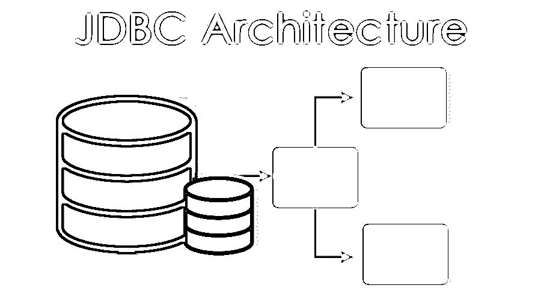
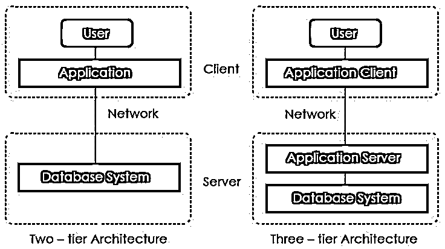
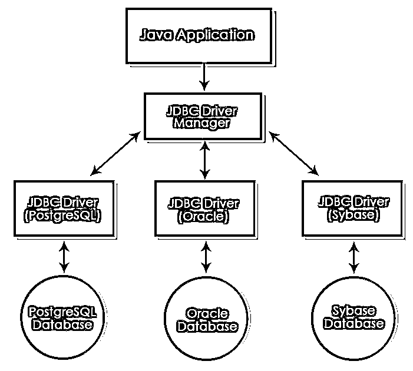
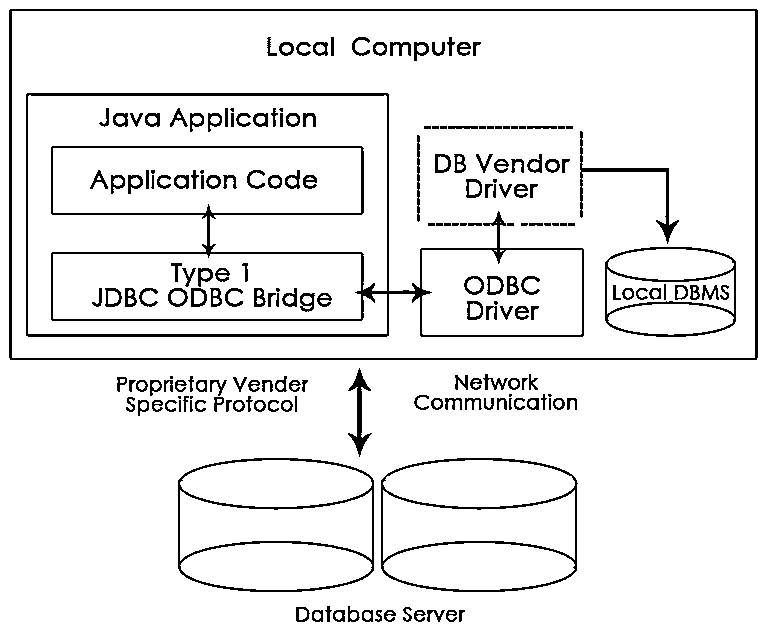
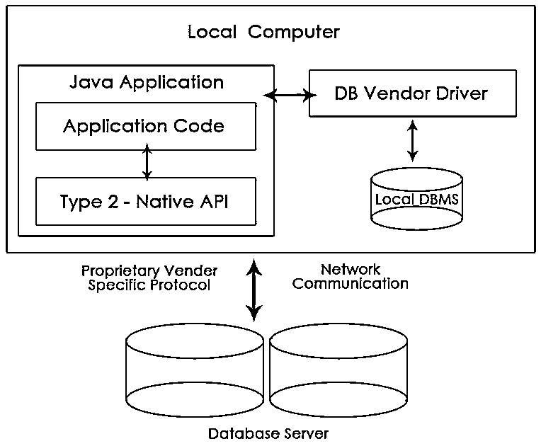
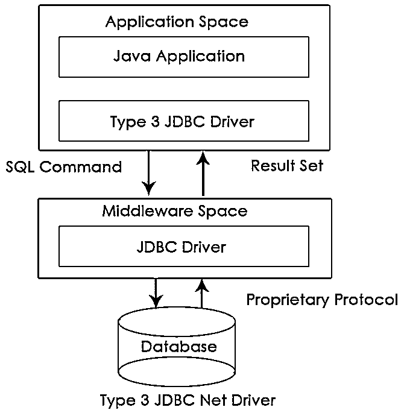
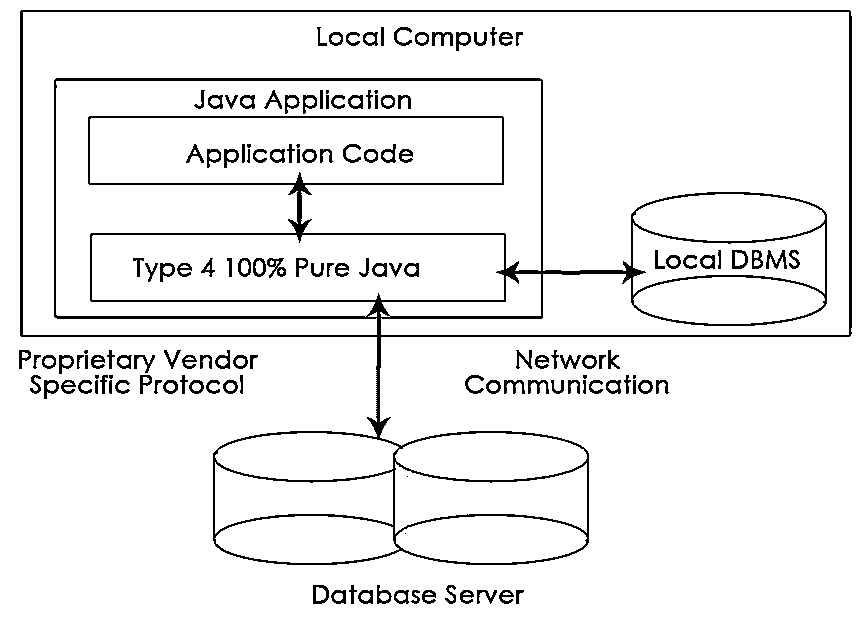

# JDBC 建筑

> 原文：<https://www.educba.com/jdbc-architecture/>

## JDBC 建筑介绍

java 数据库连接(JDBC)是一个 API(应用程序接口)或独立于平台的接口，有助于将 Java 程序与各种数据库(如 Oracle、My SQL、MS Access 和 SQL Server)连接起来。它提供了使用[结构化查询语言](https://www.educba.com/what-is-sql/) (SQL)更新语句(如创建、删除、插入和更新)和查询语句(如选择)来查询和更新数据库的方法。它几乎类似于微软提供的 ODBC(开放式数据库连接)。

要将 java 程序或应用程序与数据库连接，需要遵循五个步骤:

<small>Hadoop、数据科学、统计学&其他</small>

**1。加载驱动程序:**驱动程序有助于连接数据库，因此驱动程序必须在程序中加载一次。这可以通过两种方法实现:

*   **Class.forName():** 通过使用这个，驱动程序的类文件在运行时被加载到内存中。不需要创建新的对象。例如:

`Class.forName(“oracle.jdbc.driver.OracleDriver”);`

*   **DriverManager . register driver():**这里 driver manager 是一个内置的 Java 类，register 是它的静态成员。通过使用它，驱动程序类的构造函数在编译时被调用。在这个新的对象被创建。例如:

`DriverManager.registerDriver(new oracle.jdbd.driver.OracleDriver());`

**2。创建连接:**加载驱动程序后，连接就建立了。connection 对象使用用户名、密码和 URL 来建立连接。URL 具有预定义的格式，其中包含数据库名称、使用的驱动程序、存储数据库的 IP 地址、端口号和服务提供商。可以使用以下命令建立连接:

`Connection con = DriverManager.getConnection(URL, user, password);`

**3。创建语句:**建立连接后，用户可以与数据库进行交互。诸如 JDBC 语句、PreparedStatement、CallableStatement 之类的接口提供了允许用户发送 SQL 语句和从数据库获取数据的方法。用于创建语句的命令是；

`Statement stmt = con.createStatement();`

**4。执行查询:**执行 SQL 查询与数据库交互。查询可以用于更新/插入数据库或检索数据。语句接口提供了两种方法，即 executeQuery()方法执行检索数据的查询，executeUpdate()方法执行更新或插入的查询。例如:

`int n = stmt.executeUpdate(“DELETE TABLENAME”);
if(n==1)
System.out.println(“Success”);
else
System.out.println(“Failed”);`

**5。关闭连接:**在执行我们的查询后，用户想要更新或检索的数据已经完成，现在是时候关闭已建立的连接了。连接接口提供了一个方法 close()来关闭连接。例如:

`con.close();`

### JDBC 建筑

JDBC 支持两种访问数据库的处理模式，即两层和三层。

#### 1.双层架构

这种体系结构有助于 java 程序或应用程序直接与数据库通信。它需要一个 JDBC 驱动程序来与特定的数据库通信。用户向数据库发送查询或请求，并由用户接收返回的结果。数据库可以存在于同一台机器上，也可以存在于通过网络连接的任何远程机器上。这种方法被称为客户端-服务器架构或配置。

#### 2.三层架构

在这方面，没有直接的交流。请求被发送到中间层，即 [HTML](https://www.educba.com/what-is-html/) 浏览器向 java 应用程序发送一个请求，然后该请求被进一步发送到数据库。数据库处理请求并将结果发送回中间层，然后中间层与用户进行通信。它提高了性能并简化了应用程序部署。

### JDBC 建筑的组成部分

组件解释如下。

*   驱动管理器:它是一个包含所有驱动列表的类。当接收到一个连接请求时，它使用一个称为通信子协议的协议将请求与适当的数据库驱动程序相匹配。匹配的驱动程序用于建立连接。
*   **驱动:**控制与数据库服务器通信的接口。DriverManager 对象用于执行通信。
*   **连接:**它是一个接口，包含了联系数据库的方法。
*   **语句:**这个接口创建一个对象，向数据库提交 SQL 查询或语句。
*   **ResultSet:** 它包含执行 SQL 语句或查询后检索到的结果。
*   **SQLException:** 数据库应用程序中发生的任何错误都由该类处理。

基本的 JDBC 建筑图如下所示，包括所有组件的位置:

### 接口

java.sql 包由许多接口组成。下面提到了一些流行的接口:

*   **驱动接口:**这个接口允许多个数据库驱动。创建 DriverManager 对象是为了与数据库通信。这些对象是由 DriverManager.registerDriver()创建的；
*   **连接接口:**连接接口建立 java 程序与数据库之间的连接，即会话。它有许多方法，如 rollback()、close()等。
*   **语句接口:**这个接口提供了执行 SQL 查询的方法。它提供了获取 ResultSet 对象的工厂方法。语句接口的一些方法有 executeQuery()、executeUpdate()等。
*   **PreparedStatement 接口:**该接口在 SQL 查询需要多次执行时有所帮助。它在运行时接受输入参数。
*   **CallableStatement 接口:**当要访问存储过程时使用该接口。它还在运行时接受参数。
*   **ResultSet 接口:**这个接口帮助存储 SQL 查询执行后返回的结果。

### JDBC 司机的类型

有四种类型的 JDBC 驱动程序:

#### 1.类型 1 驱动程序或 JDBC-ODBC 桥

这个驱动程序充当了 [JDBC 和 ODBC](https://www.educba.com/jdbc-vs-odbc/) 之间的桥梁。它将 JDBC 调用转换成 ODBC 调用，然后将请求发送给 ODBC 驱动程序。它很容易使用，但执行时间很慢。

#### 2.类型 2 驱动程序或部分 Java 驱动程序的本地 API

该驱动程序在数据库特定的 native client API 上使用 JNI (Java 本地接口)调用。它比 Type-1 驱动程序相对更快，但是它需要本地库，并且应用程序的成本也增加了。

#### 3.类型 3 驱动程序或网络协议驱动程序

这些驱动程序使用专有网络协议与 JDBC 中间件服务器通信。这个中间件将网络协议翻译成数据库特定的调用。它们独立于数据库。他们可以从一个数据库切换到另一个数据库，但由于许多网络调用而很慢。

#### 4.Type-4 或瘦驱动程序

这个驱动程序也称为纯 Java 驱动程序，因为它们直接与数据库交互。它既不需要任何本地库，也不需要中间件服务器。它比其他驱动程序有更好的性能，但由于网络调用数量的增加而相对较慢。

### 结论

本文详细说明了 JDBC 体系结构、其接口以及与数据库通信或交互的驱动程序类型。

现在每个部门都有一天的数据库，因此有必要更新它们并从中检索数据。所以理解架构将有助于理解基本的 JDBC 概念。

### 推荐文章

这是一本 JDBC 建筑指南。这里我们讨论了 JDBC 架构的驱动程序、接口和组件的类型。您也可以浏览我们推荐的其他文章，了解更多信息——

1.  [如何安装 Java 8？](https://www.educba.com/install-java-8/)
2.  [JDBC 面试问题](https://www.educba.com/jdbc-interview-questions/)
3.  [如何安装 Apache？](https://www.educba.com/install-apache/)
4.  [JDBC 司机](https://www.educba.com/jdbc-driver/)

