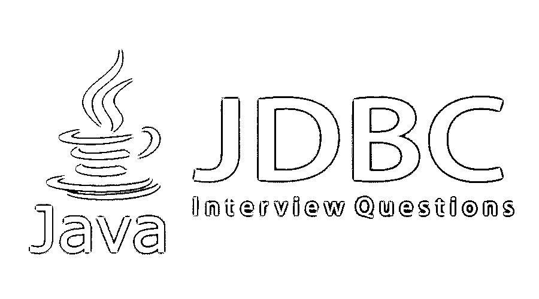

# JDBC 面试问题

> 原文：<https://www.educba.com/jdbc-interview-questions/>

## JDBC 面试问答介绍

Java 数据库连接(JDBC)是用于 Java 编程语言的 API(应用编程接口)。使用 Java 编程语言访问和执行数据库操作是一种数据访问技术。它是由甲骨文公司开发的。它是 Java 标准版(SE)平台的一部分。它面向关系数据库管理系统。它支持跨平台操作系统。它是 API 的一种数据访问类型。Oracle 公司将提供 JDBC API 指南来实现 JDBC 特性。JDBC 连接将提供一个接口来执行查询，以便从数据库中检索和更新数据。有不同类型的 JDBC 驱动器，如 1 型、2 型、3 型、4 型等。还会有商业和免费驱动。

以下是面试中最重要的问题:

<small>Hadoop、数据科学、统计学&其他</small>

现在，如果你正在寻找一份与 JDBC 相关的工作，那么你需要准备 2022 年的 JDBC 面试问题。的确，每个面试都因不同的职位而不同。在这里，我们准备了 2022 年重要的 JDBC 面试问题和答案，将帮助你在面试中取得成功。这些问题分为以下两部分:

### 第 1 部分 Basic 面试问题(基础)

这第一部分包括基本的面试问题和答案。

#### Q1。什么是 JDBC？

**回答:**
JDBC 是一个 Java API 库，用于建立数据库和 [java 应用](https://www.educba.com/applications-of-java/)之间的连接。该数据库通常是一个关系数据库管理系统。JDBC 使用驱动程序建立连接，JDBC 库将用于调用数据库连接。JDBC 驱动程序将是 Java 应用程序和数据库之间的接口。它提供了与任何类型的表格数据的连接，尤其是关系数据或结构数据。

#### Q2。实现 JDBC 互联互通需要哪些步骤？

**答案:**
这是 JDBC 面试时问的基本问题。建立 JDBC 连接的不同步骤是

1.  **加载驱动程序:**这是第一步，将加载特定且合适的 JDBC 驱动程序，以建立与数据库的通信。
2.  **连接:**这一步将使用一个连接对象从数据库获取连接，该对象将发送执行查询的语句，并将返回存储查询结果的结果对象。
3.  **创建语句:**可以从集合对象中收集语句对象，从数据库中获取结果。
4.  **执行查询:**可以使用语句对象查询数据库并检索结果来执行查询。
5.  **关闭连接:**从数据库收到结果集后，会关闭一次数据库连接。

#### Q3。在 JDBC 有哪些不同类型的陈述？

**答案:**
在 JDBC API 中基于不同的需求有不同的语句来检索结果集。它们是语句、预准备语句和可调用语句:

*   **语句:**在这种类型的语句中，可以在运行时检索结果集，并且不需要传递任何参数。

**示例:-**

`Statement *statementObject* = conn.createStatement( );
ResultSet *resultSetObject* = stmt.executeQuery();`

*   **准备好的语句:**在这种类型的语句中，查询可以根据需要执行多次，或者在应用程序中需要时频繁执行，并且它还允许接受参数。

**示例:-**

`String query = "Update Employee SET type= ? WHERE empId = ?"; PreparedStatement psObject = connObj.prepareStatement(query);
ResultSet rsObject = psObject.executeQuery();`

*   **可调用语句:**在这种类型的语句中，查询可以使用存储过程来执行，并在运行时接受参数。

**示例:-**

`CallableStatement csObject = connObject.prepareCall("{call EMPLOYEE_DETAILS}");
ResultSet rsObject = csObject.executeQuery();`

让我们转到下一个 JDBC 面试问题。

#### Q4。有哪些不同类型的 JDBC 司机？

**答案:**
下面是用于连接数据库的不同 JDBC 驱动的列表。他们是 1 型、2 型、3 型和 4 型驾驶员:

1.  **类型 1:** 类型 1 数据库也称为 JDBC-ODBC 桥驱动程序。在这种类型中，ODBC 驱动程序将用于建立到数据库的连接。
2.  **Type 2:**Type 2 数据库也称为 Native API 或部分 Java JDBC 驱动。在这种类型中，驱动程序将使用客户端库连接到数据库。
3.  **Type 3:**Type 3 数据库又称为网络协议纯 Java JDBC 驱动。在这种类型中，应用服务器充当中间件或接口，将 JDBC 调用直接转换为数据库调用。
4.  **Type 4:**Type 4 数据库也叫原生协议纯 Java JDBC 驱动。在这种类型中，瘦驱动程序将数据库调用转换为特定于供应商的数据库协议，以连接到数据库。

#### Q5。使用了哪些不同的 JDBC 组件？

**答:**
JDBC API 连接数据库使用的不同组件如下:

1.  准备报表
2.  可调用语句
3.  询问
4.  结果集
5.  结果集元数据
6.  数据库元数据
7.  关系
8.  驾驶员管理器

注意:–元数据是关于数据的数据。

### 第 2 部分-JDBC 面试问题(高级)

现在让我们来看看高级面试问题。

#### Q6。查询数据库有哪些不同的方法？

**答案:**
用来查询数据库的不同方法有 execute()，executeQuery()和 executeUpdate()。

*   **execute():** 该方法用于对任何类型的 SQL 语句执行查询。此返回类型为布尔型，即 true 或 false。
*   **executeQuery():** 这个方法用于执行查询，比如一个 only SELECT 类型的语句。它的返回类型是一个对象，如 ResultSet 对象。
*   **executeUpdate():** 该方法用于执行执行插入、更新、删除等操作的查询。，它的返回类型是整数，即 0 或 1。

#### Q7。JDBC 有哪些不同类型的锁？

**答案:**
这是面试中问的高级面试问题。JDBC 不同类型的锁如下:

1.  钥匙和行锁
2.  桌子锁
3.  页面锁
4.  数据库锁

#### Q8。什么是结果集？

**答:**
ResultSet 是一个包含使用 SQL 查询从数据库中检索的数据的对象。ResultSet 总是维护一个指向数据库表中某一行的游标。

#### Q9。什么是数据库中的连接池？

**答案:**
数据库中的连接池是将连接存储在缓存中以备后用的过程。它提供了更快的连接，并且更容易解决问题。

#### Q10。JDBC 中有哪些不同类型的异常和错误？

**回答:**
进行 JDBC 连接时不同类型的异常如下:

1.  SQLException
2.  BatchUpdateException
3.  数据截断误差
4.  SQL 警告

### 推荐文章

这是一个 JDBC 面试问题和答案的列表指南，以便候选人可以轻松地解决这些面试问题。在本帖中，我们研究了 JDBC 面试中经常被问到的问题。您也可以阅读以下文章，了解更多信息——

1.  [Java 春季面试试题](https://www.educba.com/java-spring-interview-questions/)
2.  [Java 测试面试问题](https://www.educba.com/java-testing-interview-questions/)
3.  [JSP 面试问题](https://www.educba.com/jsp-interview-questions/)
4.  [JSF 面试问题](https://www.educba.com/jsf-interview-questions/)

