# 通配符

> 原文：<https://www.educba.com/wildcard-characters/>

## 通配符简介

通配符是可以在特定字符串中搜索和替换的一个或一组字符。通配符用于带有 LIKE 操作符的 MySQL 查询。MySQL 查询的 where 子句中使用了 LIKE 操作符。我们可以使用 where 子句为表中的特定列搜索特定的模式。

**举例:**

<small>Hadoop、数据科学、统计学&其他</small>

%通配符用于 like %ab 将在给定的一组数据(记录)中查找所有 ab，产生输出，如 about、above、丰度、absorbent 等。

### 为什么我们要使用通配符？

正如您所熟悉的 MySQL，我们有各种查询，如插入、更新、选择、删除等。因为通配符完成了搜索特定模式的工作，所以 SELECT 语句和 WHERE 子句将进入画面，而不是其他 MySQL 查询。为了使通配符搜索更容易，让我们看一个简单的艺术家和他的画的例子。比如说，不同的艺术家创作的不同的画作在世界不同的地区以不同的价格出售。让数据库的名称是你的选择，说“搜索 _ 艺术家。”

#### 表名是艺术家。

下面是创建“艺术家”表的查询。

**代码:**

`CREATE TABLE `artist` (
`artist_id` int(11) NOT NULL,
`artist_name` varchar(255) NOT NULL,
`artist_painting` varchar(255) NOT NULL,
`artist_country_name` varchar(255) NOT NULL,
`artist_country_code` varchar(255) NOT NULL,
`artist_painting_price` varchar(255) NOT NULL
) ENGINE=InnoDB DEFAULT CHARSET=latin1;`

创建表格后，我们将在表格中插入数据。

#### 转储表“艺术家”的数据

**代码:**

`INSERT INTO `artist` (`artist_id`, `artist_name`, `artist_painting`, `artist_country_name`, `artist_country_code`, `artist_painting_price`) VALUES
(1, 'Leonardo Da Vinci', 'Mona Lisa', 'Angola', 'AO', '$500'),
(2, 'Edvard Munch', 'The Scream', 'Bahrain', 'BH', '$600'),
(3, 'Sistine Chapel by Michelangelo', 'The Creation of Adam', 'Bangladesh', 'BD', '$700'),
(4, 'Vincent Van Gogh', 'Sun Flowers', 'Malaysia', 'MY', '$550'),
(5, 'Rene Magritte', 'Ceci N’est pas une Pipe', 'Madagascar', 'MG', '$850'),
(6, 'Edvard Munch', 'The Scream', 'Portugal', 'PT', '$750'),
(7, 'Leonardo Da Vinci', 'Mona Lisa', 'Poland', 'PL', '$500'),
(8, 'Claude Monet', 'Poppies in a Field', 'Vietnam', 'VN', '$650');`**T2】**

一旦执行了上面的查询，将会创建下表。

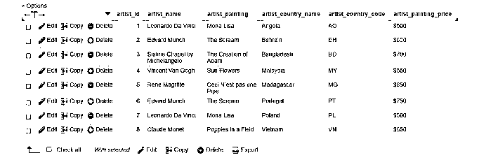

#### 1.%百分比

**例子一:**现在我们想知道哪些艺术家的作品出现在国名以“BA”开头的国家

搜索查询是这样的:

**代码:**

`SELECT * FROM artist WHERE artist_country_name LIKE 'Ba%'
The result is country names starting with Ba are “Bahrain” and “Bangladesh”`

在 MySQL 中执行上述查询:

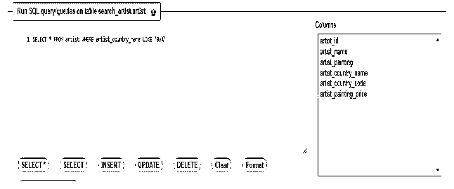

**查询的输出:**

**例子二:**在这里，我们想知道哪些艺术家在含有“al”的国家有他们的画

解决方案是:

**代码:**

`SELECT * FROM artist WHERE artist_country_name LIKE '%al%'
The result is country names starting with Ba are “Malaysia” and “Portugal”`

在 MySQL 中执行上述查询:

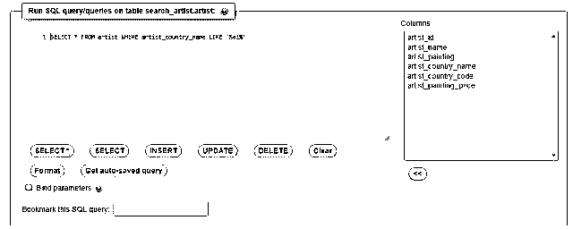

**查询的输出:**

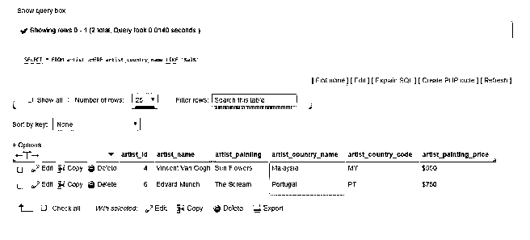

在上面的两个例子中，我们只有一个通配符，即“% .”

现在我们将检查相关的通配符，如 _ 通配符(下划线通配符)、escape 关键字、NOT LIKE 关键字等。

#### **2。_ 下划线通配符**

**示例一:**这也与 SELECT 语句和 where 子句一起使用，其中 in 代表任何单个字符，可以是任何内容。

解决方案是:

**代码:**

`SELECT * FROM artist WHERE `artist_painting_price` LIKE '$5_0'
The result is painting price names with this pattern will give output as
$500, $550, $500 in the painting price column`

在 MySQL 中执行上述查询:

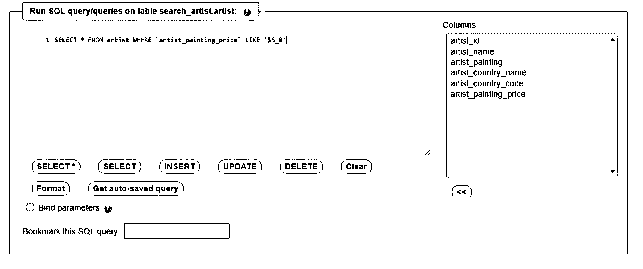

**查询的输出:**

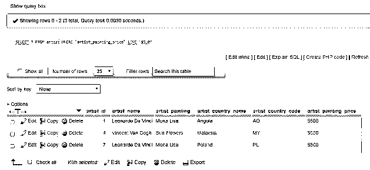

**例二:**

解决方案是:

**代码:**

`SELECT * FROM artist WHERE `artist_country_code` LIKE 'A_’`

在 MySQL 中执行上述查询:

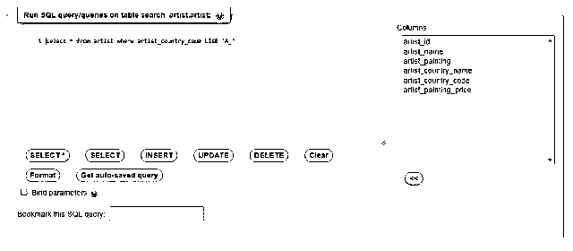

**上述查询的输出:**

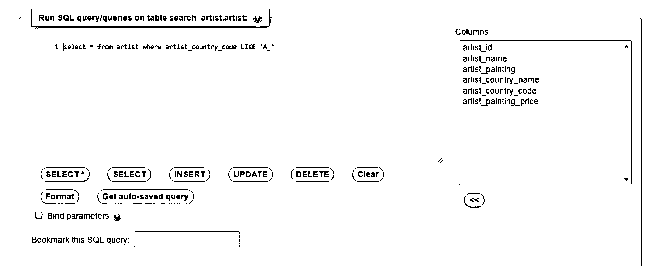

在深入第三个通配符之前，我们将看到上面两个通配符的组合，即' _ '和' % '通配符的组合。

| **通配符组合** | **意为** |
| 在那里，艺术家像“莫%”一样绘画。 | 返回所有以“Mo”开头的值 |
| 其中艺术家国家名称类似于“%n” | 返回所有以“n”结尾的值 |
| 其中艺术家国家名称类似于“%da%” | 返回任何位置都有“da”的所有值。 |
| 其中艺术家国家名称类似于' _o% ' | 返回第二个位置有“o”的所有值。 |
| 其中 artist_name 类似于“L%i” | 返回所有以“L”开头、以“I”结尾的值 |

#### **3。不像通配符**

与其他运算符一样，这种不相似运算符与 select 语句的 where 子句以及下划线和百分比通配符一起使用。它从表中返回给定模式不匹配的行。

**示例一:**我们不想要艺术家绘画的价格为$600 和$650 的记录。

解决方案是:

**代码:**

`SELECT * FROM artist WHERE `artist_painting_price` NOT LIKE '$5%'`

在 MySQL 中执行上述查询，输出:
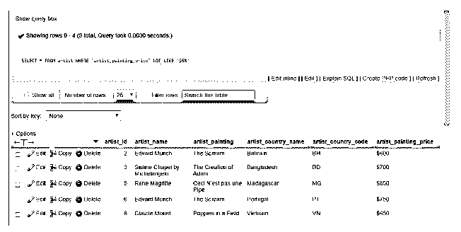

#### 4.[^characterlist]使用正则表达式

**示例一:**我们希望记录包含与括号中的模式匹配的所有字符。

解决方案是:

**代码:**

`SELECT * FROM artist WHERE `artist_country_name` REGEXP '^[po]'`

在这里，包含像 po 这样的字符组的艺术家 _ 国家 _ 名称产生两个记录，其中只包含葡萄牙和波兰。

在 MySQL 中执行上述查询，并输出:

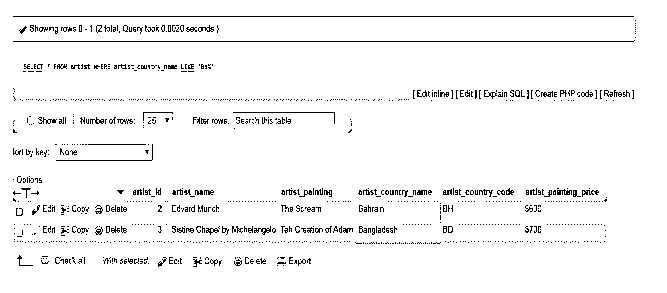

#### 5.^不含正则表达式关键字

**示例:**我们希望记录包含除括号中的字符之外的所有字符。

解决方案是:

**代码:**

`SELECT * FROM artist WHERE artist_country_name REGEXP '^[^po]'`

在 MySQL 中执行上述查询，并输出:

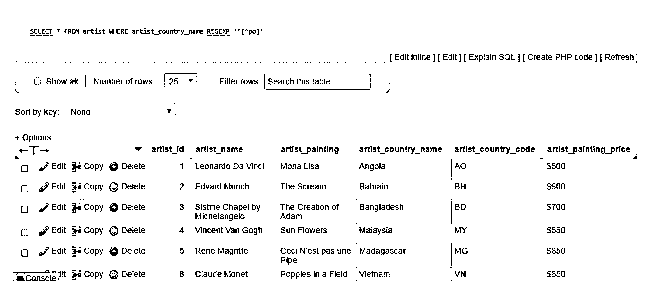

#### 6.转义关键字

**例子一:**在这个例子中，艺术家的名字是使用 escape 关键字在表中搜索给定模式的输入。下面的例子会更清楚。

解决方案是:

**代码:**

`SELECT * FROM artist WHERE `artist_name` LIKE '%$ Da %' ESCAPE '$'`

在 MySQL 中执行上述查询并输出。

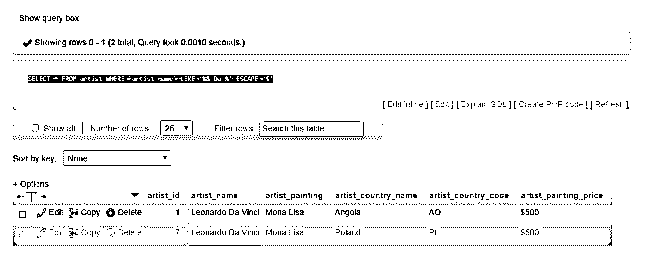

#### 7.| '关键字来执行基于给定字母的搜索

**示例:**我们想要名字以字符 L 或 s 开头的记录。

解决方案是:

**代码:**

`SELECT * FROM artist WHERE `artist_painting` REGEXP '^(L|S)'`

在 MySQL 中执行上述查询，并输出:

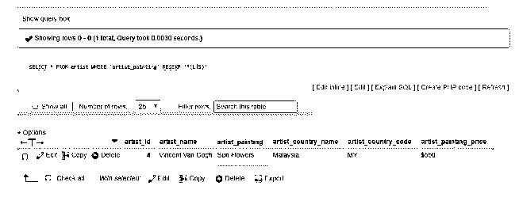

### 结论-通配符

在这个主题中，您看到了%和 _ 通配符及其示例。此外，您还看到了不喜欢操作符、带有转义关键字的搜索查询、[^characterlist]等等。通过对“artist”表执行带有 where 子句的选择查询，所有这些都变得很清楚。希望每个主题变得更容易理解和掌握。

### 推荐文章

这是关于通配符的指南。这里我们已经讨论了什么是通配符，如何使用通配符以及如何创建表格等。您也可以浏览我们推荐的其他文章，了解更多信息——

1.  [SQL 中的通配符](https://www.educba.com/wildcard-in-sql/)
2.  [表格中的过滤器](https://www.educba.com/filters-in-tableau/)
3.  [SQL 的使用](https://www.educba.com/uses-of-sql/)
4.  [T-SQL 字符串函数](https://www.educba.com/t-sql-string-functions/)

