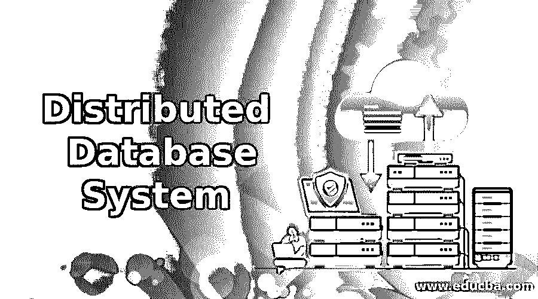

# 分布式数据库系统

> 原文：<https://www.educba.com/distributed-database-system/>

## 分布式数据库系统简介

顾名思义，分布式数据库是将一个数据库分布在几台或几台或分布式计算机的网络上，以实现高效管理系统的过程。通常，用于分布式系统的计算机网络可以位于相同的物理位置，或者它们可以位于通过单个管理系统连接的全球不同地方。这些分布式数据库可以托管在网络服务器上，或者托管在公司的内部网和外部网上，或者最近最流行的是托管在因特网上的分散的独立计算机上。

### 对分布式数据库的需求

下面是对分布式数据库的需求:

<small>Hadoop、数据科学、统计学&其他</small>

#### 1.灵活性/可调性

需要分布式系统的一个主要原因是它的可调性。由于组织的复杂性和每秒钟发生的各种事务，服务器和应用程序足够灵活以适应其不断变化的需求而不妨碍数据库管理系统的整体功能变得非常重要。例如，装有 web 服务器的机器将服务于大量的小型事务，而带有数据仓库的数据库服务器将服务于少量的大型或复杂事务。在分布式数据库系统中，这些功能是相互分离的，因此可以由最终用户和开发人员根据他们的需求进行配置。

#### 2.容错

想象一下，在一个系统中，应用程序和服务器在物理上位于同一台计算机或系统上，而其中一个组件出现故障会中断整个系统！有了 DDMS，由于服务器和应用程序位于计算机网络上，一个组件的故障不会影响整个系统，因此变得容错，这在大型组织使用时尤为重要。

#### 3.安全性

由于 DDMS 的组件在工作和位置上完全相互独立，因此如果其中一个组件受损，不会影响整个系统，这大大提高了数据库系统的安全性。

#### 4.可量测性

随着组织的增长，其数据也在增长，因此需要更好的数据库管理系统。使用分布式系统，组织可以轻松地扩展其现有的系统网络，并根据自己的需要操纵系统。

#### 5.费用

与单台大型计算机相比，创建一个跨地域的小型计算机网络的成本更低。

### 分布式数据库的功能

以下是分布式数据库系统的功能:

#### 1.目录

由于分布式系统中的数据分布在不同的位置，因此必须对存储在什么位置的数据进行编目，并详细说明其自主性和保密性。需要在动态且不断扩展的数据库目录中扩展数据库关于数据分布、数据分段和复制的细节。

#### 2.数据可恢复性

DDMS 的主要优点之一是，它分布在具有独立组件的计算机网络中，因此在特定站点恢复数据成为分布式系统的重要功能。如果其中一个位置出现问题，系统需要足够强大，以恢复在该特定位置丢失的数据。

#### 3.安全性

正如所讨论的，安全性成为分布式系统的一个重要方面，并且随着组织使用的不断增加，在具有位于多个位置的优点的分布式系统下，各种复杂的安全措施已经成为可能。

#### 4.分布式查询处理

在数据位于分布式系统的不同站点的环境中，分布式查询处理用于处理查询。

#### 5.数据事务管理

在分布式系统中，事务发生在不同物理位置的不同系统中，因此为了完成事务，数据事务管理器与所有本地事务管理器通信。因此，数据事务管理起着非常重要的作用。

### 分布式系统的优缺点

以下是分布式系统的优点和缺点:

#### 优势

*   它们经济高效，可以大幅降低数据库管理成本。这有助于许多初创公司和资金紧张的公司投资其他技术。
*   它很容易扩展，因此随着业务的增长，他们可以轻松扩展他们的分布式系统来处理增加的工作负载。
*   与传统的单个大型计算机系统相比，性能得到了显著提高，因为数据位于站点需求最大的位置，并且数据库系统可以并行化，从而允许负载按照需求公平分配。
*   一个组织可以通过对数据库系统进行更好的排序来更好地组织其各个部门，其中一个部门的数据在其位置上是分散的。
*   由于数据库的复制，可以有可靠的事务。
*   容错和单点故障不会影响整个系统。
*   地方自治或中央自治，组织拥有更大的灵活性，他们可以选择谁可以访问哪些数据。
*   它支持 [OLTP(在线事务处理)](https://www.educba.com/what-is-oltp/)和 [OLAP(在线分析处理)](https://www.educba.com/what-is-olap/)，支持多种可能有共同数据的系统。
*   大多数组织使用各种应用程序，而对于分布式系统，在各种应用程序下使用相同的数据是足够健壮的。

#### 不足之处

*   虽然它对于分布式系统是经济的，但是从长远来看，它的安装可能是昂贵的，因为它将需要相对高的资源来有效地建立分布式系统。
*   需要更新每个站点上的数据有时会影响数据的完整性。
*   如果数据分配不当，工作处理不当，整个系统可能会变得无响应或缓慢。这同样会增加开销，因为人员需要持续监控系统。
*   希望从集中式数据库转换到分布式系统的组织也可能会面临一些问题，这是因为没有相应的工具或方法，因而缺乏标准的过程。

### 结论

就数据库管理系统而言，分布式数据库管理系统是大多数组织选择的，并且由于几个优点和使用案例，对于任何寻找数据库管理系统的人来说，考虑选择分布式系统变得势在必行。此外，各种云解决方案提供商，如微软 Azure、AWS 和谷歌，已经以集中式甚至一些分散式系统的十分之一的成本提供这些系统，使企业和组织更容易转向分布式系统。

### 推荐文章

这是一个分布式数据库系统指南。这里我们讨论分布式数据库系统的功能和需求，以及它的优点和缺点。您也可以浏览我们推荐的文章，了解更多信息——

1.  [十大数据库类型](https://www.educba.com/types-of-database/)
2.  [带功能的运行数据库](https://www.educba.com/operational-database/)
3.  [NoSQL 数据库的类型|前 7 名](https://www.educba.com/types-of-nosql-databases/)
4.  [AWS 数据库简介](https://www.educba.com/aws-databases/)

