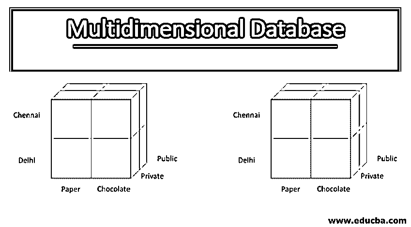
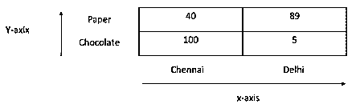
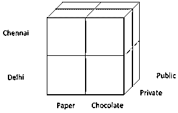

# 多维数据库

> 原文：<https://www.educba.com/multidimensional-database/>

## 多维数据库简介

多维数据库是一种数据库管理系统，可以归类为在线分析处理(OLAP)。存储在该数据库中的多维数据用于分析和报告解决方案，作为业务决策过程的主要输入。作为 OLAP 的一部分，对多维数据库执行的基本操作是上滚、下钻、切片和切割，以便从数据库中检索所需的数据，其中数据以多维立方体的形式组织。

### 关系数据库

它以行和列的二维表格格式存储数据。下表显示了关系数据库的示例。数据存储为一行中的一条记录，每条记录分为几列。

<small>Hadoop、数据科学、统计学&其他</small>

| **项目** | **店铺位置** | **数量** |
| 纸张，A4 | 金奈 | Forty |
| 巧克力，大嚼 | 德里 | Five |
| 纸张，A3 | 德里 | Eighty-nine |
| 巧克力，五星 | 金奈 | One hundred |

### 多维数组的例子

以下是多维数组的示例:

**MDB–多维数据库**:是一种具有数据仓库和 OLAP(联机分析处理)的数据库。MDB 可以从关系数据库创建输入，关系数据库可以使用 SQL(结构化查询语言)从数据库访问数据。可以从多维数据库访问数据的 OLAP 称为 MOLAL(多维在线分析处理)。多维数据库管理系统(MDDBMS)具有快速处理数据的能力，因此我们可以很快得到答案。

**OLAP(在线分析处理):**该技术是许多 BI(商业智能)操作的使用。它是用于数据发现、报告、分析计算和预测分析规划的强大技术。

#### 多维分析的 OLAP

*   OLAP 用于在多维活动中运行的业务，它支持商业智能从各种数据源进行分析。它允许分析师同时从许多不同的来源进行分析。许多 OLAP 应用包括业务处理、报表、分析、预测、预言等等。测量可以在每个维度上进行。当存在来自多个数据源的多维数据时，可以使用三种操作(上滚、下钻、切片和切片)对其进行分析。
*   举一个作为产品制造运营的组织为例，他们必须根据产品类别、客户列表、时间等来维护产品销售。在这种情况下，时间通过测量月环比、年同比等起主要作用，它保持在 x 轴上，而产品类别通过 y 轴上的销售率差异在同一 x 轴上分开。
*   现在，我们可以轻松地对我们的业务进行分析，以改进和预测我们的销售。分析师需要查看所有维度，以便针对常规客户创建更有效的分析。这就是 OLAP 在多层面行动中发挥重要作用的原因。

#### 数据库

*   数据仓库也称为企业数据仓库。它从各种来源收集和管理数据，用于报告和数据分析，并考虑商业智能洞察。它可以作为一个集中的存储库，集成来自一个或多个来源的数据。数据仓库包括数据清理、[数据集成](https://www.educba.com/what-is-data-integration/)和数据整合。
*   举一个有大量产品数据的百货商店的例子。当我们查看特定产品是否可用或还剩多少数量时，我们需要设计一个查询来将数据转换为用户可用的信息

### 二维数据阵列

下面是二维数据数组的详细说明:

上例中的数据显示为 2×2 矩阵。在下图中，x 轴表示商店位置，y 轴表示商品

多维数组中[的每一轴称为维度，维度为店铺位置和商品。它各包含两个位置](https://www.educba.com/multi-dimensional-array-in-javascript/)

*   商店位置=钦奈和德里
*   Item =纸和巧克力

维度中的每个条目称为一个位置。这些区域被绘制为每个商店位置的纸张和巧克力数量。

多维数据很容易用数组而不是关系数据库来表示。二维数据库很容易理解，有两个维度的项目和存储位置，每个维度包含两个位置。例如，巧克力的信息量被摸索到一行中，可以很容易地合计。

该阵列格式化关于多个维度和每个维度内的位置的信息，并且它也可以是一种简单的分析方法。当我们以数组格式存储数据时，我们可以很容易地进行分析，非常快速地导入和导出数据。

### 三维数据阵列

下面是三维数据数组的详细说明:

当我们通过向数据集添加第三维来扩展关系数据库时，它被表示为一个三维关系表。从上面的数组表中，我们将添加维度“Customer”。维度可以是两种可能性“公共”和“私有”。通过在二维中添加一维可以扩展表中的行数。当我们扩展表的长度时，很难处理数据，这就是为什么多维结构扮演着重要的角色。

| **项目** | **店铺位置** | **客户** | **数量** |
| 纸张，A4 | 金奈 | 公共 | Forty |
| 巧克力，大嚼 | 德里 | 私人的 | Five |
| 纸张，A3 | 德里 | 公共 | Eighty-nine |
| 巧克力，五星 | 金奈 | 私人的 | One hundred |

### 四维数据阵列

下面是四维数据数组的详细解释:

通过增加一个维度作为开放时间，三维可以扩展到四维。这个四维数组很难理解，所以用一个类似的数字把每一个相加作为开启时间。

### 多维数据库的优缺点

#### 多维数据库的优势

多维数据库的一些优点是:

*   **易于维护:**易于操作和维护
*   **性能提升:**性能远优于关系数据库等普通数据库。
*   **更好的数据呈现:**数据是多方面的，包含许多不同的因素。数据表示远远优于传统的数据库。

#### 多维数据库的缺点

解释多维数据库的缺点:

多维数据库的一个缺点是非常复杂，需要专业人员来理解和分析数据库中的数据。

### 结论——多维数据库

在本文中，我们已经了解了什么是多维数据库、OLAP、数据仓库、多维数据库的优点和缺点。

### 推荐文章

这是一个多维数据库指南。这里我们举例讨论二维、三维、四维数据阵列的优缺点。您也可以浏览我们的其他相关文章，了解更多信息-

1.  [Matlab 中的矩阵](https://www.educba.com/matrix-in-matlab/)
2.  [AWS 数据库](https://www.educba.com/aws-databases/)
3.  [数据科学工具](https://www.educba.com/data-science-tools/)
4.  [数据科学技能](https://www.educba.com/data-science-skills/)
5.  [PHP 中的多维数组](https://www.educba.com/multidimensional-array-in-php/)
6.  [数据库并行类型指南](https://www.educba.com/database-parallelism/)

