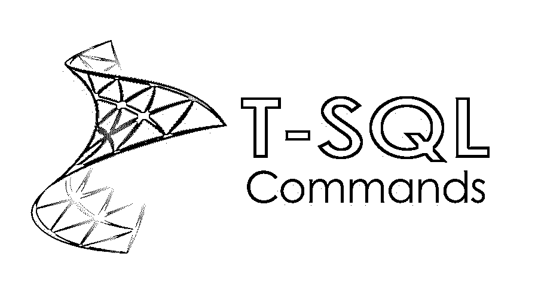

# T-SQL 命令

> 原文：<https://www.educba.com/t-sql-commands/>

## T-SQL 命令简介

每个可用的 RDBMS 数据库基本上都支持 SQL(结构化查询语言)语句或命令，用于从相应数据库中存储的数据执行开发者的任何查询。每个数据库都可能支持某种特定的 SQL 语言。T-SQL 命令是一种基于 SQL 的特定查询语言，称为事务结构查询语言。它是当前微软的升级产品之一，主要是 SQL 语言的关键扩展。它主要支持 MS SQL server。

### 基本的 T-SQL 命令

T-SQL 有许多 SQL 命令，特别是用于获取、插入、删除或截断任务的数据操作级别。下面提到了一些基本命令:

<small>Hadoop、数据科学、统计学&其他</small>

1.  **修改表格**:主要用于修改一个已有的表格列定义，或者增加一个新列，或者删除一个已经增加的列。在重命名表时，也可以使用 Alter table column。
2.  **Create table** *:* 它用于创建一个具有特定定义的新表，Create table 可以用于一些具有默认表空间的新表，对于使用一些 define tablespace 的新表需要用 Create 语句定义相同的表空间。
3.  **创建视图 *:*** 使用它我们可以创建一个视图。假设有某个特定的查询实际上花了很长时间来执行，在这种情况下，我们可以将该特定的查询定义为一个临时表，并用这个临时表执行的数据创建一个新的视图。现在直接调用视图，除了这个查询执行之外，它将比通常更快地给出结果。“创建视图”命令实际上有助于创建相同的视图。
4.  **删除 *:*** 用于删除表格、表格的特定列、表格的特定行或表格内的全部数据。在 T-SQL 命令中通常有三种删除方式，通过使用一些游标命令来删除，其中通过在游标中提及来删除一些特定的键列数据。通过一些动态命令删除，其中某人可以通过特定的动态条件删除一些关键数据，它可以根据提供的条件删除一个特定的或多个行。使用一些语言命令删除，这里也有一些特定语言的条件，有助于一次删除一行或多行。
5.  **插入 *:*** 通过使用插入命令，某人可以在表格中插入一行或多行。在这种情况下，有两种关键插件可用。一种是通过使用一些动态条件在表或视图中插入行。在这里，有人可以根据查询中提到的一些动态条件在表中插入数据。另一个根据某种语言命令插入到表或视图中。在这种情况下，可以根据命令中提到的某种语言条件进行插入。
6.  **更新** : Update 命令主要用于更新表格中已有的一些行。T-SQL 中提供了三种更新，一种是使用游标进行的位置更新，一种是使用动态命令进行的位置更新，一种是基于上述查询的动态更新，一种是使用语言命令进行的位置更新，这也是一种基于特定语言的动态更新。

### 中间 T-SQL 命令

开发人员还使用了其他几个流行的 SQL 命令，这些命令不是非常基本的命令，但是与 T SQL 一起使用时，非常需要执行这些 SQL 命令。下面提到了一些需要中间 [SQL 命令](https://www.educba.com/sql-commands/)的类型:

1.  **开始交易**:开始交易用于管理或提及用户创建交易管理的起点。假设有人愿意执行多个数据操作查询，但愿意提交同一个查询一次，在这种情况下，begin transaction 需要提到，以标识这些 DML 语句的开始。
2.  **提交事务**:它基本上将整个事务提交到数据库中。如前所述，有人愿意一次提交整个 DML 语句，而不单独提交。因为他们将提到提交事务命令，它将在事务边界之间提交整个 DML 执行，这意味着从开始到提交。
3.  **创建索引**:为表格创建一个特定的索引，有时是在某个特定的有用列上。在表的某个关键列上创建了一个索引，这些列在应用程序逻辑方面非常有用。
4.  **截断表**:截断一个表的数据，但不会删除表的结构。
5.  **回滚事务:**它也做类似提交的事情，通常在定义事务边界之间回滚整个事务。

### 高级命令

尽管如此，T-SQL 命令用户仍然需要经常执行一些关键任务。这些任务还需要执行一些高级命令，这些命令主要由一些管理人员使用，用于授予或取消特定用户的一些访问权限，删除一些关键的表结构，提供对数据库中特定表的访问权限等。这些高级 T-SQL 命令如下:

1.  **删除索引**:从数据库中删除已创建的有结构的索引。从特定表中删除一个索引可能会产生多种影响，这是一个架构决策。因此，放弃通常授予某个项目的某些特定关键人员的访问权限。
2.  **删除表 *:*** 从数据库中删除一个已有的带有结构的定义表。从数据库中删除一个表意味着该表将被完全删除。
3.  **授予 *:*** 授予某些特定关键用户整个表或数据库的权限。
4.  **撤销 *:*** 撤销某些特定用户的一些关键访问。
5.  **使用 *:*** 提供对一个已有数据库的访问。

### 要使用的提示和技巧

一些经常使用这个命令查询的普通用户，他们通常会使用一些技巧和窍门来正确地利用 t-SQL 命令输出。这种技巧通常用于解决一些特定于用户的查询，并显示执行输出以正确理解这些查询。一些非常常用的关键技巧是:

1.  **恢复数据库**:普通开发人员对于使用 SQL server 通用备份工具进行数据库恢复的正常态度。而 T-SQL 有一些恢复数据库的关键命令，比 SQL server 恢复机制更快更安全。
2.  **存储过程:**SQL server 通常不支持常见的存储过程概念，但 T-SQL 提供了一个存储过程 sp_executeSQLFromFile，帮助开发人员在存储过程结构中执行 T-SQL 命令，比通常情况下更快。

### 结论

T-SQL 是关键的 SQL 查询语言之一，对于 SQL server 执行查询至关重要。由于 T-SQL 是基于 SQL 的，所以几乎最大的可用特性都与 SQL 相同。但是，它还没有那么受欢迎。

### 推荐文章

这是 T-SQL 命令的指南。这里，我们分别讨论了基本和高级 T-SQL 命令以及一些即时 T-SQL 命令。您也可以阅读以下文章，了解更多信息——

1.  [h base 命令的使用](https://www.educba.com/hbase-commands/)
2.  [如何使用 Sqoop 命令](https://www.educba.com/sqoop-commands/)
3.  [Tableau 命令的重要性](https://www.educba.com/tableau-commands/)
4.  [Hive 命令如何使用](https://www.educba.com/hive-command/)

