# T-SQL 字符串函数

> 原文：<https://www.educba.com/t-sql-string-functions/>

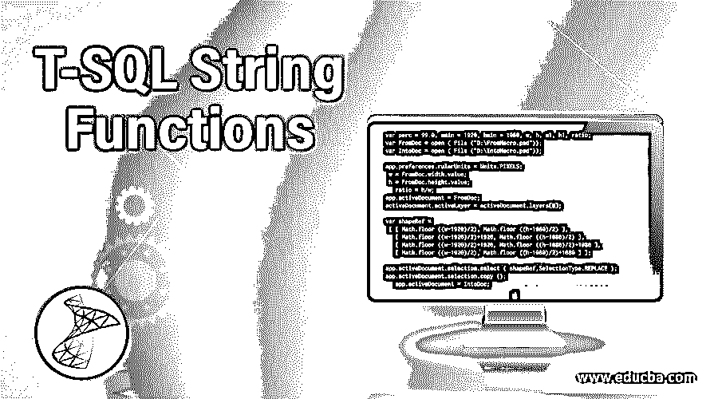

## T-SQL 字符串函数简介

几乎所有的 web/桌面应用程序都需要一个持久层来存储必要的信息。大多数应用程序利用了数据库管理系统,该系统以结构化的方式存储数据(与 Mongo DB 不同),如 MySQL、SQL Server、Sybase、Postgres 和由 Oracle、IBM 和微软等科技巨头开发的其他数据库系统。所有这些 RDBMS 产品都使用一种通用语言，即 SQL(结构化查询语言)。后来，这些供应商通过扩展 SQL 语言的功能开发了他们自己的数据库语言。T-SQL 字符串函数就是由微软开发的一种这样的语言。

**我们开始吧**

<small>Hadoop、数据科学、统计学&其他</small>

现在你已经掌握了 T-SQL 的要点，让我们开始吧。让我们看看 T-SQL 中一些有用的内置 SQL 函数。

### T-SQL 字符串函数

让我们在下面讨论 T-SQL 字符串函数，

#### 1.美国信息交换标准代码

它返回最左边字符的 ASCII 码。返回类型是整数。

**语法:**

`ASCII ( character expression )`

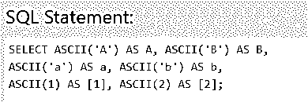

**结果:**

#### 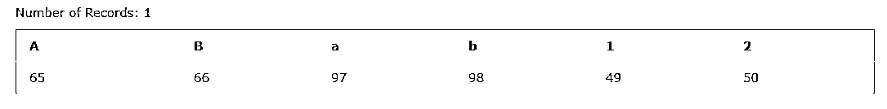

2。茶

这个函数与 ASCII 函数正好相反，即将 ASCII 值转换为字符值。

**语法:**

`CHAR (integer expression)`

**结果:**

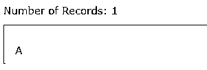

**提示:** CHAR(13)可以在查询中用于引入换行符。

#### 3.查林德克斯

此 T-SQL 字符串函数返回子字符串在字符串中的位置。

**语法:**

`CHARINDEX(expressionToFind, expressionToSearch [, start_location])`

**自变量:**

*   **expression find**:必选参数，表示要搜索的子串
*   **expression search**:必选参数，在其中搜索子串的字符串
*   **start_location** :可选参数，定义搜索开始的位置，如果没有定义，默认从字符串的开头开始。

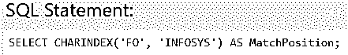

**结果:**

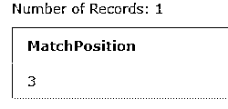

#### 4.串联

此函数以端到端的方式追加两个或更多字符串值，并返回连接的字符串。

**语法:**

`CONCAT ( string_value1, string_value2 [, string_valueN ] )`

**自变量:**

concat 函数至少需要两个字符串参数，最多可以扩展到 254 个字符串参数。

返回类型

返回类型是输入字符串的串联字符串。

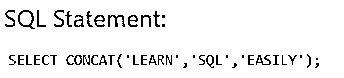

**结果:**

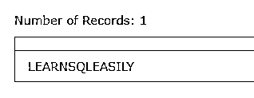

#### 5\. CONCAT_WS

这个 T-SQL 字符串函数以端到端的方式追加两个或多个字符串值，并用第一个参数中定义的分隔符将它们分隔开。

**语法:**

`CONCAT_WS ( separator, argument1, argument2 [, argumentN]... )`

**自变量:**

*   **分隔符:**它可以是任何类型 char、nchar、nvarchar 或 varchar 的表达式

返回类型

返回类型用字符串之间的分隔符连接字符串。

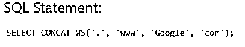

**结果:**

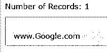

**注意:**在空值的情况下，concat_ws 不附加分隔符并返回空值。

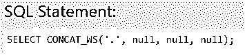

**结果:**

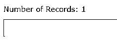

#### 6.差异

该函数返回一个测量两个字符表达式的 SOUNDEX()值的整数值。

**语法:**

`DIFFERENCE ( character_expression , character_expression )`

**自变量:**

*   **character_expression:** 可以是字符数据的字母数字表达式，可以是常量、变量或列。

返回类型

整数

**注意:** difference 比较两个不同的 SOUNDEX 值并返回一个整数值，该值表示 SOUNDEX 值在 0 到 4 的范围内匹配，其中 0 表示不匹配或零相似，4 表示完全匹配的字符串。

**结果:**

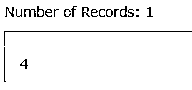

#### 7.版式

此 T-SQL 字符串函数返回指定格式和可选区域性的格式化字符串值。使用此函数进行日期时间和数值的区域设置格式化。

**语法:**

`FORMAT ( value, format [, culture ] )`

**自变量:**

*   **Value:** 必选，需要格式化的数值。
*   **格式:**必选，定义格式模式
*   **文化:**可选，定义一个本地文化

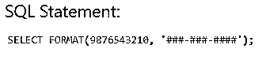

**结果:**

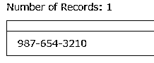

#### 8.左边的

该函数返回从左侧开始的指定数量的字符。

**语法:**

`LEFT ( character_expression , integer_expression )`

**自变量:**

*   **character_expression:** 必选，表示从中提取字符的字符串
*   **integer_expression:** 必选，表示要提取的字符数。

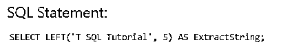

**结果:**

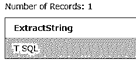

#### 9.低输入联网（low-entry networking 的缩写）

此 T-SQL 字符串函数返回指定字符串的字符数。

**语法:**

`LEN ( string_expression )`

**自变量:**

*   **string_expression:** 长度待定的字符串变量。它可以是常量、字符串变量或列。

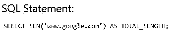

**结果:**

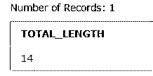

#### 10.降低

该函数在将大写字符转换为小写字符后返回字符串表达式。

**语法:**

`LOWER ( character_expression )`

**自变量:**

*   **character_expression:** 表示需要转换小写的字符串。

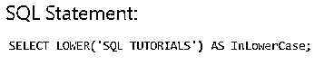

**结果:**

**

** 

#### 11.LTRIM(即时通讯)

此 T-SQL 字符串函数返回删除前导空格后的字符表达式。

**语法:**

`LTRIM ( character_expression )`

**自变量:**

*   **character_expression:** 必填字段，要删除前导空格的字符串变量。

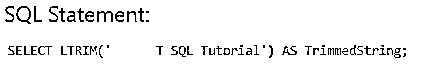

**结果:**

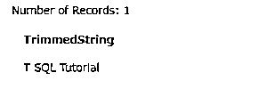

#### 12\. NCHAR

此函数返回由 Unicode 标准定义的指定整数代码的 Unicode 字符。

**语法:**

`NCHAR ( integer_expression )`

**自变量:**

*   **integer_expression:** 它可以是一个从 0 到 6535 的正整数值，如果指定的值大于该值，则返回 Null。

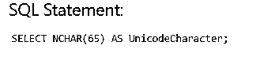

**结果:**

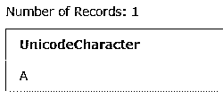

#### 13.PATINDEX

此 T-SQL 字符串函数返回指定字符串表达式中指定模式的第一个匹配项的索引。

**语法:**

`PATINDEX ( '%pattern%' , expression )`

**自变量:**

*   **模式:**需要一个字段，这是一个字符表达式，包含一个要在字符串表达式中找到的序列。模式中也可以使用通配符，最多 8000 个字符。它必须被%包围。
*   **表达式:**可以是要搜索指定模式的列。

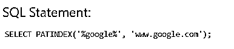

**结果:**

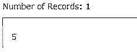

#### 14.替换

此函数用另一个值替换所有出现的指定字符串值。

**语法:**

`REPLACE ( string_expression , string_pattern , string_replacement )`

**自变量:**

*   **string_expression:** 必选，这是要搜索的字符串表达式。
*   **string_pattern:** 必选，这是要在字符串表达式中找到的字符串模式。
*   **string_replacement:** 必选，替换字符串模式的字符串。

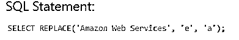

**结果:**

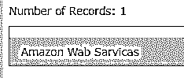

#### 15.子链

这个函数从字符串中提取指定的字符。

**语法:**

`SUBSTRING ( expression ,start , length )`

**自变量:**

*   **表达式:**必需，定义要从中提取零件的字符串表达式。
*   **Start:** 必选，定义字符串提取的起始索引。
*   **Length:** 必需，定义字符串必须提取到的长度。

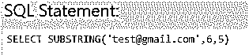

**结果:**

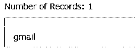

#### 16.反面的

此函数逐字符反转字符串表达式，并返回反转后的字符串。

**语法:**

`REVERSE ( string_expression )`

**自变量:**

*   **String_expression:** 需要，定义要反转的字符串。

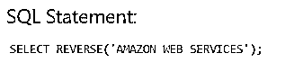

**结果:**

**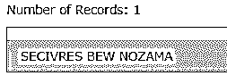

** 

### 结论

在本教程中，我们学习了常用且极其有用的字符串函数。这些字符串函数通常在编写复杂的存储过程和触发器时使用。您还可以使用预定义的函数创建自定义字符串函数。这将在本教程的后面部分讨论。

### 推荐文章

这是 T-SQL 字符串函数的指南。这里，我们借助语法和结果讨论了 T-SQL 字符串函数的工作方式。您也可以阅读以下文章了解更多信息:

1.  [T-SQL 命令](https://www.educba.com/t-sql-commands/)
2.  [MySQL 简介](https://www.educba.com/introduction-to-mysql/)
3.  [SQL 命令](https://www.educba.com/sql-commands/)
4.  [SQL 的使用](https://www.educba.com/uses-of-sql/)

