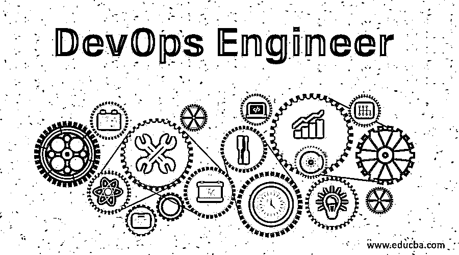

# DevOps 工程师

> 原文：<https://www.educba.com/devops-engineer/>

## DevOps 工程师简介

DevOps 工程师是一种帮助组织进行更快和更可靠的软件交付生命周期管理的工作角色。DevOps 专业人员与开发团队、测试团队和 IT 基础架构团队或云管理员一起协作完成任务和流程。DevOps 工程师精通多种用于源代码管理、构建和部署自动化的工具和技术。

除了标准工具之外，DevOps 工程师通常使用云平台，如 AWS、Azure、GCP 和 IBM Cloud。DevOps 工程师管理某些任务，例如使用 python 脚本或类似语言的基础设施供应和作业调度。

<small>Hadoop、数据科学、统计学&其他</small>

### 为什么我们需要 DevOps 工程师？

*   我们需要 DevOps 工程师或 DevOps 以比传统流程更短的时间和更高效的方式完成工作。我们需要一个 DevOps 工程师来统一所有团队之间的事情。例如，开发团队正在 windows 环境下开发模块，而测试团队正在使用 [Linux 或 Mac](https://www.educba.com/linux-vs-mac/) 环境，但生产环境是 Ubuntu 等其他环境，那么我们可能会在部署产品后看到许多问题，因为开发是在一个环境中完成的，而测试是在其他环境中完成的。
*   为了解决这类问题，DevOps 工程师和工具需要克服这种情况，代码将在任何环境下工作。我们需要一个 DevOps 工程师，以更少的时间和更高的生产率实现软件开发；发布可能会非常频繁，工作可以分成小任务并分配给适当的团队，我们可以轻松地回滚到以前的版本，这将降低公司的成本。

### DevOps 工程师的角色和职责

DevOps 工程师的角色和职责包括但不限于:

*   设计、构建、测试、部署和维护 CI/CD 工具，如 Jenkins、Dockers、[集成工具，如 Git、](https://www.educba.com/what-is-git/) Maven 和其他工具。
*   需要了解不同的工具和流程，以及根据业务需求选择什么。
*   DevOps 工程师必须能够自动化测试、部署工具、基础架构代码、填充结果并显示在仪表板上。
*   DevOps 工程师需要在开发、系统团队、测试和基础设施团队等团队之间进行协作，并在规定的时间内频繁地向客户交付应用程序/产品。
*   DevOps 工程师需要了解开发团队使用的不同工具，以及如何与库、数据库、邮件系统等组件集成，以交流和发布软件。
*   它们需要用行业中使用的最新技术和工具进行更新。
*   他们需要跳出思维定势，实施解决方案，并能够处理紧急情况。
*   他们需要扩展系统和基础设施，需要确保系统和服务对开发人员和测试人员的可用性。
*   为了在团队中有效地沟通，他们需要成为一个有效的沟通者。

### DevOps 工程师所需的技能

以下是 DevOps 工程师所需的技能:

1.他们需要在不同的环境中拥有部署技能，以部署机器和不同的自动化工具，如 chef、puppet 和 Ansible，以自动化部署。在[私有云](https://www.educba.com/what-is-private-cloud/)、公共云域等中部署虚拟机的虚拟化技能。

2.他们需要具备 AWS、Azure 和 Google cloud 等云技术以及 Kubernetes 等集群技术方面的工作经验，以便随时部署和维护日程表。

3.能够以这样一种方式设计体系结构，即它可以根据客户要求扩展基础架构。

4.他们需要有不同编程语言的编程和脚本编写经验，如 python、JavaScript、Perl 等。以及如何使用 web APIs 和[使用 restful 服务](https://www.educba.com/restful-services/)。

5.需要具备整合不同软件工具、CI/CD 工具、部署工具如 Jenkins、Ansible、Puppet、Git 等的技能。并且自动化整个集成和部署过程，以便将来不需要手动干预。

6.他们需要像客户一样思考，需要更好的沟通技巧，以便能够轻松地与组织中的其他团队沟通和协作。

7.他们需要了解不同用途的不同工具，

*   **源代码控制(源代码库控制):** Git，BitBucket，SVN，Mercurial。
*   **云技术:** AWS，Azure，和 Google Cloud。
*   **持续整合与持续部署:**詹金斯、竹子等。
*   **基础设施自动化工具:** Ansible、Puppet、Chef 等。要自动创建环境，需要使用模板安装软件包。
*   **部署:**为了有效地进行部署，我们需要了解使用 Kubernetes 管理集群(一组 Docker 映像)的容器化。

8.他们需要具备网络和安全方面的知识，以确保一切都得到简化，并且不会影响日常业务活动。这将启用适当的防火墙，以便只有所需的流量才能进入并访问服务和应用程序。

9.他们需要具备出色的调试和验证技能，以便他能够调试问题，并能够尽快提供修复方案，从而使生产或日常回归不会影响日常业务活动。

10.他们需要有像 Nagios 这样的监控工具的经验，这将持续监控仪表板。

11.他们需要有 web API 的工作经验，以便我们可以在 AWS、Azure 和 Google cloud 等云提供商中实现自动化部署。

### DevOps 工程师的职业道路

*   DevOps 工程师每天都有许多工作机会或工作角色涌现。一些工作，如 DevOps 架构师、软件测试工程师、系统工程师、自动化工程师、云工程师、安全工程师、集成工程师、AWS web 服务工程师和发布工程经理。
*   对 DevOps 工程师的需求很大，职位空缺数量逐年增加，3-5 年经验的平均工资为 75 万英镑，5-10 年经验的平均工资为 100 万至 200 万英镑。因此，DevOps 工程师在行业中有很多机会。

### 结论

最后，都是关于 DevOps 工程师的。我们讨论了谁是 DevOps 工程师，我们为什么需要 DevOps 工程师，DevOps 工程师的角色和职责是什么，需要什么技能，在 DevOps 的职业道路等。因此，我们可以说 DevOps 工程师不局限于某个特定的角色，因为他需要用不同的技能处理不同领域的多项任务。希望你看完这篇文章后对 DevOps engineer 有更深入的了解。

### 推荐文章

这是 DevOps 工程师指南。这里我们讨论一下为什么我们需要一个 DevOps 工程师？角色和责任、技能和职业道路。您也可以阅读以下文章，了解更多信息——

1.  [开发运维的不同优势](https://www.educba.com/benefits-of-devops/)
2.  [devo PS 十大工具](https://www.educba.com/devops-tools/)
3.  [devo PS 自动化的最佳工具](https://www.educba.com/devops-automation-tool/)
4.  [敏捷和 DevOps 是如何重叠的？](https://www.educba.com/agile-devops/)

