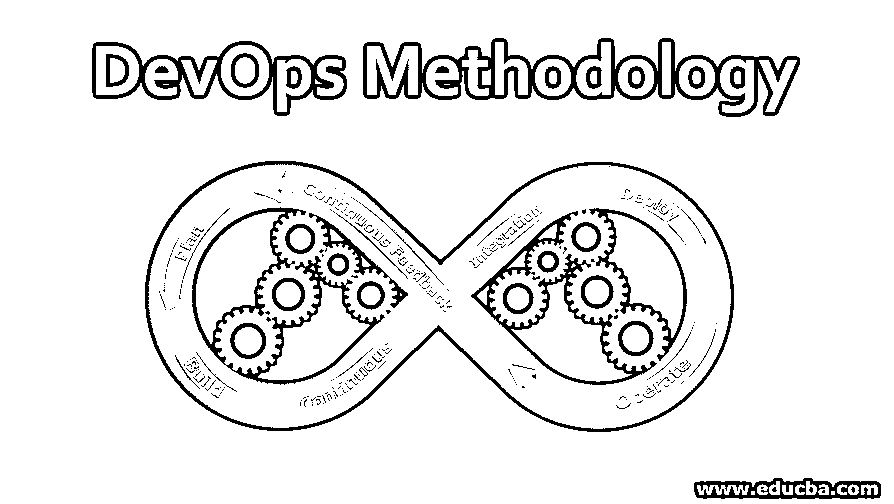
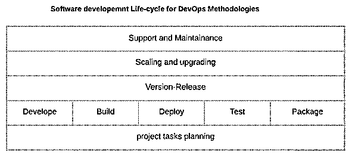
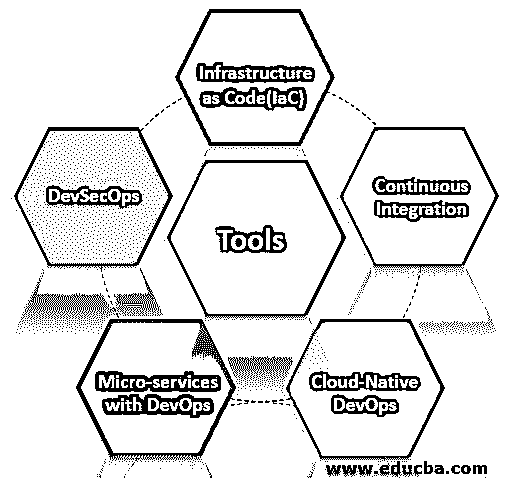

# DevOps 方法

> 原文：<https://www.educba.com/devops-methodology/>

## DevOps 方法简介

DevOps 方法是一个概念，它集成了开发团队和运营团队的任务，以实现高效的软件生命周期管理。开发运维中涉及多种方法，如基础设施即代码、持续集成和持续部署(CI/CD)、云原生开发运维、开发运维微服务和开发运维。这是一个不断发展的领域，使用了多种开源和企业工具。随着云和 Saas 服务的日益流行，云供应商(如 AWS、Azure)可以将 DevOps 方法作为托管服务提供，并提供一些附加功能和支持。DevOps 方法实施专业技能在行业中需求量很大。

DevOps 方法包括几个实践，如:

<small>Hadoop、数据科学、统计学&其他</small>

*   基础设施作为代码
*   持续集成持续部署(CI/CD)
*   CloudNative DevOps
*   采用 DevOps 的微服务

### DevOps 方法生命周期的阶段

在详细介绍每种方法之前，让我们了解一下软件项目生命周期[中涉及的阶段，DevOps](https://www.educba.com/what-is-devops/) 方法可以帮助优化这些阶段。

**1。项目任务规划:**这主要涉及软件生命周期的项目管理方面。Scrum sprint 或敏捷是业界首选的实践。

**2。开发:**这是项目的主要部分，涉及源代码开发和代码协作。

**3。构建代码:**构建代码是代码编译或者将代码转换为可部署格式的一部分。

**4。部署代码:**在测试或沙箱或生产服务器中的部署，这是项目或软件的运行时环境。

**5。测试已部署的资源:**测试是测试服务器中已部署代码质量保证的一个重要阶段。

**6。打包工件:**可能会涉及到一个阶段，该阶段将打包可以通过各种渠道共享的生产就绪的可部署工件。

7 .**。版本发布周期:**这包括增强和新版本发布周期。

**8。伸缩和升级:**这涉及到性能优化和基础设施伸缩，以实现可部署工件或服务的负载平衡。

**9。服务的支持和维护:**这涉及服务或应用程序的生产支持和监控、问题上报、问题修复和解决。

### DevOps 方法论的工具

下面给出了 DevOps 方法的工具:

#### 1.基础设施即代码(IaC)

IaC 是一种用于基础设施管理的编程方法的实践，它支持系统的开发实践，该系统可以根据系统供应和配置的要求自动扩展。有几种脚本语言用于管理 IaC。

一些常用的脚本语言有:

*   Python 脚本
*   命令过程
*   Windows PowerShell 脚本
*   批处理脚本

除了标准的脚本语言，市场上还有几种工具可以非常有效地管理配置自动化。

一些常用的配置自动化或 IaC 工具有:

*   Ansible
*   厨师
*   木偶
*   AWS 云形成(模板化基础设施供应)

#### 2.持续集成持续部署(CI/CD)

持续集成是一种 DevOps 方法，用于将开发的源代码自动集成到构建的环境中，持续部署是将生成的构建文件或工件部署到相关的部署环境中。

1.一些常见的实践涉及到使用 IDE 开发代码，IDE 是用版本控制系统的代码库配置的。

*   **举例:** Eclipse [IDE 可以使用一些附加插件配置](https://www.educba.com/what-is-ide/)到几个版本控制系统。

2.在版本控制系统上存储代码库。

*   **例子:** Git，Svn 仓库。Git 是当今最流行的代码库，它有几个托管服务版本，如 GitHub、GitLab & BitBucket。

3.对于构建自动化，业界使用了一些众所周知的工具。

一些最常用的构建自动化工具有:

*   **例子:** Maven，Ant，Gradle

4.通过脚本管理构建并使用一些集成管道工具，如:

*   **例子:**詹金斯，竹子

DevOps CI/CD 主要用于自动化交付渠道。对于一个有效的交付管道过程，软件项目要经过几个组件或阶段。这些可能因组织或应用程序而异。

#### 3.云原生 DevOps

在这种方法中，容器和云实现是开发操作的一部分，这使得代码更加可移植、可靠、轻量和易于部署。

在这种情况下，有几种流行的虚拟化工具，这些工具的大多数场景都是在云上实现的。

一些最常用的工具是:

*   码头集装箱
*   库伯内特斯
*   [码头工人群](https://www.educba.com/what-is-docker-swarm/)
*   无赖

类似地，云提供商以 DevOps 解决方案或 DevOps 即服务的形式提供托管服务。

最受欢迎的云提供商有:

*   自动警报系统
*   微软 Azure

这个云提供商正在提供一些开源工具，作为他们的云服务的一部分，并提供一些附加功能。

#### 4.DevOps 微服务

*   微服务是对 DevOps 的集成，以提供额外的功能。
*   微服务可以与 DevOps 实践相结合，通过加速项目生命周期来实现更好的持续集成和持续部署。基本上，微服务是软件项目或服务的模块化功能，以敏捷的方式独立开发和管理，以更快和优化项目交付。
*   通过采用微服务方法，DevOps 可以非常有用，因为参与项目的各个团队不需要相互等待，DevOps 实现自动执行代码共享和操作协作工作。
*   容器和无服务器计算是微服务支持 DevOps 的首选技术
*   **示例:** [AWS 提供亚马逊](https://www.educba.com/what-is-aws/)弹性容器服务和 [AWs Lambda 作为](https://www.educba.com/what-is-aws-lambda/) DevOps 微服务产品的一部分。

#### 5.DevSecOps

DevSecOps 是对 DevOps 的集成，以提供额外的功能。DevSecOps 方法是一个安全配置过程，为开发运维的每个阶段或方法启用各种安全功能。由于新技术和监控工具的快速实施，开发运维中的安全问题成为一些组织的主要障碍，这主要与治理或合规性有关。

安全因素(sec)位于任何其他 DevOps 方法之上，将安全性视为 DevOps 实施计划中的优先事项。对于一般的 DevOps 来说，这个实现相对复杂。更多的是关于实施团队的心态和理解，以坚持新的安全实践集，将新的基于安全的工具添加到技术堆栈的开发运维中。

有一些基本的安全实现将被用作 DevSecOps:

*   漏洞扫描
*   身份访问管理
*   防火墙
*   安全策略配置
*   添加 devops 工具时的正确身份验证机制

### 结论

DevOps 是 IT 行业中一个不断发展的概念，越来越多的技术和概念被添加进来，并越来越受欢迎。它打破了传统的系统管理、软件开发和产品交付的工作角色。事实上，主要的 IT 工作人员已经意识到并掌握了开发运维。

### 推荐文章

这是 DevOps 方法论指南。在这里，我们讨论 DevOps 方法的各个阶段及其各种工具，如 IaC、CI/CD 等等。你也可以看看下面的文章来了解更多-

1.  [DevOps 架构](https://www.educba.com/devops-architecture/)
2.  [DevOps 服务](https://www.educba.com/devops-services/)
3.  [开发运维的优势](https://www.educba.com/benefits-of-devops/)
4.  [Java 中的静态关键字](https://www.educba.com/static-keyword-in-java/) [DevOps 自动化工具](https://www.educba.com/devops-automation-tool/)

