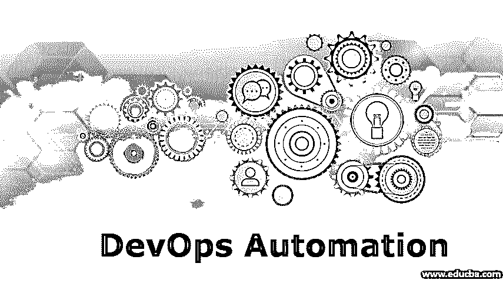

# DevOps 自动化

> 原文：<https://www.educba.com/devops-automation/>

## DevOps 自动化简介

DevOps 是一种被许多组织所接受的方法，但是在开发团队和运营团队之间建立联系的主要事实在某处被牺牲了。这就是我们需要 DevOps 自动化来消除和克服那些现有故障的地方。

### 为什么我们在 DevOps 中需要自动化？

DevOps 是一种从传统软件实践到现代软件交付实践的巨大转变，它也不会影响质量。为了完全采用这种方法，必须投入大量的努力来理解已经遵循的敏捷和旧的瀑布模型的约定方式，利益相关者或开发人员以及测试团队和开发团队。我们将举一个例子来理解为什么我们在 DevOps 中需要自动化。当一个客户产品投入生产时，它被认为经历了软件开发生命周期的不同阶段。从开发到部署的每个阶段都包括大量的手工工作。因此，如果我们自动化并改变所有的阶段，而不涉及开发人员和利益相关者之间太多的手动工作，会怎么样呢？

<small>Hadoop、数据科学、统计学&其他</small>

为了更好地理解，我们可以再举一个例子，比如提出变更请求或票证的老方法。客户将首先提出问题或票证。然后，它将被转发给 It 团队，然后 IT 团队将进一步将其发送给运营团队，并将其发送回运营团队进行测试，从而导致所有团队之间的沟通中断和耗时的流程。最重要的是阻碍了最终的反馈回路。

### 自动化在 DevOps 中是如何工作的？

DevOps 的自动化已经成为交付高质量产品的一种非常强大和有用的方式，在软件开发生命周期的每个阶段都有持续的集成。通过将工具与开发到部署的每个阶段相结合，自动化的本质变得更强。开发团队中的开发人员将使用 git 或 SVN 来维护他们的高质量代码结构和流程，他们将使用各种工具编写单元测试用例，并通过使用 Jenkins 或 Hudson 进行集成的测试环境来测试和维护构建。

类似地，Staging Environment 可以通过 bash 脚本使用管道来简化整个手动过程。但是，这完全取决于项目需求，即在各个构建的每个阶段，集成实际上是如何发生的。其次是可以利用任何监控工具的生产环境。因此，为了维护项目的端到端流程，如果使用一组理想的工具和技术进行集成，那么只剩下最少的手工工作。它为各个阶段的所有团队提供了一个很好的视角，让他们能够保持同步，缩小彼此之间的差距。持续的反馈增强了 SDLC 的整个逻辑流程，并使其自动化。

### DevOps 自动化工具

只有数以千计的工具可用于开发运维，但我还是要说，这完全取决于项目需求和这些工具的使用方式。

让我们看看如何在 SDLC 或一般产品开发的每个阶段使用工具:

*   **持续开发:**持续开发包括持续计划和持续集成，这可能涉及到像 git SVN 和 bitbucket 这样的工具来维护代码结构或版本控制。
*   **持续测试:**当开发团队分叉一个分支并提交代码时，测试团队将获取测试分支，然后反馈给测试团队，在测试团队中可以使用 Jenkins、Hudson 和 bamboo 等工具来维护单元测试等构建。
*   **连续交付:**连续交付包括打包和制作部署到一个资源中的应用程序。Docker 和 OpenStack 等工具用于将产品部署和交付到生产环境中。
*   **持续监控:**持续监控包括使用 Nagios、Kubernetes 等监控工具的生产阶段。连续的反馈和循环也是对整个自动化过程的一种增强，从而使其更加强大。

### 在 DevOps 中使用自动化的优势

以下是 DevOps 自动化的优势:

1.  **优质产品:**当产品从开发阶段开始时，确保持续计划和持续集成开始。这就是即兴创作开始的地方。
2.  **客户满意度:**当最终客户得到一个有最少 bug 和缺陷的产品时，最终客户对你的产品的信心和信任会增加。
3.  **缩短上市时间:**自动化降低了产品发布周期的繁琐程度，因为它涉及快速部署和持续改进。
4.  **弥合团队之间的差距:**[devo PS 工程师](https://www.educba.com/devops-engineer/)有能力通过让所有团队同步并协调所有团队来维持和弥合差距，这是下一个创新。
5.  **缩短和自动化的工作流程:**持续的部署和开发链实现了自动化，这使得整个流程变得快速和即兴。
6.  **资源管理:** DevOps 帮助管理和维护与服务器和虚拟化相关的整个云和基础架构。Openstack 和 AWS 等开源软件帮助维护了部署的机器和基础设施维护的堆栈和服务器。
7.  **安全性和更少的风险:**由于产品开发的整个 SDLC 涉及并经历持续的反馈或持续的集成和持续的开发，因此最终会提升产品而不会妨碍安全性问题。
8.  **出站监控:**持续检查仪表板上的实时项目，发布版本并轻松修复缺陷。
9.  **持续集成和持续交付:**像 SonarQube 这样的工具(一种静态代码分析工具)有助于建议和提供系统的持续代码分析，而无需在系统之间切换和进行剧烈的改变，交付因素不会受到阻碍。
10.  **业务改进:**整个组织的业务部门可以专注于即兴创作和其他创新项目，而不是关注项目管理。

### 结论

DevOps 不是传统或常规的自动化方法，但它不能被忽视，必须采取措施打破手动操作的孤岛，以免影响质量和客户满意度。虽然采用 DevOps 自动化并不容易，但一旦采用，就可以简化任务，使其变得容易，为更多创新、创意和质量问题留出时间，以便根据产品改进的需要进行检查。

### 推荐文章

这是 DevOps 自动化指南。在这里，我们讨论 DevOps 自动化的介绍，以及 DevOps 中使用的重要工具及其优势。您也可以浏览我们的相关文章，了解更多信息——

1.  [你应该知道的开发运维的 16 大好处](https://www.educba.com/benefits-of-devops/)
2.  [DevOps 架构&组件与功能](https://www.educba.com/devops-architecture/)
3.  [devo PS 测试工具列表介绍](https://www.educba.com/devops-testing-tools/)
4.  [关于 DevOps 生命周期的完整教程](https://www.educba.com/devops-lifecycle/)

