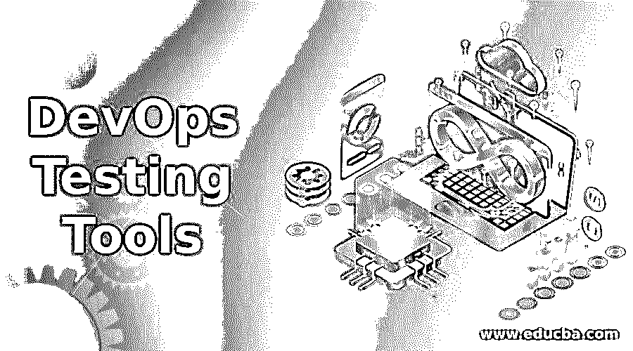
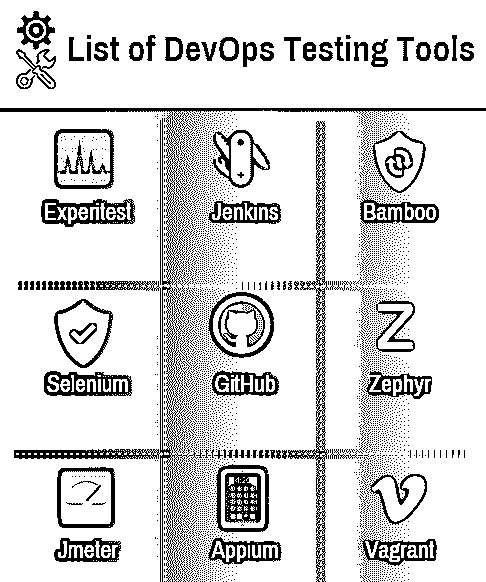

# DevOps 测试工具

> 原文：<https://www.educba.com/devops-testing-tools/>

## DevOps 测试工具简介

下面的文章提供了 DevOps 测试工具的概要。 [DevOps 有利于](https://www.educba.com/what-is-devops/)更大的产品开发项目，反过来，挑选需要专注于保证高质量产品创造和实施的未考虑的额外领域。除了开发和测试之外，还有许多其他的职责需要处理，这样产品开发生命周期才能顺利地通过各个阶段。它有助于保持项目的敏捷性，保持开发过程的一致性，以及部署规划&使用 DevOps，及时交付变得很容易。

### DevOps 测试工具列表

下面列出了最好的 DevOps 测试工具:

<small>Hadoop、数据科学、统计学&其他</small>

#### 1.实验测试

这是跨浏览器测试和电话应用的领先平台。

**主要特性:**

*   大规模测试的执行。
*   与开源工具以及 [selenium 和 Appium](https://www.educba.com/appium-vs-selenium/) 完全一致。
*   开发新的应用程序测试或实施一个令人兴奋的项目。
*   与诸如 TeamCity、Jenkins 等 CL 工具相结合。
*   享受安全性、可见性和企业级可扩展性。

#### 2.詹金斯

Jenkins 是用 Java 编写的，它也是一个开源的自动化服务器。Jenkins 是一个基于服务器的系统，运行在 T2 的 Apache Tomca servlet 容器上。Jenkins 可用于诸如构建、开发程序或应用程序以及[测试软件](https://www.educba.com/what-is-software-testing/)等任务。

**主要特性:**

*   我们可以很容易地将其安装在任何平台上，如 Linux、Mac OS 和 Windows。
*   你可以很容易地将你的工作分配到不同的机器上。
*   在 web 界面的帮助下，它可以很容易地进行配置和设置。
*   Jenkins 对 Shell 和 Windows 命令的执行处于预构建步骤。
*   这里是你可以下载 Jenkins 的链接:[点击这里](https://www.jenkins.io/download/)

#### 3.竹子

Bamboo 是一个持续集成和部署工具。它用于 DevOps 的测试。Bamboo 支持多种语言和技术，如 Ducker、SVN、亚马逊 S3 桶等。

**主要特性:**

*   立竹很容易。
*   运行平行批次的测试。
*   它可以基于存储库更改触发推送位桶通知。
*   这里是你可以下载竹子的链接:[点击这里](https://www.atlassian.com/software/bamboo)

#### 4.硒

[Selenium 是一个](https://www.educba.com/what-is-selenium/)开源工具，是自动化测试最流行的工具。它是专门为支持自动化测试的各种浏览器而设计的。

**主要特性:**

*   它支持 Java、C#、PHP、Safari 等语言。
*   与其他测试工具相比，selenium 需要的资源非常少。
*   使用这个测试工具准备的测试用例可以在任何操作系统上执行。
*   它还支持不同的平台，如 Windows、Mac OS 等。
*   这里是你可以下载 Selenium 的链接:[点击这里](https://www.selenium.dev/downloads/)

#### 5.GitHub

这是一个基于网络的[托管服务器](https://www.educba.com/what-is-hosting/)和版本，学科应用 GitHub。我们也可以说 GitHub 是一个内容追踪器。它也用于存储内容，但由于她的特性，主要是存储在代码中。

**主要特性:**

*   GitHub 有 SSL 安全。
*   它还具有第三方集成。
*   GitHub 将保持您的公共和私人代码可用，受到保护。
*   大约有 600 万个 Gits 托管的存储库。
*   我们可以在代码中使用拖放选项，这样可以立即复制和粘贴代码，从而节省大量时间。
*   这里是下载 GitHub 的链接:[点击下载](https://git-scm.com/downloads)

#### 6.泽法

泽法是各种规模的敏捷团队的端到端解决方案。而且还具有极大的灵活性、可靠性和观察力，你需要发布更好的软件。

**主要特性:**

*   同化与吉拉，竹子，詹金斯，还有许多一步之遥。
*   它还拥有 DevOps 仪表板和高级分析技术。
*   它还具有 SSL 支持安全性和 24/7 的客户支持。
*   泽法有超过 50，000 名用户支持可扩展性。
*   这里是你可以下载泽法的链接[点击这里](https://zephyrplugins.github.io/download.html)

#### 7.Jmeter

[Jmeter 是 Apache 的项目](https://www.educba.com/what-is-jmeter/)。它也被称为桌面应用程序。这是一个开源的测试加载工具。Jmeter 有一个设计来衡量网站的成就。在 [DevOps 方法论](https://www.educba.com/devops-methodology/)中，我们可以使用负载工具测试。

**主要特性:**

*   Jmeter 是开源的，这就是它可以免费获得的原因。
*   Jmeter 也是一个独立的平台工具。
*   它支持 HTTP，JDBC，SOAP， [FTP 协议](https://www.educba.com/what-is-ftp/)。
*   测试结果有各种格式，如图表、表格、树和报告等。
*   JMeter 附带了一个交互式的简单 GUI。
*   JMeter 是用 java 开发编写的，可以在任何环境下运行。
*   这里是你可以下载 JMeter [的链接，点击下载](https://jmeter.apache.org/download_jmeter.cgi)

#### 8.Appium

这是一个用于测试移动应用的开源平台。您可以为您的移动应用程序、Android-iOS 和其他操作系统编写 UI 测试。它允许用户使用标准的 Web 驱动程序库来测试各种类型的移动应用(比如本地、混合和移动 Web)。

**主要特性:**

*   一步之内最快的安装之一。
*   本地或远程快速连接到移动设备。
*   它将在 IDE 中运行您的脚本。
*   这是一个简单的应用程序，需要非常少量的内存来进行测试。
*   这里是你可以下载该应用程序的链接:[http://appium.io/](http://appium.io/)

#### 9.无赖

它是 DevOps 的[测试工具。它在要构建和管理的单个工作流中使用虚拟机环境。它还用于提高开发人员的工作效率。](https://www.educba.com/devops-testing-tools/)

**主要特性:**

*   这是一个非常强大的工具，简单易用。
*   流浪者工作起来像 OS Mac，Linux 和 Windows 无害
*   没有困难的设置；只需下载并点击安装。
*   这里是你可以下载流浪者的链接:[点击这里](https://www.vagrantup.com/downloads)

### 结论

DevOps 是开发团队和运营团队之间的协作方法。DevOps 允许根据贵公司和客户的需求提高交货速度。

### 推荐文章

这是 DevOps 测试工具的指南。这里我们讨论了最佳 DevOps 测试工具的介绍和列表。您也可以浏览我们推荐的其他文章，了解更多信息——

1.  DevOps 是个好职业吗？
2.  [什么是 Java 继承？](https://www.educba.com/what-is-java-inheritance/)
3.  [c#中的设计模式是什么？](https://www.educba.com/what-is-design-pattern-in-c-sharp/)
4.  [什么是 Maven 插件？](https://www.educba.com/what-is-maven-plugins/)

