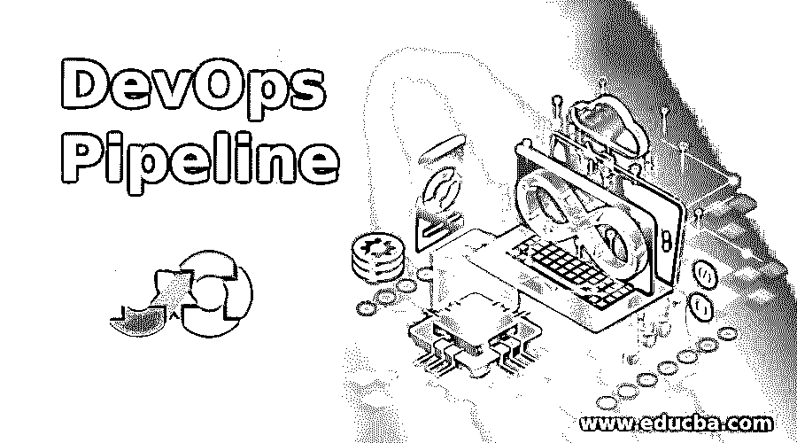
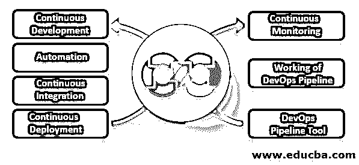

# DevOps 管道

> 原文：<https://www.educba.com/devops-pipeline/>

## DevOps 管道的定义

DevOps 管道是包括阶段形式的阶段的管道。每个阶段都包括遵循持续集成和开发规则的自动化的手动操作。DevOps 管道的主要和最漂亮的特性是，它为开发人员、测试人员和自动化团队提供了一个简化复杂的开发和部署流程的环境，因为它是以一种满足 DevOps 生命周期不同阶段(开发、测试、集成、质量保证、试运行、部署和生产)的方式构建的。

### 为什么我们需要 DevOps 管道？

DevOps 被认为是一个缩小开发人员和运营团队之间的差距、扩展敏捷方法或自动化任何流程的完整端到端流程的过程，但这并不意味着已经实现了整体 DevOps。许多其他因素会影响整个 [DevOps 生命周期](https://www.educba.com/devops-lifecycle/)。从真正的意义上来说，DevOps 管道为开发人员和测试人员创造了一个环境，让他们在现实中体验软件定义的生命周期阶段。自动化是软件世界中最重要的因素，但不影响产品的质量，这一点实际上由 DevOps 管道负责。因此，非常需要设计一个好的管道，并遵循 DevOps 管道中的阶段。

<small>Hadoop、数据科学、统计学&其他</small>

### DevOps 管道的组件

如果我们考虑 DevOps 管道，每个组织都会有不同的要求，这取决于组件。当然，有许多组件，但重点主要围绕几个强制性组件，没有这些组件，要用更少的时间获得完整的高质量产品，质量将需要时间。下面列出了 DevOps 管道的几个强制性组件:

*   持续开发(持续编码)
*   质量测试自动化
*   连续累计
*   持续部署
*   连续监视

#### 1.持续发展

它涉及整个组织的人员。无论是开发团队还是运营团队，他们都有同等的责任来确保编码环境是正确的，因为它将被转移到生产中。否则，如果代码的功能在中间中断或者不令人满意，那么将 DevOps 与 hope 结合的整个过程将变得毫无用处。目标是使用版本控制或任何好的工件来维护代码库，从而维护高质量的代码。

#### 2.质量测试自动化

测试是下一个至关重要的阶段，不仅在传统的软件生命周期实践方面，而且在 DevOps 生命周期方面。自动化与测试相结合，以应对更多的错误，并为开发人员提供使用自动化提供高质量代码的洞察力，这消耗更少的时间，并使开发人员和测试人员之间的相互作用过程变得容易。

#### 3.连续累计

当开发人员向测试人员提供代码库时，就执行了自动化测试；在发布和开发的每个阶段之后，代码库的持续集成也起着重要的作用。只有这样才能满足 DevOps 生命周期的另一个关键阶段。

#### 4.持续部署

如果没有将这个阶段作为组件引入到管道中，任何 DevOps 生命周期都是不完整的，因为这不仅包括具有主应用程序的容器或集群形式的阶段，而且该应用程序一旦部署，将进入最终客户的生产环境，并逐步发布。

#### 5.连续监视

最后，一个阶段是 DevOps 管道和 DevOps 生命周期不可避免的组成部分。已经使用了许多监控工具，但是同样，这取决于项目的需求，是否需要它们，因为在进入生产环境之前，在这些阶段中已经对是否交付产品以及应用程序或产品开发的每个功能是否按预期工作进行了持续的检查。

#### 6.在 DevOps 管道上工作

DevOps 管道的所有上述组件都扮演着关键角色。它将负责从端到端应用程序开发流程到应用程序部署的整个过程，持续集成和监控是它的另一个重要特性。不过话说回来，这要看情况，根据组织要求而变化。如果我们将编码作为主要需求，即提供编码环境，那么 DevOps 管道将以这种方式进行:

*   **代码提交或代码拉取:**代码库也使用工件和版本来维护。例如:SVN 的 git。
*   **持续测试:**在转移到测试人员之前，为开发人员创建一个测试驱动的环境。然后，使用 SonarQube，向开发人员提供带有建议的动态测试形式。
*   **持续集成:**一旦 Jenkins 完成测试，就执行持续集成。
*   **持续部署:**应用一旦容器化，就准备好部署了，这是使用许多容器化技术完成的，即 Docker 和 Kubernetes。
*   **持续监控:**使用 Nagios、AWS 等工具对应用程序进行全面、持续的检查。

#### 7.DevOps 管道工具

DevOps 管道的每一个阶段都需要一个工具，但是同样，有必要清楚地记住应用程序开发的需求。DevOps，这不仅仅是玩玩工具；这是一种优化整体端到端流程并简化从开发到部署的方法。这些工具可以列举如下:

*   **SVN、Git、Bitbucket:** 用于维护代码库的版本控制。
*   **sonar cube:**静态工具分析
*   詹金斯:持续集成和测试
*   **Allure 和 TestNG:** 用于生成测试报告
*   **Docker 和 Kubernetes:** 用于集装箱化和部署
*   **持续监控:** AWS 和 Nagios 等。

### DevOps 管道的优势

*   弥合团队之间的差距和依赖性。
*   单个应用程序流水线触发的时间优化。
*   可以使用定制的 DevOps 管道实现全面优化。
*   确保质量代码和产品交付给最终用户，从而提供客户满意度。

### 结论

DevOps 本身仍然是一个与市场同步发展的话题。许多组织不能完全接受或欢迎这种方法。尽管如此，对于每个开发人员来说，慢慢缩小和填补开发和运营团队之间的差距变得越来越困难。DevOps 管道增强了整个 DevOps 生命周期。

### 推荐文章

这是 DevOps 管道指南。这里我们讨论 DevOps 管道的介绍和组件，包括持续集成、部署等。您也可以看看以下文章，了解更多信息–

1.  [DevOps 方法学](https://www.educba.com/devops-methodology/)
2.  [DevOps 自动化](https://www.educba.com/devops-automation/)
3.  [DevOps 工具](https://www.educba.com/devops-tools/)
4.  [DevOps 服务](https://www.educba.com/devops-services/)

