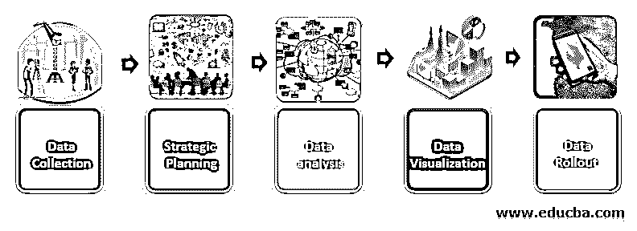
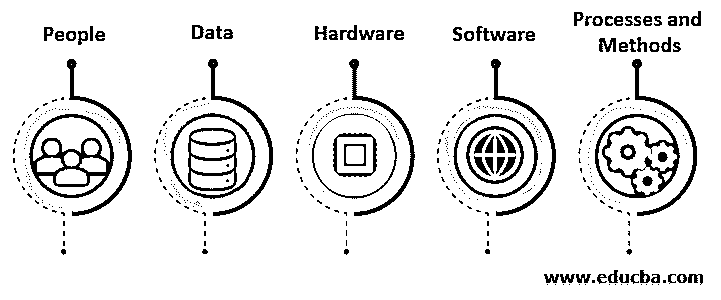
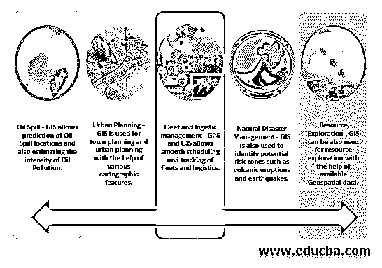

# GIS 是什么？

> 原文：<https://www.educba.com/what-is-gis/>

## 地理信息系统介绍

通俗地说，地理信息系统就是允许任何人或组织分析、存储和可视化与地理位置相关的数据的系统。例如，这些数据可以是任何数据，如经度或纬度、包含地址数据点的电子表格、卫星图像以及与任何行政边界分布相关的信息。这些数据被称为空间数据，用来存储这些数据的数据库被称为地理空间数据库。GIS 不仅仅局限于研究空间数据。尽管如此，它仍然包括开发、数据分析、编辑地图中的数据，甚至实践操作——与之相关的物流管理。

### GIS 是如何工作的？

<small>Hadoop、数据科学、统计学&其他</small>

*   **数据收集:**现场工程师和现场工作人员使用各种高传感器摄像机和测量方法收集数据。
*   **战略规划:**采集的数据可以是光栅图像和坐标等矢量数据点两种类型。一组 GIS 经理和分析师坐在一起规划可交付成果。
*   **数据分析:** GIS 分析师、GIS 开发人员和技术人员与架构师一起处理分析和分析部分的工作。
*   **数据可视化:** GIS 技术人员和分析师在 BI 顾问的帮助下，致力于空间数据可视化后处理和分析的副产品。
*   **数据展示:**最终产品随后展示给最终消费者和战略合作伙伴/客户，并提供最新的地图和导航信息。消费者也可以选择反馈各种反馈和意见。

### 特征

一个有效的地理信息系统由 5 个关键部分组成。它们如下:

人员、数据、硬件、软件/应用程序和方法。

添加以上信息图是为了以互动图像格式展示 GIS 的一般组件。

#### 1.人

这是地理信息系统的重要因素之一。如果没有这个组件，这项技术将会受到限制。它的范围从使用复杂地理空间数据库的人到每天使用地图的消费者。

#### 2.数据

建立任何 GIS 的最有用和最重要的部分是收集和管理精确的空间数据。主要分为矢量和[栅格数据](https://www.educba.com/raster-data/)。矢量数据是关于坐标和形状的。然而，栅格数据完全是关于卫星影像源的。组织和机构也使用云和数据库管理系统来管理地理空间数据。

#### 3.五金器具

硬件对于管理大量地理空间数据和建立地理信息系统的复杂软件也至关重要。它可以是独立的、虚拟的或网络驱动的，具体取决于数据量。

#### 4.软件

硬件补充了系统的软件部分。该软件包括查询构建和处理工具、存储地理空间数据的数据库管理系统、操纵地理空间数据的输入和编辑工具以及便于从前端访问地理空间数据的图形用户界面。ESRI 是一个以 ArcGIS 命名的巨人。一些组织也有他们的专有软件。像 QGIS 这样的开源软件在 GIS 领域的学生和初学者中是众所周知的。

#### 5.流程和方法

地理信息系统需要适当的规划和方法。建立一个好的系统不是一朝一夕的事情。当然，组织需要遵循许多既定的流程和方法。像 HERE MAPS 这样的组织使用精益和改善方法来保持一流的数据质量和系统。

### 地理信息系统的应用

### 地理信息系统的优点和缺点

以下是优点和缺点:

| **优势** | **缺点** |
| 它可以处理多种数据格式和数据集。例如，卫星图像，向量数据点，如坐标，纬度和经度，来自无人机和高传感器相机的驱动文件。 | GIS 通常需要地质学、生物信息学或信息技术领域的训练有素的候选人。非 GIS 人员最终会彻底破坏设置。 |
| GIS 可以与各种硬件和软件集成，以创建一个健壮的环境。 | 没有可用的有意义的空间数据集和数据库，它是不完整的。 |
| 该系统可以分析过去的数据集，并根据趋势分析未来的预测。 | 人们和组织抱怨 GIS 的实施和集成非常昂贵。 |
| 它通过分析、管理和监测自然灾害，用于自然资源管理。 | 它需要将大量数据输入到系统中，因此，出现错误的可能性更大。 |
| 在数据收集、处理和可视化方面，它非常高效。 | 大多数情况下，组织无法实现功能全面的 GIS。 |
| 它可以很容易地记录地理变化，以供进一步分析。 | 数据的私密性和完整性是 GIS 的重要资产。当涉及到侵犯隐私时，它有更多的风险。 |

### GIS 领域的职业发展

*   在 GIS 领域工作不仅仅是数据分析和操作基于图形用户界面的软件。如今，GIS 的发展已经超出了教科书和大学中的定义。
*   随着数据分析、编程、后端技术甚至地理知识的融合，该领域的工作角色变得更加高级。随着数据科学和机器学习/人工智能在市场上蓬勃发展，这些组织还在系统中集成了基于 ML / AI 的模型，以提高预测和准确性。许多大学在他们的课程中提供地理信息学和 GIS 作为主要选修课。
*   像 HERE Maps、Bing Maps、Google Maps、Apple Maps、TomTom 和 ESRI 这样的基于产品的公司正在为即将到来的毕业生提供许多工作角色和职责。凯捷科技(Capgemini Technologies)和威利斯·塔沃森(Willis Tower Watson)等服务型公司利用地理信息系统建立制图模型，以识别潜在风险。
*   角色包括 GIS 技术人员、分析师、空间分析师、GIS 数据专家、GIS 开发人员和架构师。GIS 技术人员使用基于 GUI 的 [GIS 软件](https://www.educba.com/gis-software/)来构建地图。GIS 分析师和空间数据分析师处理通过各种来源获得和提取的空间数据。
*   GIS 开发人员和架构师与数据库工程师一起构建一个健壮的 GIS。架构师是创建整个体系结构的人，而整个项目或程序是由 GIS 项目或程序经理来编排的。
*   像这里的公司正在研究汽车导航和高级驾驶辅助系统。该组织本身是由戴姆勒、宝马和奥迪的著名财团资助的。
*   他们还与 DJI 等无人机公司整合各种地图。
*   苹果和谷歌主要面向低端消费者群体，提供台式机、手机和平板电脑体验。TomTom 一直是 GPS 设备领域的前沿。他们有各种各样的导航设备。

### 结论

很多组织和人总是低估这个系统的力量。他们认为这是一个昂贵的设置，投资回报率较低。然而，掌握这一领域的公司和个人在市场上蒸蒸日上，取得了巨大的成功。像 HERE Maps、Tele Atlas、Apple、Bing Maps 和 TomTom 这样的公司正在与 ESRI 和谷歌这样的科技巨头对抗。GIS 总是会有巨大的投资，但是如果用正确的方法规划事情，投资于此的组织将会获得收益。

### 推荐文章

这是一个什么是 GIS 的指南？.在这里，我们讨论地理信息系统的不同特征、工作、应用以及优缺点。您也可以浏览我们推荐的文章，了解更多信息——

1.  [八大免费数据分析工具](https://www.educba.com/free-data-analysis-tools/)
2.  [数据分析技术的类型](https://www.educba.com/types-of-data-analysis-techniques/)
3.  [什么是数据集成？](https://www.educba.com/what-is-data-integration/)
4.  [GIS 组件指南](https://www.educba.com/gis-components/)