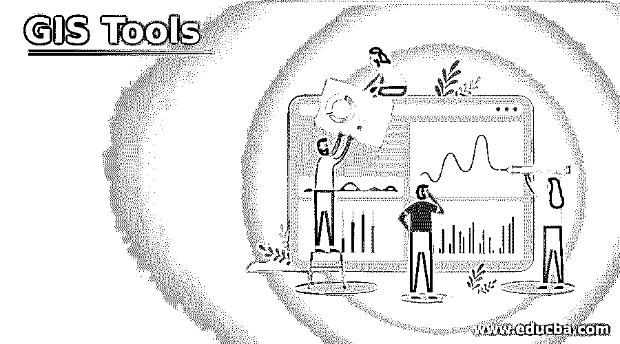

# GIS 工具

> 原文：<https://www.educba.com/gis-tools/>

## GIS 工具简介

GIS(地理信息系统)工具是作为 GIS 框架的一部分出现的工具。GIS 工具作为 GIS 框架的一部分，用于通过科学和数据分析来收集、分析、展示和管理大量数据。GIS 工具在科学和地理方面已经发展成为理解和深入学习地理信息的强大平台。GIS 工具使最终用户能够使用信息层、实时模拟和数据来操作和创建他们自己的数字地图，以便创建具有增强功能的应用程序来揭示模式和趋势。

### 不同的 GIS 工具

有许多 GIS 工具已经发展起来，但有些仍处于探索阶段。

<small>Hadoop、数据科学、统计学&其他</small>

**1。叠加工具:**几乎所有的叠加工具在概念上都是一样的，只是特征叠加不同。

*   **身份:**身份特征和输入特征是叠加工具的一部分，叠加工具用于获取工具身份特征的所有属性。
*   **更新:**更新要素也是叠加工具的一部分，用于将更新要素更新的输入要素的相交几何面积完全转换为输出要素类。
*   **对称差异:**作为叠加工具的一部分，对称差异侧重于输入和更新要素中不会与几何区域的输出要素发生冲突和覆盖的那些要素或部分要素。
*   **Intersect:** 该功能专门用于获取几何区域，该区域的焦点在公共区域上，用于覆盖和重叠所有信息层或要素类到输出类。
*   **联合:**所有输入要素计算都使用联合要素进行，所有相关属性都将被写入并出现在输出要素类中。

**2。栅格叠加工具:**栅格叠加工具也是 ArcGIS 扩展模块提供的一种叠加工具，它拥有单独的空间分析许可。

*   **加权求和:**该工具通过将每个叠加图乘以给定的权重并将所有内容相加，来帮助为多个叠加图提供栅格。
*   **加权叠加:**在该叠加中，栅格被处理，并通过添加低权重叠加为每个层分配权重。
*   **区域统计:**在该叠加图中，首先评估栅格中的值，然后将这些值添加到另一个图层中，形成区域。
*   **Combine:** 根据从几层输入中得到的组合和某些操作，将值分配给其他层的每个单元格。

**3。邻近工具:**有些邻近工具大致分为两类，如基于特征的邻近工具和基于栅格的距离工具。

**4。表工具:**许多 GIS 数据在本质上是庞大而复杂的，选择合适的支持数据表的工具对数据库处理大量数据及其分析操作起着重要的作用。

**5。插值工具:**这些工具专门用于按照要求的方式创建曲面，并帮助创建用于计算值的值，然后根据需要应用这些值。

**6。地形分析工具:**该 GIS 工具用于分析所有用于分析与地形、坡度等相关的不同表面的表面。

7 .**。可见性工具:**用于表面部分的可见性，用于观察表面的微小细节和用途。

**8。体积工具:**该工具用于测量与表面相关的体积信息。

**9。重新分类工具:**该工具用于对各种表面进行分类，并用于收集一些关于这些表面的有用信息。

有一些工具仅用于统计分析，这些工具在 GIS 数据中作为创建大量信息的信息出现，然后这些属性用作进一步分析的函数。地理处理工具在维护这些包含大量数据的统计分析中也发挥着重要作用。

上述工具大多是 ArcGIS Desktop 工具，在实施时需要遵循特定的规则和规定。

还有其他一些 GIS 工具，按以下方式列出和分组:

**1。一些远程 GIS 软件的可访问性:**

*   **ArcGIS for Desktop:** 该软件用于计算中心的研究，该计算中心用于提供 ArcGIS for Desktop 的学生副本。
*   **虚拟实验室(vLab):** 虚拟实验室(vLab)软件用于 GIS 的远程访问，由 GeoDa、ArcGIS 和 Google Earth Pro 组成。工作和操作需要遵循某些步骤。
*   **ArcGIS Online:** 该软件是一款完全依赖于网络的软件，用于通过使用一些要求输入 URL 的企业登录来查找、探索和分析空间数据。

**2。一些远程 GIS 工具以免费桌面的形式出现:**

*   Google Earth Pro: 该软件免费提供，用于创建、查看和显示空间数据和信息。
*   **QGIS:** 开源用于与 GoogleEarthPro 相同的基本添加，它也有助于发布。
*   适合学习 R 编程语言的知识分子，只需要下载可视化的包。
*   **GeoDa:** 免费开源的空间分析工具。

**3。作为流行的在线工具，Web GIS 中流行的许多工具:**

*   这个工具主要用于在地图上显示时间轴。
*   **Carto:** 该软件专门用于创建静态地图，用于维护可用性。
*   **手绘地图:**用于制作简单的类似图像的地图，然后将其导出。
*   **OpenStreetMaps:** 基于本地知识和人群来源的地图，用于编辑家乡工作。

**4。用于创建许多网络地图的许多编程库:**

*   **D3:** 这个库用于创建交互式的、数据驱动的地图和图表。
*   **传单:**这是一个 JavaScript 库，用于创建网络地图。

### 结论

地理信息系统工具有助于获得关于任何地理地形的适当信息，将科学研究与地理信息系统工具的使用相结合，有助于提供许多相关信息。使用这些工具进行的统计分析和数据处理执行了许多非常有用的操作。

### 推荐文章

这是一个 GIS 工具指南。为了更好地理解，我们在这里讨论了介绍以及不同的 GIS 工具。您也可以看看以下文章，了解更多信息–

1.  [什么是 GIS？](https://www.educba.com/what-is-gis/)
2.  [GIS 的应用](https://www.educba.com/applications-of-gis/)
3.  [GIS 组件](https://www.educba.com/gis-components/)
4.  [取证工具](https://www.educba.com/forensic-tools/)