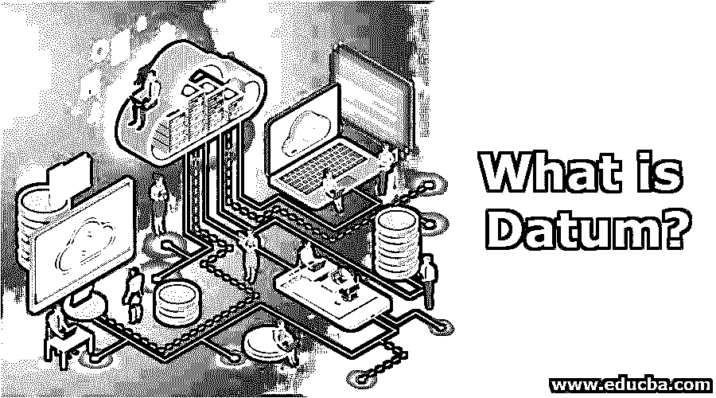

# 什么是数据？

> 原文：<https://www.educba.com/what-is-datum/>

## 基准介绍

数据是数据的单数形式。这个词很少在日常生活中使用，因此在我们当中很少见。数据可以是一条信息，也可以是任何工作的起点。这可以是任何参考点，在坐标的帮助下，可以从这里进行计算和测量。这对于进行分析以及基于事实点进行预测分析非常重要。在地理信息系统领域，矢量和栅格形式的信息可以定义为完美的数据。简而言之，在进行实验或观察后获得的随机参数称为数据。

### GIS 中为什么需要数据？

在地理信息系统中，数据是最重要的因素。在野外测量和大地测量的帮助下，收集数据用于进一步分析。大地测量学是地球科学领域的一种研究形式，其中专家们研究各种地质参数，如极地运动、地壳运动和潮汐运动等。

<small>Hadoop、数据科学、统计学&其他</small>

主要有两种类型:它们如下:

用于经度和纬度细节的水平基准面和用于理解地理特征的高度和深度的垂直基准面。地理信息系统完全是关于地质知识的，因此需要使用所有数据收集的信息来完成整个拼图。

例如，水平数据用于测量地球上的位置，垂直数据用于测量海平面或海拔高度的深度。

### GIS 中如何使用基准面？

在使用和创新卫星制图技术之前，计算测量值和进行投影的最佳方式是基于大地水准面(考虑海平面的地球形状)。随着测量技术的改进和数据采集方法的发展，计算特征和大地水准面的公式也得到改进。

地球不是一个完美的球体。这导致了定义我们星球确切形状的问题。在计算的帮助下，人类创造了一个简化投影的基准。然而，由于许多不规则性，不同的省、地区和国家有自己的数据集。它有助于大地测量人员了解坐标系，因为基准参考点保存在坐标系中。它以 DMS 格式保存，即度、分和秒。当基准面改变时，地理坐标系的坐标值也会改变。不同国家(WGS84、NAD27、BESSEL 1841)在协调值、经度和纬度信息的帮助下建立了多个合法的标准化数据。它同样可以与各种地理信息系统集成，了解不同地区的地形地貌。ArcGIS 是使用大量基准数据的完整地理信息系统的完美范例。地理坐标系统和全球定位系统的融合在识别层上的缺陷和偏移方面变得更加精确。

### 地理信息系统中数据是如何工作的？

在地理信息系统中，单一地图或场景中不共享同一地理坐标系统的数据，需要进行地理转换。地理变换将坐标值从一个地理坐标系转换到另一个地理坐标系。在处理数据时，GIS 分析师和技术人员会向地图添加多个图层来转换坐标值。

当谈到在地理信息系统中工作时，它仅指两个与转换相关的协调系统。一个是世界大地测量系统，另一个是中国大地坐标系统。与世界大地坐标系统不同，中国大地坐标系统不提供自定义功能。像 ArcGIS 这样的企业软件系统利用 GIS 爱好者来进行地理基准转换。GIS 分析师和技术人员处理所有可用的坐标级别和标准基准面计算，同时。

GIS 数据有助于分析人员了解海平面的深度和测量山脉的高度。与山的高度、河的长度、海洋的深度甚至任何湖的面积相关的地理信息可以保存在通过数据提取的地理信息系统中。大多数组织都是以坐标值为基础来构建他们的地理信息系统。关于不同坐标的信息保存在系统的关系数据库中。这些信息将进一步用于地图地理编码和解决现有数据中的漏洞。

### 基准的优势

以下是 GIS 中数据的一些优势:

*   地理学家和测量员用于创建洪泛区地图、地产边界、施工测量和堤坝设计(为自然灾害修建的堤坝)的参考点。
*   数据用于投影，如将 3D 模型转换为 2D 模型、地壳监测以及勘测边界划定(任何特征的勘测相关边界)
*   全球定位系统使用数据来理解坐标的移动。
*   测地学家主要使用它来计算水体运动，如潮汐运动，海平面变化，甚至河流宽度的变化。
*   基准有助于进行重复性尺寸测量。
*   它也有助于交流部分功能运动和关系。

### 结论

主题的这一部分至关重要，但同时也很复杂；因此，具有地理信息系统和数学知识的工程专家在这方面开展工作。从观察和进行的实验中得出各种计算和假设。地球没有简单意义上的真实形状，所以 datum 帮助我们了解地球的椭球体、球体或椭圆形状。地球上有抽象的垂直线和水平线，根据坐标系划分和分布区域。地理信息系统中数据工作的真实而完美的例子是 Google Earth。

### 推荐文章

这是一个什么是数据的指南？.这里我们讨论了数据的定义，数据在地理信息系统中是如何工作的以及它的优点。您也可以浏览我们推荐的其他文章，了解更多信息——

1.  [八大免费数据分析工具](https://www.educba.com/free-data-analysis-tools/)
2.  [数据分析技术类型介绍](https://www.educba.com/types-of-data-analysis-techniques/)
3.  [数据分析与数据分析–主要差异](https://www.educba.com/data-analytics-vs-data-analysis/)
4.  [什么是数据集成？](https://www.educba.com/what-is-data-integration/)