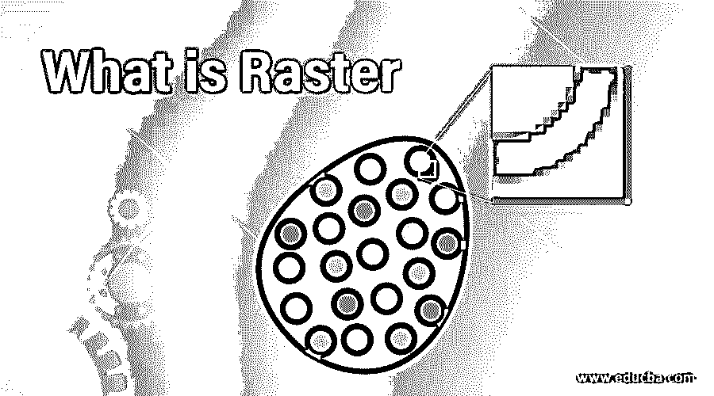

# 什么是光栅

> 原文：<https://www.educba.com/what-is-raster/>

## 栅格简介

栅格背后的数据是按行和列组织的矩阵，其中每个像元都包含它试图表示的信息值。栅格格式的数据代表了真实世界的现象。它们可以表示离散数据，如美国各州的地理空间数据，连续数据，如温度、湿度数据以及地图或绘图的扫描数据。另一种类型的数据，我们前面提到的矢量数据，定义了特征的中心和边缘。另一个区别是这些数据描述的重要领域。正方形表示描述要素内部的栅格数据，而矢量数据是对边界或外部的描述。这两种类型的数据都有其独特的专门化类型，因为栅格数据适合描述因地而异的数据，如温度、湿度、高程等。，而矢量数据出色地描述了空间细节。

我们在上一段中提到了专题数据和连续数据，所以让我们花些时间来了解更多，因为这将是理解栅格数据的用途和用途背后的意图的基础。专题数据也称为不连续数据或离散数据。在栅格中，这些专题数据具有可定义的边界，通常表示数据存储系统中的对象。例如，在谷歌地图中，我们看到水体被称为蓝色物体，这意味着陆地和水体的交汇点在地图上有明确的定义。连续数据更多的是了解该位置与空间中另一个固定点的关系的现象。例如，如果你注意到布告板上提到某个特定地点的海拔，它总是提到海平面。这个海平面是参考点；高程是连续的数据。

<small>Hadoop、数据科学、统计学&其他</small>

使用栅格数据建模时，应充分了解这些差异，因为这些数据类型中的每一种都是在建模过程中使用的，如果在差异之间产生误解，可能会导致重大的解释错误，并且整个分析在下一节中提到的任何应用中都将毫无用处！

### 光栅的应用

随着栅格数据的描述变得如此简单，以至于空间信息被描述在由行和列组成的矩阵中，栅格数据的应用范围越来越广。

它在当今世界的一些应用有:

*   大多数数码照片由光栅数据组成。如果你碰巧放大了你的任何一张数码照片，你最终会注意到在放大几个 x%后，微小的正方形像素开始形成。当连贯地看到这些像素时，它们代表了您刚刚缩放的数字图片。
*   甚至当今世界上所有的 LCD 显示器都是用光栅数据构建的。回顾历史，有一幅画被命名为点彩艺术作品，它依靠单色点来描绘艺术作品，这与光栅技术的概念相同。
*   栅格数据用于底图，其中底层数据是描绘用于显示其他要素的背景显示的栅格数据。例如，栅格数据被用作道路特征、基础图像、卫星图像和施加在基础图像上的其他扫描地图，以在空间上将地图与用户的置信度对齐。
*   它也因被用作表面地图而闻名。这些地图用来表现一个地区的连续变化。例如，我们在前面的章节中讨论的高程值描绘了使用栅格来描绘位置相对于海平面的高度，当在地图中描绘时，会导致地图中的连续要素。
*   现在我们看到了连续数据的使用，栅格中的专题数据也广泛用于从卫星图片了解土地覆盖。此外，人们甚至可以将土地划分为子类别，如农业用地、贫瘠土地、草地、森林等。

### 栅格的特征

既然这已用于描绘如此惊人的要素，那么栅格中就会有一些元数据来帮助它在上述应用程序中实现所需的描绘。让我们来看看这些功能，并简要讨论一下每一项功能:

*   **数据源:**栅格首先需要的信息是关于它的来源。如果源来自服务器，将显示数据库服务器的详细信息，而不是路径信息，如果源来自本地目录，则会显示路径信息。
*   **栅格信息:**关于栅格本身的复杂信息，如行数和列数、像元大小、格式压缩类型等。，构成了光栅的另一个特征。
*   **栅格元数据:**这是一个附加选项卡，可用于表示不同的信息，如传感器名称、产品名称、云量、太阳辐射等。
*   **空间参考:**描述栅格数据集坐标系的坐标系是空间参考。
*   **统计:**这提到了整个统计，如栅格数据值的最小值、最大值、平均值、标准偏差。
*   **范围:**该特征用于描述包含整个栅格数据集的边界。
*   **地理数据转换:**该转换用于将栅格数据的显示转换为其转换后的边界，以便在需要时进一步使用。

### 光栅的优势

由于其简单性，这带来了相当多的好处，它们是:

*   只有原点以数据的形式存储。不存储地理坐标。因此它是轻型数据。
*   数据存储是这样的，它使得能够建立简单的程序来快速地对其进行数据分析。
*   支持数据的多方面变体，即连续数据和离散数据。
*   易于与图形终端或静电绘图仪等基于光栅的输出设备兼容。

### 结论

因此，简而言之，栅格数据是要素集之一，这使得空间数据更具信息量和价值。在当前情况下，处理大量数据根本不是挑战，因为能够存储这些数据的高度可靠的系统将使栅格数据成为未来最有前途的数据之一，因为人们将开始更多地关注基于卫星的图片，尤其是在研究领域。

### 推荐文章

这是什么是光栅的指南。在这里，我们讨论了光栅的介绍以及应用，特点和优势。您也可以浏览我们的其他相关文章，了解更多信息——

1.  [什么是空间数据](https://www.educba.com/what-is-spatial-data/)
2.  [在 Illustrator 中栅格化](https://www.educba.com/rasterize-in-illustrator/)
3.  [数据可视化的类型](https://www.educba.com/types-of-data-visualization/)
4.  什么是数据？