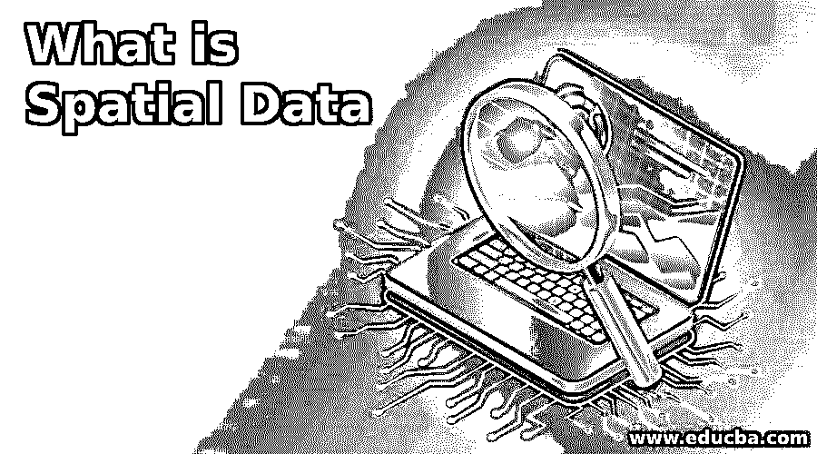
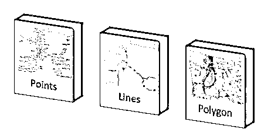
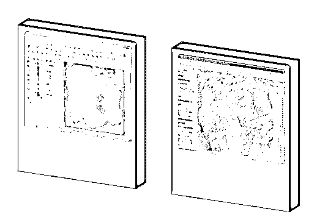

# 什么是空间数据

> 原文：<https://www.educba.com/what-is-spatial-data/>

## 空间数据简介

用于分析过去以及进行分析的数据集称为空间数据。空间数据仅限于简单的电子表格级别的信息，但也包括来自卫星和无人机的影像、地址数据点以及经度和纬度数据。

空间数据主要分为矢量数据和栅格数据。矢量数据由坐标信息组成，而栅格数据是从相机传感器提取的图像层。属于地理和地质信息的空间数据称为地理空间数据。关系数据库管理系统处理这些地理空间数据，它们被称为 GIS 数据库。

<small>Hadoop、数据科学、统计学&其他</small>

### 空间数据的类型

空间数据主要分为两种类型，即矢量数据和栅格数据。

#### 1.矢量数据

矢量数据是用点、线描绘的数据，根据使用的坐标，可以用二维和二维模型表示。GIS 中的矢量数据用于在坐标的帮助下输入信息，并可视化地址点&感兴趣的地方，河流、公路、铁路、轮渡路线甚至主要管道流的线路，另一方面，多边形用于展示内陆水体，如湖泊、建筑物等。

*   **点:图层上的一个点描绘了它们**。它可以是 x 或 y 或 z 坐标。
*   **线条:**这种形式的矢量数据用两个坐标表示，即 x 坐标-y 坐标或其逆坐标。该特征具有定义的长度，并且由于二维模型，它没有宽度。
*   **多边形:**用 3 个或 3 个以上的坐标描绘特征。当定义任何区域时，通常使用这种形式的矢量数据。

**图片来源链接:**https://support.pitneybowes.com/SearchArticles/

#### 2.栅格数据

栅格数据是来自卫星、无人机和各种其他相机传感器的多层地图图像。存储的数据是基于单元的彩色像素格式。这些是以行列格式排列的像素。数据已经出来了。jpg，。png，位图，。GIS 中的栅格数据对于可视化和分析非常有效，这在基于矢量的数据中几乎是不可能的。与矢量数据不同，栅格形式的 GIS 数据由于质量更高而庞大且管理复杂。

**来源链接:**[https://www . GIS lounge . com/styling-vector-and-raster-data-mastering-qgis/](https://www.gislounge.com/styling-vector-and-raster-data-mastering-qgis/)

### 地理信息系统中空间数据的使用

*   空间数据是从各种相机源、无人驾驶飞机、卫星、传感器和地质野外工作者那里收集的。矢量数据主要是关于地址点、线和多边形。对所有要素进行属性值和地理参考编码。所有属性都符合组织标准化操作程序，也称为 sop。在特征中添加属性数据时，涉及到许多地质概念和逻辑。
*   GIS 技术人员、GIS 分析师和 GIS 开发人员在地理编码过程中共同工作。例如，像地址点、道路、河流这样的特征，甚至像湖泊这样的多边形特征都被输入了所有的属性信息，如名称、长度、宽度，如果需要，甚至还有一些额外的参数。
*   根据位置的不同，数据与经度和纬度信息结合在一起。数据的矢量形式总是在引用特定栅格数据并对其进行验证后添加。
*   任何空间数据都通过 [GIS 软件](https://www.educba.com/gis-software/)进行处理，可以根据个人或组织的要求进行完美的分析、操作和可视化。基于 GIS 系统中可用的栅格数据，GIS 技术人员开始剩余或半熟的地图，并通过参考可用的度量来完成所有地理编码。在进行地理编码和参考时，技术人员还会记录经度、纬度值等参数，甚至名称、长度和宽度等额外信息。
*   集成的数据然后被保存在 RDBMS 中，因此同样可以用于理解与地球相关的问题陈述。如今，3D 模型被用于协调系统，以更精细的方式描绘业务问题。为了处理 3D 模型，组织还让在各种动画工具方面拥有高端知识的 VFX 和图形专家参与进来。

### 使用空间数据的优势

现在让我们来看看一些优势:

*   通过及时更新数据集，组织可以轻松地进行分析。
*   更新的信息可以迅速地展现给消费者。
*   空间数据库存储矢量和栅格数据，因此可以用来处理大量的业务问题。
*   矢量和栅格数据的混合产生了一个强大的产品，可以解决各种经济和地球相关的问题。
*   空间数据与非空间数据(如土壤信息、城市人口信息)相结合，可以成为丰富的知识来源。
*   在可用信息的帮助下，决策和战略规划可以彻底完成。
*   数据会定期更正和更新，因此从系统中分析错误数据的机会非常低。
*   空间数据可以与各种其他技术集成，如*激光雷达，以创建各种模型。*

 *### 结论

当涉及到地理空间数据及其特征时，有很多事情。所有的事情都不能写在一个文件中，以了解真正的潜力。一个人必须在实际生活中进行一些活动来理解事物。由于在市场上处于劣势，GIS 领域仍有许多未开发的领域。像它的领域一样，空间数据也被低估了，几乎没有任何组织试图利用这些数据。许多 GIS 组织更喜欢通过对消费者进行调查来刷新他们的空间数据。他们重视在其系统中流动的数据，无论是消费者还是现场工作人员。

### 推荐文章

这是什么是空间数据的指南。这里我们讨论空间数据的介绍和类型，以及在 GIS 中的解释和使用。您也可以浏览我们的其他相关文章，了解更多信息——

1.  [NoSQL 数据库的类型](https://www.educba.com/types-of-nosql-databases/)
2.  [什么是数据挖掘？](https://www.educba.com/what-is-data-mining/)
3.  [大数据概念](https://www.educba.com/big-data-concepts/)
4.  [什么是 GIS？](https://www.educba.com/what-is-gis/)*