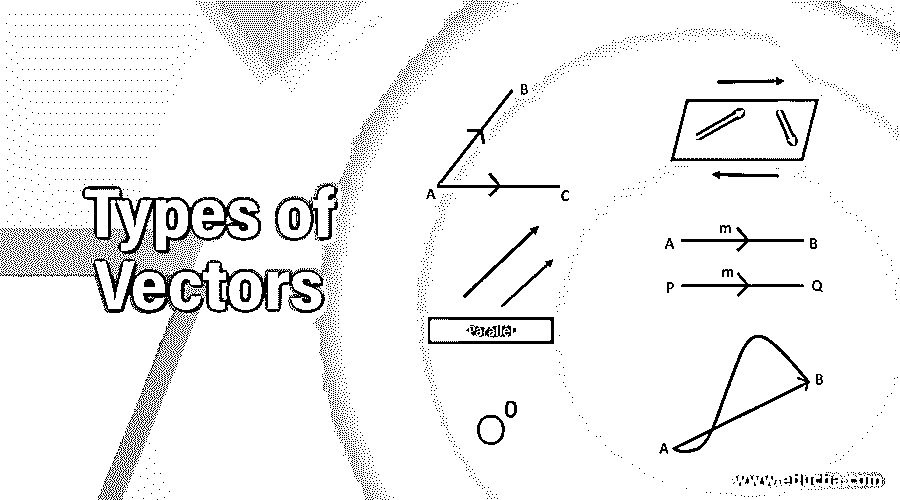
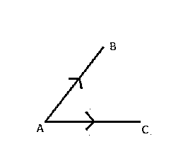
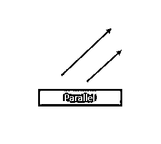
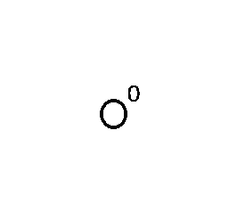
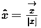
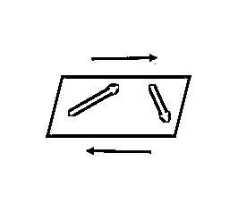
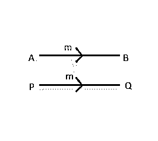
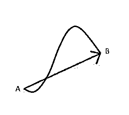
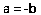

# 向量的类型

> 原文：<https://www.educba.com/types-of-vectors/>

## 向量类型介绍

矢量被定义为既有大小又有方向的量。向量由直线表示，其中长度表示向量和大小，方向表示向量的方向。向量在数学中使用，有几种类型的向量，包括零向量、单位向量、共初始向量、共线向量、相等向量、负向量等等。矢量用于表示物理对象，因为它们既有大小又有方向。

### 前 10 种媒介

有不同类型的向量。其中一些描述如下:

<small>Hadoop、数据科学、统计学&其他</small>

#### 1.共初始向量

共初始向量是两个或两个以上的独立向量具有相似初始点的向量类型。在这种类型的向量中，所有的向量都来自同一个位置。向量的原点是相同的，称为共初始向量。例如，如果我们有两个 *AB* →和 *AC* →那么这些向量被称为共初始向量，因为它们都有一个相似的初始点，即 a

在上图中，表示了共同初始向量。

#### 2.共线向量

共线是另一种类型的矢量，其中有两个或两个以上的矢量是相互平行的，与大小或方向无关。自然界中的平行意味着它们永远不会相互交叉。两个矢量的方向在本质上是相同的。例如，如果矢量 a 在 x 方向，而 b 也在相同的方向，那么它们被称为共线矢量。两个向量的坐标本质上是相同的。共线向量的另一个性质是两个共线向量的叉积总是等于零。共线矢量的另一个名称是平行矢量。

在上图中，两个向量一个用红色显示，另一个用蓝色显示。这两个向量都称为共线向量。

#### 3.零矢量

零矢量是另一种类型的矢量，其中矢量幅度等于零，并且矢量的原点与终点重合。例如，如果矢量 AB->如果 A 的坐标和 B 的坐标相同，那么这个矢量就是零矢量。零矢量的方向是不确定的，大小总是零。零矢量不指向任何方向，并且所有分量都等于零。

在上图中，零矢量如上图所示。

#### 4.单位向量

单位向量是这样一种向量，它的大小等于单位长度 1。所有大小等于 1 的矢量称为单位矢量。假设向量 x->的大小为 x，那么单位向量由 **x̂** 表示，它与向量 x 的方向相同，大小为 1。

单位矢量的公式由下式给出:

如果两个向量的大小相同，直到它们的方向也相同时，才认为它们相等。

#### 5.位置向量

位置向量是另一种类型的向量，其中原点取为 0，并且在空间中有一个名为 A 的任意点。那么向量 OA->被称为具有参考原点 0 的位置向量。位置向量主要用于表示点在三维笛卡尔坐标系中的位置。并且从任何参考原点确定位置。

#### 6.共面向量

共面矢量是这样一种矢量，其中三个或三个以上的矢量位于同一平面或可以位于平行平面，那么这些矢量称为共面矢量。总是有可能找到任意两个位于同一平面的随机向量，称为共面向量。共面向量的另一个性质是三个向量的标量三重积总是等于零。共面向量总是线性相关向量。

在上图中，表示了共面向量。

#### 7.相似和不相似向量

相似向量是具有相同方向的向量类型，称为相似向量。方向相反而彼此无关的矢量称为异矢量。

#### 8.相等向量

等矢量是这样一种矢量，其中两个或两个以上具有相同大小和相同方向的矢量称为等矢量。

在上图中，矢量 AB->和矢量 PQ->是相等的矢量，因为它们具有相同的大小和相同的方向。

#### 9.位移向量

位移矢量是这样一种矢量，当一个矢量从它的位置移开时，这个矢量就称为位移矢量。例如，如果有任何物体在时间=0 时出现在点 A，一段时间后在时间=t 时出现在点 B。位移可以计算为物体的初始点和最终点之间的矢量距离。

在上图中，位移计算为红色 AB 线的长度。方向是从 A 点到 b 点。

#### 10.负向量

负矢量是这样一种矢量，其中两个矢量大小相等，但方向完全相反。这种类型的向量被称为负向量。假设我们有两个向量 a 和 b，它们是负向量，那么它可以表示为

### 结论

矢量是既有大小又有方向的物理量。向量是数学概念，有各种各样的向量，如共线向量、共面向量、相似和不相似向量、位移向量、单位向量，以及上面定义的许多其他向量。

### 推荐文章

这是矢量类型的指南。在这里，我们详细讨论了 10 种矢量类型。您也可以浏览我们的其他相关文章，了解更多信息——

1.  [GIS 的应用](https://www.educba.com/applications-of-gis/?source=leftnav)
2.  [GIS 组件](https://www.educba.com/gis-components/?source=leftnav)
3.  什么是数据？
4.  [栅格数据](https://www.educba.com/raster-data/?source=leftnav)