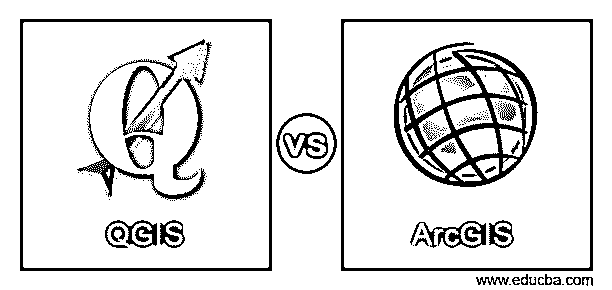
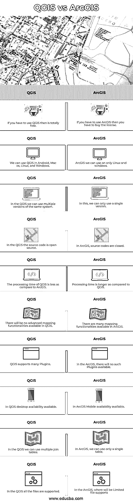

# QGIS 与 ArcGIS

> 原文：<https://www.educba.com/qgis-vs-arcgis/>

## QGIS 与 ArcGIS 的区别

Microsoft Office 和 Google Doc 之间的替代方案更有可能区分 QGIS 和 ArcGIS。领先的 GIS 应用程序是 QGIS 和 ArcGIS。除了几处不同，它们几乎完全相同。两者都是任何人都可以操作的两大渠道。根据它提供的资源和相关的价格效应，您可以在 QGIS 和 ArcGIS 之间进行选择。只要你知道如何正确使用这两种方法来得出你的结论，它们都会对你的工作有所帮助。但是在您决定开始使用哪个 GIS 项目之前，需要记住这两个应用程序之间的一些重要差异。

**什么是 QGIS**

<small>Hadoop、数据科学、统计学&其他</small>

虽然 ArcGIS 仍然是标准，但 QGIS 是商业 GIS 软件选项的常见替代方案。像奥地利的福拉尔贝格州、瑞士的格拉鲁斯州和索洛图恩州一样，QGIS 已经接管了许多私人和公共机构。虽然 ArcGIS 标准仍然存在，但 QGIS 是商业 GIS 软件的常见替代产品。包括奥地利福拉尔贝格州、瑞士格拉鲁斯州和索洛图恩州在内的众多公共和私人组织已经接管了 QGIS。

**什么是 ArcGIS**

ArcGIS 是一种 GIS 程序，可通过图层构建地图(如气候数据或贸易流量)可视化地理统计数据来管理和分析地理信息。它被许多大学和机构用于建立和展示人文和科学领域的突破性研究。世界各地的许多政府和商业/私人组织也在使用它。

### QGIS 与 ArcGIS 的直接比较(信息图表)

以下是 QGIS 与 ArcGIS 之间的主要差异:

### QGIS 与 ArcGIS 的主要区别

下面详细解释了 QGIS 和 ArcGIS 之间的一些主要差异:

*   当在其他坐标中插入其他数据集时，ArcGIS 会“动态”投影数据。这可确保图层与数据框的第一个图层和坐标方案相匹配。QGIS 支持 2，700 个已建立的坐标参考系统。它允许为没有预定 CRS 的层指定全局和投影 CRS。您还可以动态描述自定义 CRS 并支持矢量和栅格图层投影。
*   "听起来像一部烂片，被授权进行地理处理."ArcGIS 是迫使您登录的敌人。开源英雄是 QGIS。
*   ArcGIS 的地理处理系统非常强大。挺强的。非常强壮。相当广泛。但是，您的许可标准定义了您可以使用的 ArcGIS 工具。QGIS 中的许可级别不可用。QGIS 开源软件不限制资源的使用。
*   在 QGIS 中，您需要提前了解该工具。这并不是一件坏事。但是像 ArcGIS 10 这样的银碟是不会随你而来的。ArcGIS 探索性回归工具有助于用户将统计数据与信息联系起来，因为输出支持这些工具。对于分析师来说，这可以节省时间。
*   ArcGIS 在启动时充满了令人惊叹的符号系统。我们喜欢点、线和面类型的规则符号系统，它非常完美。当前的 ArcMap 符号系统美观、便捷且丰富。QGIS 遗漏了当前选择的节拍。如果它配有符号系统，如火车和阴影多边形，QGIS 中的生活会更简单。请记住，您可以将它们下载到您的符号调色板并加载它们。

### QGIS 与 ArcGIS 的对比表

比较表是理解不同软件的主要事实的一个非常好的媒介。我们的表格中有许多事实，如下所示:

| **服务请求编号** | **QGIS** | **ArcGIS** |
| One | 如果你必须使用 QGIS，那么是完全免费的。 | 如果您必须使用 ArcGIS，则必须购买许可。 |
| Two | 我们可以在 Android、Mac os、Linux 和 Windows 中使用 QGIS。 | 我们只能在 Linux 和 windows 上使用 ArcGIS。 |
| Three | 在 QGIS 中，我们可以使用同一系统的多个版本。 | 在这种情况下，我们只能使用单一版本。 |
| Four | 在 QGIS 中，源代码是开源的。 | 在 ArcGIS 中，源代码是封闭的。 |
| Five | 与 ArcGIS 相比，QGIS 的处理时间更短。 | 与 QGIS 相比，处理时间更长。 |
| Six | QGIS 中将没有高级制图功能。 | ArcGIS 中提供了许多制图功能。 |
| Seven | QGIS 支持许多插件。 | 在 ArcGIS 中，没有此类插件可用。 |
| Eight | 在 QGIS 桌面可用性。 | 在 ArcGIS Mobile 中可用。 |
| Nine | 在 QGIS 中，我们可以使用多个连接表。 | 在 ArcGIS 中，我们只能使用一个表。 |
| Ten | QGIS 支持所有文件。 | 在 ArcGIS 中，哪里会支持有限的文件 |

### 结论

在本文中，我们看到了 QGIS 和 ArcGIS 之间的主要区别。您可以根据自己的需求选择任何一种。我希望这篇文章对你有所帮助。

### 推荐文章

这是关于 QGIS 和 ArcGIS 的指南。在这里，我们通过信息图表和比较表来讨论 QGIS 和 ArcGIS 的主要区别。您也可以看看以下文章，了解更多信息–

1.  [原生脚本 vs 离子](https://www.educba.com/nativescript-vs-ionic/)
2.  [线性回归 vs 逻辑回归](https://www.educba.com/linear-regression-vs-logistic-regression/)
3.  [OpenGL vs DirectX](https://www.educba.com/opengl-vs-directx/)
4.  [戈多 vs 尤尼蒂](https://www.educba.com/godot-vs-unity/)