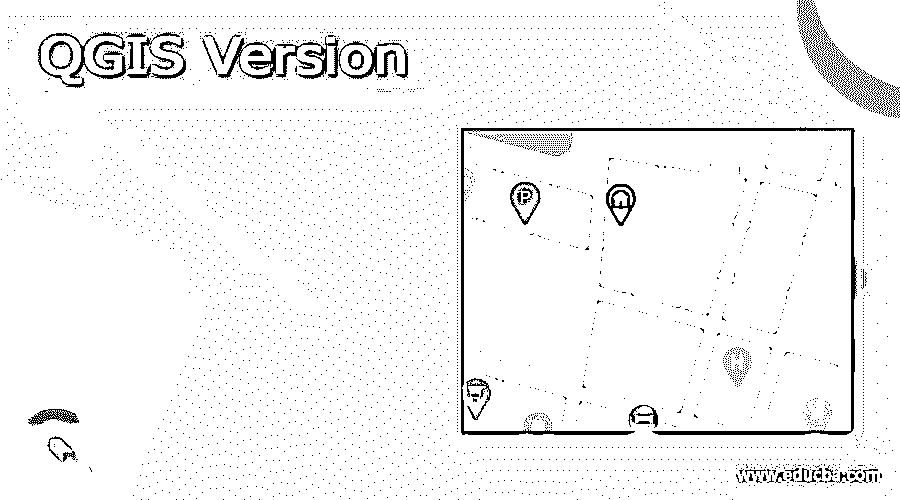

# QGIS 版本

> 原文：<https://www.educba.com/qgis-version/>

## QGIS 版本介绍

一种开源应用程序，提供地理空间数据以供查看和编辑，如果需要，还可以分析地理信息，这种应用程序称为 QGIS 或量子地理信息系统。QGIS 可以与其他 GIS 应用程序集成，并可以从任何 GIS 站点导入不同的文件，以便为应用程序中的用户提供信息。此外，用户可以将 Python 或 C 语言编写的插件安装到 QGIS 中，这样就可以将新功能添加到应用程序中，以支持各种其他应用程序。许多组织使用这个应用程序，因为它是免费提供的，我们可以把 QGIS 称为一个向用户提供信息的通用资源管理器。

### QGIS 版本

QGIS 的一个版本解释如下:

<small>Hadoop、数据科学、统计学&其他</small>

*   Gary Sherman 是 2007 年发布的 Quantum GIS 的开发者。这篇文章发表在开放空间地理空间基金会上。可以合成或导出图形地图，以便用户可以分析不同维度的地理空间数据。QGIS 也支持光栅图像，我们可以自己绘制数据并将其导出到应用程序中。另外，从我们获取坐标信息的地方也支持矢量图像。这些图像可以进行地理参考，这有助于理解整个数据。数据可以从任何外部来源(如互联网)导出，并且可以在应用程序中的图形图像中引用。安装应用程序的二进制包存在于网站中，可用于下载和安装该应用程序。WMS 服务器与 QGIS 相关联，以便应用程序正常运行。我们有不同版本的基础应用程序，用于连接和直接使用服务器。
*   2009 年，发布了新的 1.0 版本。在这个版本中，设置了硬编码的全局透明度。因此，用户可以在这个版本中找到初始版本中没有的全局透明度。坐标系在两个版本中都存在，但在 1.0 版本中，用于更改坐标的对话框出现在坐标本身附近。服务器搜索和图层定义在初始版本和 1.0 版本中都可用。
*   2013 年发布 2.0 版本时，名称改为 QGIS。此外，我们不能在版本 2 中使用版本 1 中使用的插件。插件必须与每个版本兼容，否则应用程序将在显示图形图像时抛出错误。在版本 2 中，我们可以在改进的模式下进行插值和缓冲，这有助于以更好的方式提供地图服务。该数据库可用于 QGIS 和 PostGIS。
*   QGIS 3.0 版本于 2018 年开发，现在我们有处于开发阶段的 3.19 版本。我们可以直接从应用程序中给出不同的表达式和计算值，这样就可以从图形和矢量图像本身找到问题的解决方法。代码可以直接在控制台中编写并执行。如果我们需要获得图形的图像，我们可以通过编写相同的代码直接从应用程序中打印出来。如果我们需要在应用程序之外导入它，我们可以使用打印布局，以不同的模式打印图形，并可以发送到系统。我们应该为坐标设置合适的值，以便系统可以设置属性来导入不同用途和信息的图形。
*   插件在应用程序中被广泛使用，因此如果用户在插件中输入一些值，当他们使用相同的坐标时，插件可以被存储和重用。应该为存储的值提供一些变量，以便在需要时可以很容易地检索这些变量。我们有全局、地图图层或项目设置，因此如果用户需要保存一些特定于项目的值，如背景颜色或坐标值，可以保存这些值并在同一个项目中重复使用。但是如果应用程序本身需要一些全局设置，比如位置，那么这些设置就需要是全局的。地图图层设置不同，它是地图的实例，除非存储在文件中，否则将无法再次使用。
*   应用程序中使用了不同的身份验证方法，这有助于保护应用程序内部的数据。因此，当我们连接到数据库时，需要进行身份验证，这有助于保存特定用户的数据，并以安全的方式建立连接。应用程序中提供了几个插件或小部件，这样无论何时开发人员需要数据库连接，他们都可以使用。
*   在 QGIS 中，通过管理应用程序中响应用户的线程来维护用户界面。存在任务管理器，其控制应用程序的运行，该应用程序记录对后台操作的访问并为其提供报告。也可以使用全局任务管理器，一次控制不同用户的日志。但是会比个性化的任务管理器更增强。
*   几何在 QGIS 中非常重要，因为它用于绘制地图。我们有点，线或多边形的应用程序中不同层次的几何特征。几何由层表示，并且可以从这些层中提取各种特征。我们可以从现有的几何图形创建几何图形，或者编写代码或文本。要搞清楚几何类型才能分析和画一样的。
*   QGIS 的文档和社区支持帮助用户解决与应用程序相关的问题。需要输入数据来构建图形，以便我们可以将矢量格式转换为图形图像。我们可以在创建图表时添加更多信息，以便在图表中提供更多数据。

在开发 QGIS 的新版本时，开发人员要确保可用的功能得到更多的增强，并添加新的特性以方便用户使用。插件也可用于不同版本，因为旧插件不支持新版本。在任何情况下使用的代码都是相同的。

### 推荐文章

这是 QGIS 版本的指南。在这里，我们还将讨论 QGIS 的介绍和版本，以及详细的解释。您也可以看看以下文章，了解更多信息–

1.  [GIS 的应用](https://www.educba.com/applications-of-gis/)
2.  [GIS 工具](https://www.educba.com/gis-tools/)
3.  [什么是注册表？](https://www.educba.com/what-is-registry/)
4.  [GIS 软件](https://www.educba.com/gis-software/)