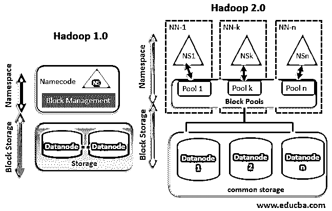
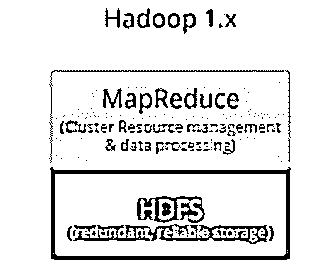
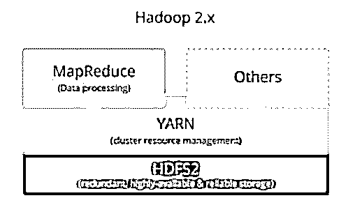

# Hadoop 版本

> 原文：<https://www.educba.com/hadoop-versions/>

## 什么是 Hadoop 版本？

Hadoop 是一种软件，它在开源框架上使用分布式网络而不是集中式网络存储数据，从而以并行转换的方式处理数据。这使得 Hadoop 能够充当最可靠的批处理引擎和分层存储及资源管理系统之一。随着数据存储和处理的复杂性增加，Hadoop 也是如此，开发人员推出各种版本来解决问题(错误修复)并简化复杂的数据流程。随着 Hadoop 开发遵循主干(基础代码)-分支(修复)模型，更新会自动实现。Hadoop 有两个版本:a) Hadoop 1.x(版本 1)和 b) Hadoop 2(版本 2)

<small>Hadoop、数据科学、统计学&其他</small>

### 实施两个 Hadoop 版本

下面是两个 Hadoop 版本:

*   Hadoop 1.x(版本 1)
*   Hadoop 2(版本 2)

#### 1.Hadoop 1.x

以下是 Hadoop 1.x 的组件

1.Hadoop 公共模块是一个 jar 文件，它充当基础 API，所有其他组件都在此基础上工作。

2.版本一是第一个出现的版本，非常坚固，没有新的更新

3.它对扩展节点有限制，每个集群最多只能有 4000 个节点

4.利用插槽概念来限制功能，即插槽能够运行 map 任务或 reduce 任务。

5.下一个组件是 Hadoop 分布式文件系统，通常称为 HDFS，它扮演着分布式存储系统的角色，旨在满足大型数据的需求，其块大小为 64 兆字节(64MB)，用于支持该架构。它进一步分为两个部分:

*   用于存储数据节点元数据的名称节点，与主节点放在一起。它们包含详细信息，如关于从节点、索引及其各自位置的详细信息，以及时间线的时间戳。
*   数据节点，用于存储与从节点中使用的应用程序相关的数据。

6.Hadoop 1 使用 Map Reduce (MR)数据处理模型，无法支持其他非 MR 工具。

MR 有两个组成部分:

*   作业跟踪器用于将与 MapReduce 任务相关的任务(如果场景失败或关闭)分配或重新分配给位于节点群集中的一个名为任务跟踪器的应用程序。此外，它还维护一个关于任务跟踪器状态的日志。
*   任务跟踪器负责执行任务跟踪器和传感器分配的功能，并将这些任务的状态报告给任务跟踪器。

7.集群的网络由主节点和从节点组成。该群集中的哪一个被进一步划分为包含一组商用计算机或节点的磁道。

8.每当 Hadoop 系统接收到针对大数据集的大型存储操作时，数据就会被划分为可解读且有组织的数据块，这些数据块分布在不同的节点上。

#### 2.Hadoop 版本 2

Hadoop 版本 2 的发布是为了改善用户面对版本 1 时的滞后。让我们来介绍一下新版本提供的改进:

*   [HDFS 联盟对](https://www.educba.com/hdfs-federation/)进行了改进，以提供名称节点的水平可伸缩性。此外，namenode 仅可用于单点故障，它可用于不同的点。这将是 Hadoop stat 已增加到包括 Hive、Pig 等堆栈，这使该 tap 装备良好，使我能够处理与 NameNode 有关的故障。
*   YARN 代表 Yey 另一个资源网络已得到改进，具有处理更大范围内的数据的新能力，即 Pb 级和 TB 级，使其可用于 HDFS，同时使用不基于 MapReduce 的应用程序。其中包括像 MPI 和 GIRAPH 这样的应用程序。
*   **Version–2.7 . x 于 2018 年 5 月 31 日发布:**此次更新集中于提供两大功能，即提供您的应用程序和提供全局资源管理器，从而提高其整体效用和通用性，将可扩展性提高到每个集群 10000 个节点。
*   【2018 年 9 月发布的 2.8.x 版本:更新后的改进包括 capacity scheduler，该计划旨在为 Hadoop 上的数据处理提供多租户支持，并且可用于窗口使用，从而提高了整个行业对处理大数据相关问题的软件的采用率。

#### 版本 3

下面是最新运行的 Hadoop 更新版本

【3.1.x 版-2019 年 10 月 21 日发布:此更新使 Hadoop 能够作为一个平台来提供大量数据分析功能和实用程序，这些功能和实用程序将在事件处理中执行，同时使用实时操作来提供更好的结果。

*   现在，它改进了容器概念的功能，使 had 能够执行早期版本 1 中无法执行的泛型。
*   2019 年 9 月 22 日日发布的最新**版本 3.2.1 解决了多租户数据节点的非功能性(在支持方面)问题，仅限于 MapReduce 处理，以及实时处理和图形分析所需的备用数据存储所需的最大问题。**
*   不断增长的数据雪崩和[大数据分析](https://www.educba.com/what-is-big-data-analytics/)仅与业务相关的数据就估计达到 1690 亿美元，预计到 2022 年将增长到 2740 亿美元，市场似乎正在欣喜若狂地增长。
*   这就更加需要一个功能完整的系统，用于日益增长的废弃的犹他州。Hadoop 应用程序非常适合存储、处理和访问这款出色的解决方案能够以有组织的方式存储、处理和访问非结构化/结构化的异构数据集。
*   通过不断更新的功能，作为工具来纠正开发人员在使用 Hadoop 时所说的错误，改进的版本增加了应用范围，提高了使用 Hadoop 的维度和灵活性，增加了它成为所有与大数据处理和分析相关的功能的下一个最大的机会。

### 推荐文章

这是 Hadoop 版本的指南。在这里，我们将详细讨论 Hadoop 2 版本，并了解当前运行时间最长的版本。您也可以浏览我们的其他相关文章，了解更多信息——

1.  什么是 HDFS？
2.  [Hadoop 管理员](https://www.educba.com/hadoop-administrator/)
3.  [纱线卷装经理](https://www.educba.com/yarn-package-manager/)
4.  [Hadoop 纱线架构](https://www.educba.com/hadoop-yarn-architecture/)

