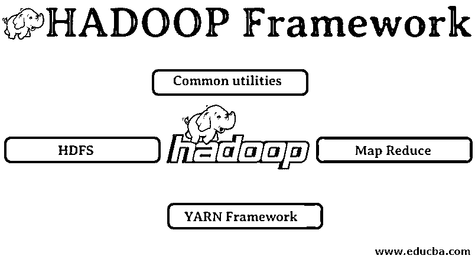

# HADOOP 框架

> 原文：<https://www.educba.com/hadoop-framework/>

## Hadoop 框架简介

Hadoop 框架是流行的开源大数据框架，用于处理大量非结构化、半结构化和结构化数据以进行分析。这是 Apache 软件许可的。Hadoop 框架主要涉及存储和数据处理或计算任务。它包括一个 Hadoop 分布式文件系统[，称为 HDFS](https://www.educba.com/what-is-hdfs/) ，用于数据计算的 Map-reduce，用于资源管理的 YARN，作业调度和其他用于管理 Hadoop 集群和分布式数据系统的高级功能的标准实用程序。Hadoop 是使用框架和组件功能的 Java 库实现的。Hadoop 支持数据的批处理，可以通过商用硬件实现。

### HADOOP

1.大数据解决方案:它处理大容量、高速度和多种数据的复杂性。

<small>Hadoop、数据科学、统计学&其他</small>

2.建立开源项目。

3.可靠地存储大量数据，并允许大规模分布式计算。

4.Hadoop 的关键属性是冗余和可靠性(绝对没有数据丢失)。

5.主要关注批处理。

6.在商用硬件上运行–您不需要购买任何特别昂贵的硬件。

### Hadoop 框架

1.常见实用程序

2.HDFS

3.地图缩小

4.纱线框架

#### 1.常见实用程序

也称为 Hadoop common。这些只是其他 Hadoop 组件执行时实际需要的 JAVA 库、文件、脚本和实用程序。

#### 2.HDFS: Hadoop 分布式文件系统

为什么 Hadoop 选择合并分布式文件系统？

我们用一个例子来理解这个:我们需要读取 1TB 的数据，我们有一台机器有 4 个 I/O 通道，每个通道有 100 MB/s；读取全部数据花了 45 分钟。10 个引擎读取相同数量的数据，每个引擎有 4 个 I/O 通道，每个通道有 100MB/s。猜猜读取数据需要多少时间？4.3 分钟。HDFS 解决了存储大数据的问题。HDFS 的两个主要组件是名称节点和数据节点。名称节点为主节点；我们可能有一个二级名称节点；如果主要名称节点停止工作，辅助名称节点将充当备份。名称节点主要通过存储元数据来维护和管理数据节点。数据节点是从节点，从节点基本上是低成本的商品硬件。我们可以有多个数据节点。数据节点存储实际数据。此数据节点支持复制因子；假设一个数据节点出现故障，另一个复制的数据节点可以访问该数据。因此，提高了数据的可访问性，并且防止了信息的丢失。

#### 3.地图缩小

解决了大数据的处理问题。让我们通过解决这个现实世界的问题来理解 map reduces 的概念。ABC 公司想计算其城市的总销售额。散列表的概念是行不通的，因为使用 [Map-Reduce 思想](https://www.educba.com/what-is-mapreduce/)数据是以 TB 为单位的。

**有两个阶段:**

**a)映射**:首先，我们将根据键/值对把数据分成更小的块，称为映射器。所以这里的关键字是城市名，值是总销售额。每个测绘员将获得每个月的数据，其中给出了城市名称和相应的销售。

**b) Reduce:** 它会得到这几堆数据，每个 reducer 负责北/西/东/南城市。reducer 的工作将是收集这些小块，并为某个特定的城市将它们转换成更大的数量(通过相加)。

#### 4.纱线框架:又一个资源谈判者。

Hadoop 的最初版本只有两个组件:Map Reduce 和 HDFS。后来意识到 Map Reduce 无法解决很多大数据问题。其想法是将资源管理和作业调度职责从旧的 map-reduce 引擎中分离出来，并将其交给一个新的组件。这就是纱线的由来。它是 HDFS 和 Map Reduce 之间的中间层，负责管理集群资源。

它有两个关键角色要执行:a)作业调度。b)资源管理

**a)作业调度:**当给定大量数据进行处理时，需要将其分布并分解成不同的任务/作业。现在，JS 决定哪个位置需要被给予最高优先级、两个位置之间的时间间隔、作业之间的依赖性，并检查正在运行的作业之间没有重叠。

**b)资源管理:**为了处理数据和存储数据，我们需要资源，对吧？因此，资源管理器提供、管理和维护存储和处理数据的资源。
现在我们清楚了 Hadoop 的概念，以及它如何解决大数据带来的挑战！!!

### 推荐文章

这是 Hadoop 框架的指南。在这里，我们已经详细讨论了 4 大 Hadoop 框架的基本含义。您也可以浏览我们推荐的其他文章，了解更多信息——

1.  [Hadoop 数据库](https://www.educba.com/hadoop-database/)
2.  [Hadoop 生态系统](https://www.educba.com/hadoop-ecosystem/)
3.  [Hadoop 的用途](https://www.educba.com/uses-of-hadoop/)
4.  [Hadoop 软件](https://www.educba.com/hadoop-versions/)

