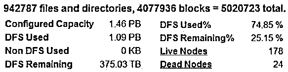
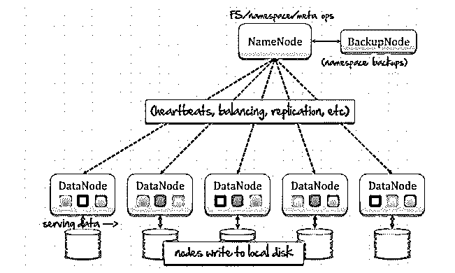
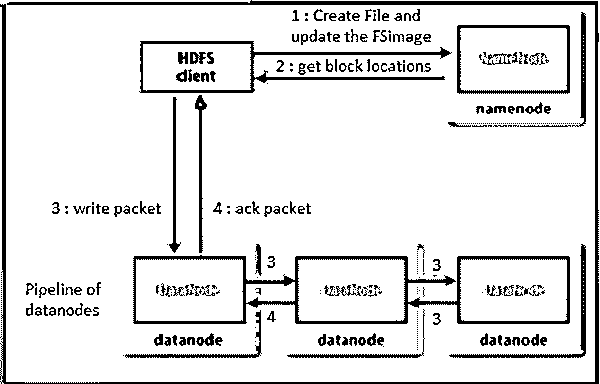
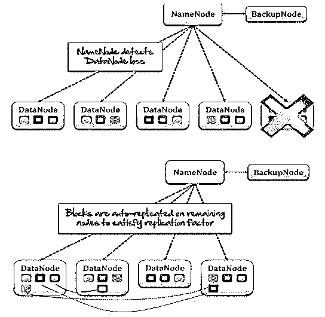
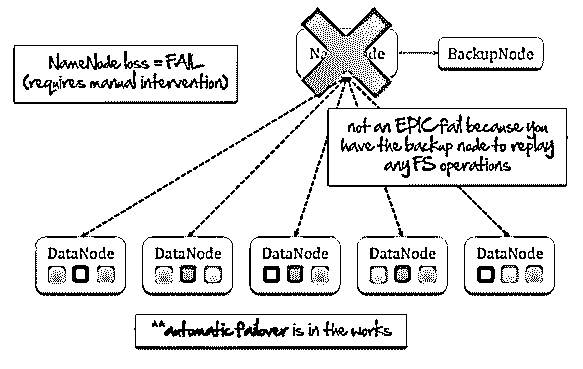
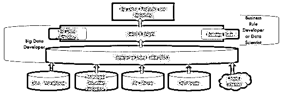

# Hadoop 生态系统

> 原文：<https://www.educba.com/hadoop-ecosystem/>

## Hadoop 生态系统简介

以下文章概述了 Hadoop 生态系统。Apache Hadoop 是一个开源系统，可以在许多商用计算机上可靠地存储和处理大量信息。Hadoop 最初被写在一篇论文中，并于 2013 年 10 月以“谷歌文件系统”的名义发表。当时在雅虎工作的道格·卡丁(Doug Cutting)根据他儿子的玩具大象名字引入了 Hadoop 生态系统的名字。如果我们考虑 Apache Hadoop 的主要核心，那么首先可以考虑存储部分，称为 Hadoop 分布式文件系统(HDFS)，其次是处理部分，称为 Map-Reduce 编程模块。这是因为 Hadoop 实际上会拆分一个巨大的文件，并将它们存储在集群中的多个节点上。

### Hadoop 生态系统的概念

[Apache Hadoop 框架](https://www.educba.com/hadoop-framework/)主要包含以下模块:

<small>Hadoop、数据科学、统计学&其他</small>

*   **Hadoop Common:** 包含使用 Hadoop 模块所需的所有库和实用程序。
*   **Hadoop 分布式文件系统(HDFS):** 它是一种分布式文件系统，有助于在多台或商用机器上存储海量数据。还有，在带宽的情况下提供一个大的效用；作为群集上的一种聚合，它通常提供非常高的带宽。
*   **Hadoop Yarn:**2012 年推出。它主要用于管理商品中所有系统上的资源，甚至是集群中的资源。基于资源能力，它根据需求分配或调度用户的应用程序。
*   **Hadoop MapReduce:** 主要通过 map-reduce 编程方法论帮助处理大规模数据。

Apache Hadoop 总是在处理和存储大量数据方面帮助降低 IT 成本。此外，由于 Apache Hadoop 是开源的，硬件非常普遍，它总是有助于我们适当降低 it 成本。

**开源软件+商用硬件=降低 IT 成本**

例如，如果我们考虑每天接收 942787 个文件和目录，这需要 4077936 个块，总共 5020723 个块。因此，如果我们配置了至少 1.46 PB 的容量，那么为了处理上述负载，分布式文件系统将使用 1.09 PB，这意味着几乎是总配置容量的 74.85%，而我们考虑的是 178 个活动节点和 24 个死节点。

Hadoop 生态系统主要用于存储和处理大数据，通常具有如下一些关键特征:

*   **Volume:**Volume 代表实际存储和生成的数据的大小。取决于数据的大小，数据集是否为大数据已经确定。
*   **变化:**变化代表正在使用的数据的性质、结构和类型。
*   **速度:**速度代表在特定的开发流程中，已经存储和生成的数据的速度。
*   **准确性:**准确性表示已获取数据的质量，也有助于数据分析达到预期目标。

HDFS 主要用于在集群中的大量机器上存储大量信息(兆兆字节或千兆字节)。它始终保持一些共同特征，如数据可靠性，在商用硬件上运行，使用数据块存储文件或文件的一部分，利用“一写多读”模式。

HDFS 体系结构下面有名字节点和数据节点的概念。

**1。名称节点的责任(主节点)**

*   管理文件系统命名空间。
*   维护集群配置。
*   负责复制管理。

**2。数据节点的责任(Slaves)**

*   将数据存储在本地文件系统中。
*   使用 heartbeat 定期向名称节点报告。

### HDFS 写操作

Hadoop 遵循以下步骤来编写任何大文件:

*   首先，在从任何 HDFS 客户端收到一个文件写入请求后，创建文件并更新文件系统映像。
*   从名称节点获取块位置或数据节点详细信息。
*   以单个数据节点并行方式写入数据包。
*   确认完成或接受数据包写入，并将信息发送回 Hadoop 客户端。

### HDFS 块复制管道

*   客户端从 Namenode 中检索 Datanodes 的列表，Namenode 将承载该块的副本。
*   然后，客户端将数据块刷新到第一个 Datanode。
*   第一个 Datanode 接收一个块，写入该块，并将其传输到管道中的下一个数据节点。
*   当写入所有副本时，客户端会移动到文件中的下一个数据块。

### HDFS 容错

一个数据节点突然停机；在这种情况下， [HDFS](https://www.educba.com/what-is-hdfs/) 可以自动管理这种情况。首先，所有名称节点总是从每个数据节点接收一个心跳。如果某个数据节点因某种原因丢失了一个心跳，则认为该数据节点已关闭，立即自动复制其余节点上的所有数据块，以满足复制因子。

如果名称节点检测到群集中有一个新的数据节点可用，它会立即重新平衡所有数据块，包括添加的数据节点。

现在不知何故名称节点丢失或失败；在这种情况下，保存名称节点的一个文件系统映像的备份节点会立即重放所有文件系统操作，并根据需要启动名称节点。但在这种情况下，需要手动干预，整个 Hadoop 生态系统框架将会停机几次，以便再次设置新的名称节点。因此，在这种情况下，名称节点可能是单点故障，为了避免这种情况，HDFS 联邦正在引入名称节点的多个集群设置，ZooKeeper 可以根据需要立即管理一个备用名称节点。

### Hadoop 生态系统的示例

下图给出了完整的 Hadoop 生态系统示例:

数据可以来自任何来源，如数据仓库、托管文档存储库、文件共享、普通 RDMS 数据库、云或外部来源。所有这些数据都以结构化、非结构化或半结构化的方式来到 HDFS。HDFS 以分布式方式存储所有这些数据，这意味着非常灵活地存储在分布式商品系统中。

### 结论

Hadoop 生态系统主要设计用于存储和处理海量数据，这些数据本应呈现数量、速度和多样性之间的两个因素中的任何一个。它将数据存储在运行于商用硬件上的分布式处理系统中。考虑到完整的 Hadoop 生态系统流程，HDFS 分发数据块，Map Reduce 提供编程框架来读取存储在 HDFS 的文件中的数据。

### 推荐文章

这是 Hadoop 生态系统的指南。在这里，我们讨论了 hadoop 生态系统的基本概念、其架构、HDFS 操作、示例、HDFS 容错等。您也可以阅读以下文章，了解更多信息——

1.  [Hadoop 在现实世界中的应用](https://www.educba.com/uses-of-hadoop/)
2.  [Hadoop vs Splunk](https://www.educba.com/hadoop-vs-splunk/)
3.  [Hadoop 职业生涯](https://www.educba.com/career-in-hadoop/)
4.  [Hadoop 与 SQL 性能对比](https://www.educba.com/sql-vs-hadoop/)

