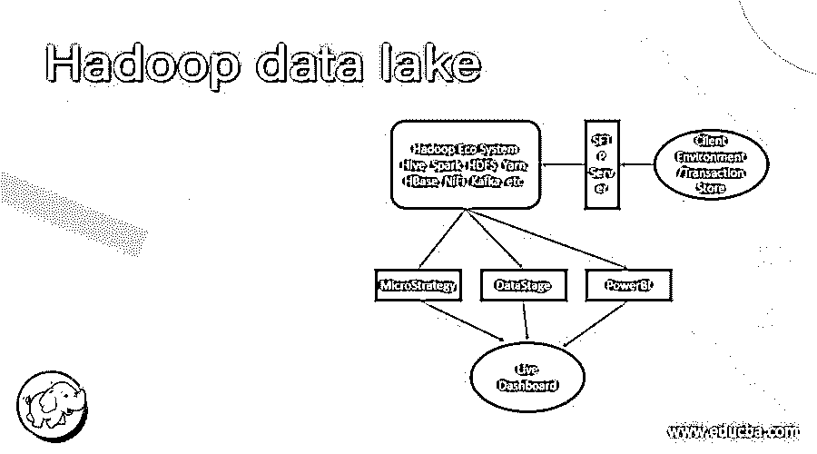
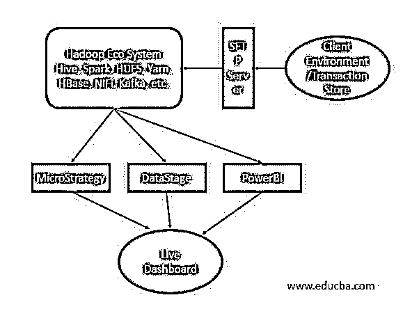

# Hadoop 数据湖

> 原文：<https://www.educba.com/hadoop-data-lake/>

## Hadoop 数据湖简介

Hadoop 数据湖是一个数据管理平台。它将包括 Hadoop 的多集群环境。这将有助于处理结构化或非结构化数据。这些数据将有不同的形式，如日志数据、流数据、社交媒体数据、互联网点击记录、传感器数据、图像等。它还具有保存事务级数据的能力。它还会从 RDBMS 中提取它。许多组件、多种技术都参与其中。它不仅仅局限于 Hadoop 技术。

**注:**架构适用于非事务性数据。

<small>Hadoop、数据科学、统计学&其他</small>

**语法**

因此，Hadoop 数据湖没有特定的语法。一般来说，我们在 it 中使用了几种技术。根据要求或需要，我们可以使用 Hadoop 数据湖的必要组件，并使用适当的语法。

### Hadoop 数据湖是如何工作的？

Hadoop 和数据湖都是不同的术语。我们无法在一个窗口中同时塑造 Hadoop 和数据湖。Hadoop 是一个技术堆栈，而数据湖是架构。有了这两样东西的帮助，我们就可以开发 Hadoop 数据湖平台了。

在 Hadoop 数据湖中，我们结合了多种技术，如 Hadoop、BI、数据仓库、不同的应用程序等。在这种情况下，我们可以使用任何商用硬件来构建 Hadoop 数据湖。在商用硬件上，我们可以使用 HDFS 文件系统以分布式方式存储 Hadoop 级别的数据。我们也可以使用不同的云存储平台，如亚马逊 S3、Azure DLS 等。根据用例或客户需求，我们可以在数据缺乏实现中整合多种技术或堆栈。

按照下面的图表，我们在数据湖平台上做了更多的阐述。

正如我们所讨论的，Hadoop 数据湖是架构，Hadoop 是技术。根据上图，我们正在浏览上面的用例。

**用例:**在不同的地理位置有多家商店。有不同种类的数据和不同的格式，如 JSON、Avro、Excel、文本格式等。所有数据格式都具有不同的信息，如交易数据、销售数据、库存数据等。我们需要收集所有的信息。数据可以是结构化或非结构化的格式。我们需要对数据进行处理，并将其转换成有意义的格式。一旦数据以正确的格式可用。我们需要把它传递给下游系统。然后下游系统将接受完成的数据。在数据之上，它将在数据上创建一个实时仪表板。我们可以看到交易、库存、销售等实时数据。

### Hadoop 数据湖实施

正如我们在上面的案例研究中所讨论的。我们需要解决这个问题，即如何在 Hadoop 和其他技术的帮助下实施解决方案。

我们在不同的地区有多家商店。每个商店都有不同类型的数据，如销售数据、商店信息、位置、产品描述、产品信息、产品数量等。商店有不同的数据格式，如 JSON、Avro、Excel、文本格式等。从商店，相同的文件将被上传到 SFTP 的位置。上传数据时，他们遵循 SFTP 上的特定等级。

一旦数据在 SFTP 上可用，我们就使用 SSH 或 NFS 协议，让商店上传相同的数据。当从 SFTP 捕获数据时，我们需要编写不同的验证，比如避免复制、避免多个数据副本、不复制相同的标签等。

正如我们所讨论的，我们使用 SSH 或 NFS 协议将数据从 SFTP 复制到 Hadoop 环境。我们在 HDFS 层存储数据。根据数据量，我们需要 3 倍的 HDFS 存储。

**示例:**如果您想在 HDFS 级别存储 1 TB 的数据。然后，我们需要至少 3 TB 的存储(操作系统存储除外)。

在 Hadoop 堆栈中，我们有多种服务，如 hive、hdfs、yarn、spark、HBase、oozie、zookeeper 等。根据需要，我们可以使用 hive、HBase、spark 等。

默认情况下，我们需要将 HDFS 用于存储目的。对于资源调度，我们使用的是 yarn 服务。我们在 Hadoop 中有不同的执行引擎，如 Tez、MapReduce。在 hive 的帮助下，我们可以使用 SQL 查询。对于列存储，我们使用 HBase。根据需求或用例，我们使用 Hadoop 服务。

一旦数据被转换，我们就在 HDFS 级别存储数据。对于实时数据捕捉，我们使用不同的服务，如 NiFi 或 Kafka。在完成的数据之上，我们需要做不同的分析。为此，我们需要使用不同的工具，如 MicroStrategy、Datastage、PowerBi 等。在这些工具的帮助下，我们正在此基础上创建不同的报告。每种工具都有自己不同的功能。根据需求，我们可以为报表前端选择 BI 技术。我们还可以使用 API 调用来快速获取相关的数据信息。我们可以用不同的语言编写 API，如 java、python 等。

### 结论

我们已经看到了带有正确用例、解释和实现方法的完整概念。Hadoop 数据湖只不过是架构。Hadoop 是技术。借助 Hadoop 和不同的技术，我们可以构建数据湖。我们可以在普通的商用硬件或云上构建它。

### 推荐文章

这是 Hadoop 数据湖的指南。在这里，我们讨论“Hadoop 数据湖”的完整概念，以及正确的用例、解释和实现方法。您也可以看看以下文章，了解更多信息–

1.  [Hadoop 版本](https://www.educba.com/hadoop-versions/)
2.  [什么是 Hadoop？](https://www.educba.com/what-is-hadoop/)
3.  [Hadoop 调度程序](https://www.educba.com/hadoop-schedulers/)
4.  [Hadoop 的优势](https://www.educba.com/advantages-of-hadoop/)

