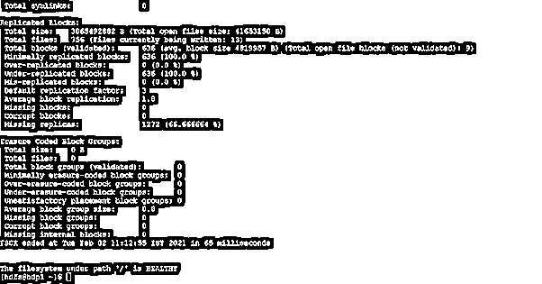

# Hadoop fsck

> 原文：<https://www.educba.com/hadoop-fsck/>

## Hadoop fsck 简介

在 Hadoop 堆栈中，我们使用 HDFS 服务来管理 Hadoop 的完整存储部分。fsck 命令用于检查 HDFS 级别或 HDFS 文件系统上的各种不一致。为了保持 HDFS 文件系统的健康，我们需要对 HDFS 文件系统进行适当的管理。HDFS 文件系统用于检查文件系统的运行状况。我们能够在复制的数据块下、丢失的文件数据块、损坏的数据块、复制的数据块上等位置进行查找。根据需要，我们可以将不同的命令与 fsck 命令一起使用。在本主题中，我们将了解 Hadoop fsck。

**HDFS fsck 的语法**

<small>Hadoop、数据科学、统计学&其他</small>

`hadoop fsck [ GENERIC OPTIONS ] < path > [-delete | -move | -openforwrite ] [-files [ -blocks [ -locations | -racks] ] ]`

1.Hadoop:我们可以在语法或命令中使用 Hadoop 关键字。它会将不同的参数作为选项和命令。最终结果是，我们能够检查 Hadoop HDFS 文件系统的状态。

2.fsck:使用 HDFS 文件系统的状态。我们需要在 HDFS 或 Hadoop 命令中使用 fsck 关键字。

3.选项:我们可以提供不同的标志作为与 Hadoop fsck 命令兼容的选项。我们需要使用不同的兼容关键字，如 delete、-move、-openforwrite 等。

4.路径:根据需要，我们可以定义 HDFS 路径来检查 HDFS 文件系统的状态。

### HDFS fsck 是如何工作的？

在 Hadoop 生态系统中，我们有多个组件或服务。HDFS 是分布式存储数据的重要服务之一。在运行任何应用程序作业时，数据应处于一致状态，这一点很重要。由于数据分布在不同的节点上，可能会出现数据不一致的情况。为了解决这个问题，我们使用了 hadoop fsck 命令。这将有助于检查 Hadoop 文件系统中的不一致性。它主要用于报告 HDFS 文件系统的问题。在报告中，它将提供有关复制数据块、丢失文件数据块、损坏数据块、覆盖复制数据块等信息。在传统的 fsck 命令中，fsck 命令不会纠正检测到的错误。一般来说，namenode 会自动精确恢复文件系统的大部分变更或故障部分。默认情况下，fsck 命令会忽略打开的文件，但在报告时，它会选择所有文件并给出其详细信息。HDFS / Hadoop fsck 命令不是 shell 命令。基本上，它会运行“bin/hadoop fsck”文件。

Hadoop fsck 命令处理 Hadoop HDFS 服务。为了使用 Hadoop fsck 命令，我们可以以不同的方式触发该命令，如 HDFS shell、Hue UI、Zeppelin UI、第三方应用工具等。

Hadoop fsck 命令将从 HDFS shell 窗口或任何其他工具中触发。HDFS 编译器将首先验证该命令。如果命令是有效的，那么它将通过进一步的进程，或者它将通过一个错误消息。一旦命令生效，请求就会发送到 HDFS namenode。具有 HDFS 街区详细信息的命名节点。它将检查请求是否有可用的块信息。如果块信息可用，它将对其执行必要的操作。如果块信息不存在，则会显示一条错误消息。

以下是与 Hadoop fsck 命令兼容的选项列表。

<path>:根据引号<>，从同一路径开始检查。</path>

-move:这将有助于将损坏的文件移动到/lost+found。

-delete:这将有助于在 HDFS 级别删除损坏的文件。

-openforwrite:它将打印为写入而打开的输出文件。

-files:它将显示正在检查的文件。

-blocks:这将有助于显示 HDFS 文件系统的块报告信息。

-位置:它将显示每个街区的位置。

-机架:这将有助于显示数据节点位置的网络拓扑。

### HDFS fsck 的例子

以下是提到的例子

#### Hadoop fsck 命令

在 Hadoop 环境中，Hadoop fsck 命令用于检查 Hadoop 文件系统的一致性状态。它将打印 HDFS 文件系统的详细报告。

**语法:**

`hadoop fsck /`

**说明:**

按照上面的命令，我们得到了平均块、缺失块、损坏块、缺失内部块等的详细报告。我们正在获取“/”级别的信息。如果您需要特定目录的信息，我们可以提供该目录的路径。

**输出:**

#### HDFS fsck:检查 HDFS 损坏块的状态

在 Hadoop 中，我们拥有仅打印 HDFS 校正数据块的功能。这将有助于识别块信息并尝试修复它。

**语法:**

`HDFS fsck / -list-corruptfileblocks`

**说明:**

按照上面的命令，我们使用-list-corruptfileblocks 选项。这将有助于仅打印“/”HDFS 级别的块信息。

**输出:**

#### HDFS fsck:获取复制不足的块的状态

在 Hadoop fsck 命令中，我们可以在复制的块下打印。

**语法:**

`HDFS fsck /spark2-history/ | grep 'Under replicated' | awk -F':' '{print $1}'`

**说明:**

按照上面的命令，我们使用“/spark2-history/”目录。我们正在获取“/spark2-history/”目录的“复制不足”块的信息。
**输出:**

### 结论 Hadoop fsck

我们已经看到了“HDFS fsck”的完整概念，以及正确的示例、解释和输出。就 Hadoop 文件系统数据或文件恢复而言，HDFS fsck 非常重要。我们能够从平均数据块、缺失数据块、损坏数据块、缺失内部数据块等方面获得 HDFS 文件系统的详细信息。它还将检查 Hadoop 文件系统的一致性状态。

### 推荐文章

这是一个 Hadoop fsck 的指南。在这里，我们讨论了“HDFS fsck”的完整概念，并给出了适当的例子、解释和输出。您也可以看看以下文章，了解更多信息–

1.  [Hadoop 调度程序](https://www.educba.com/hadoop-schedulers/)
2.  [Hadoop 管理员](https://www.educba.com/hadoop-administrator/)
3.  [Hadoop fs 命令](https://www.educba.com/hadoop-fs-commands/)
4.  [Hadoop 的优势](https://www.educba.com/advantages-of-hadoop/)

