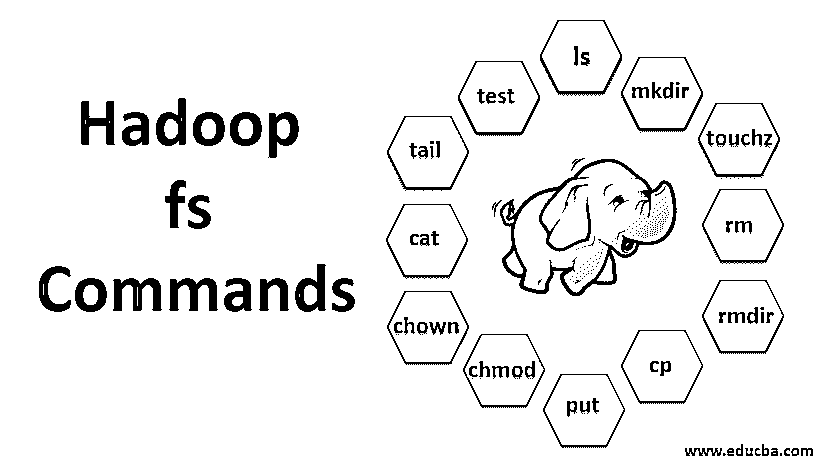

# Hadoop fs 命令

> 原文：<https://www.educba.com/hadoop-fs-commands/>

## Hadoop fs 命令简介

Hadoop fs 命令是用于 Hadoop 系统的命令行实用程序。这些命令广泛用于处理数据和相关文件。这些命令是基于 Linux 的命令，用于控制 Hadoop 环境和数据文件。“Hadoop fs”作为前缀与命令语法相关联。一些常用的 Hadoop fs 命令包括列出目录结构以查看文件和子目录、在 HDFS 文件系统中创建目录、创建空文件、从 HDFS 删除文件和目录、将文件从其他边缘节点复制到 HDFS 以及将文件从 HDFS 位置复制到边缘节点。

### Hadoop fs 的命令

现在，让我们学习如何使用 HADOOP fs 命令。

<small>Hadoop、数据科学、统计学&其他</small>

我们将从基础开始。只需在 PUTTY 或任何您熟悉的控制台中键入这些命令。

#### 1.hadoop fs -ls

对于目录，它返回文件和目录的列表，而对于文件，它返回文件的统计信息。

****hadoop fs -lsr:**** 这是用于递归列出特定文件夹下的目录和文件。

**举例**:

`Hadoop fs -ls / or hadoop fs -lsr`

**Note** : hadoop fs -ls [-d] [-h] [-R]

*   **-d:** 用于以普通文件的形式列出目录。
*   **-h:** 这用于将文件的大小格式化为人类可读的方式，而不仅仅是字节数。
*   **-R:** 用于递归列出目录的内容。

#### 2.hadoop fs -mkdir

该命令将路径作为参数，[在 hdfs 中创建目录。](https://www.educba.com/what-is-hdfs/)

**举例**:

`hadoop fs -mkdir /user/datahub1/data`

**Note:** If we try to create subdirectories, the parent directory must exist. If this condition is not met then, ‘No such file or directory’ will be appearing.

#### 3.hadoop fs -touchz

它创建一个空文件，不利用任何空间

**举例:**

`hadoop fs -touchz URI`

#### 4.hadoop fs -rm

删除指定为参数的文件。我们必须指定-r 选项来删除整个目录。如果指定了-skipTrash 选项，它将跳过回收站，并立即删除文件。

**举例**:

`hadoop fs -rm -r /user/test1/abc.text`

#### 5.hadoopfs -rmdir

它删除目录和子目录的文件和权限。基本上，它是 Hadoop fs -rm 的扩展[版本。](https://www.educba.com/hadoop-versions/)

#### 6.hadoop fs -cp

它将文件从一个位置复制到另一个位置

**举例**:

`hadoop fs -cp /user/data/abc.csv /user/datahub`

#### 7.hadoop fs -copyFromLocal

它将文件从 edgenode 复制到 HDFS。

#### 8.hadoop fs -put

它将文件从 edgenode 复制到 HDFS，类似于前面的命令，但是 put 也从标准输入 stdin 读取输入，并写入 HDFS

**举例**:

`hadoop fs -put abc.csv /user/data`

**注:**

*   ****hadoop fs -put -p:**** 标志保存了访问、修改时间、所有权和模式。
*   ****hadoop fs -put -f:**** 如果文件在复制之前已经存在，该命令会覆盖目标。

#### 9. hadoop fs -moveFromLocal

它类似于从本地复制，只是源文件在复制到 HDFS 后会从本地 edgenode 中删除

**举例**:

`fs -moveFromLocal abc.text /user/data/acb.`

#### 10.hadoop fs -copyToLocal

它将文件从 HDFS 复制到 edgenode。

**举例**:

`fs -copyToLocal abc.text /localpath`

#### 11.hadoop fs -chmod

这个命令帮助我们改变文件或目录的访问

**举例**:

`hadoop fs -chmod [-R] [path]`

#### 12.hadoop fs -chown

这个命令帮助我们改变文件或目录的所有权

**举例**:

`hadoop fs -chown [-R] [OWNER][:[GROUP]] PATH`

#### 13.hadoop fs -cat

它在终端上打印 HDFS 文件的内容

**举例**:

`hadoop fs -cat /user/data/abc.csv`

#### 14.hadoop fs -tail

它向标准输出显示 HDFS 文件的最后一个 KB

**举例**:

`hadoop fs -tail /in/xyzfile`

#### 15.Hadoop fs-测试

该命令用于 HDFS 文件测试操作，如果为真，则返回 0。

*   –**e:**检查文件是否存在。
*   **-z:** 检查文件长度是否为零
*   **-d/-f:** 分别检查路径是否为目录/文件

这里，我们详细讨论一个例子

**举例**:

`hadoop fs -test -[defz] /user/test/test1.text`

#### 16.hadoop fs -du

显示给定目录中包含的文件和目录的大小，如果是文件，则显示文件的长度

#### 17.hadoop fs -df

它显示可用空间

#### 18.Hadoop fs-校验和

返回文件的校验和信息

#### 19.hadoop fs -getfacl

它显示特定文件或目录的访问控制列表(ACL)

#### 20.hadoop 文件系统计数

它计算与指定文件模式匹配的路径下的目录、文件和字节数。

#### 21.hadoop fs -setrep

更改文件的复制因子。如果该路径是一个目录，则该命令会更改该目录下所有文件的复制因子。

**举例**:

`hadoop fs -setrep -R /user/datahub:`

它用于接受向后功能，没有任何作用。

**Hadoop fs–set rep-w/user/data hub**:等待复制完成

#### 22.hadoop fs -getmerge

它将源文件中的 HDFS 文件连接到目标本地文件中

**举例**:

`hadoop fs -getmerge /user/datahub`

#### 23.hadoop fs -appendToFile

将本地文件系统中的一个或多个源附加到目标。

**举例**:

`hadoop fs -appendToFile xyz.log data.csv /in/appendfile`

#### 24.hadoop fs -stat

它打印关于文件或目录的统计数据。

**举例**:

`hadoop fs -stat [format]`

### 结论

因此，我们已经完成了文件处理和查看文件内部数据所需的几乎所有命令。现在，您可以修改文件并将数据导入 Hadoop 平台。

### 推荐文章

这是 Hadoop fs 命令指南。在这里，我们详细讨论基本概念、各种 Hadoop fs 命令及其示例。您也可以阅读以下文章，了解更多信息——

1.  [安装 Hadoop](https://www.educba.com/install-hadoop/)
2.  [Hadoop 工具](https://www.educba.com/hadoop-tools/)
3.  [Hadoop 架构](https://www.educba.com/hadoop-architecture/)
4.  [Hadoop 组件](https://www.educba.com/hadoop-components/)
5.  [学习不同类型的 Hadoop 命令](https://www.educba.com/hadoop-commands/)

