# Hadoop FS 命令列表

> 原文：<https://www.educba.com/hadoop-fs-command-list/>

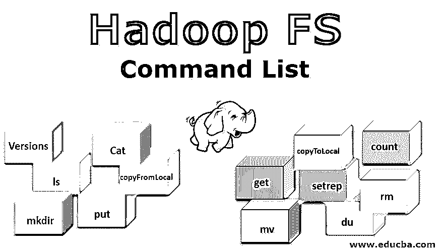

## Hadoop FS 命令列表简介

Hadoop 工作在自己的文件系统上，这个文件系统在自然界中是分布式的，被称为“Hadoop 分布式文件系统 HDFS**”**。Hadoop 依赖于分布式存储和并行处理。这种在集群中的分布式位置存储文件的方式称为 Hadoop 分布式文件系统，即 HDFS。为了在文件级别执行各种操作，HDFS 提供了自己的一组命令，称为 Hadoop 文件系统命令。让我们来探索这些命令。在本主题中，我们将了解 Hadoop FS 命令。

### Hadoop FS 命令列表中的命令

任何 HDFS 命令都有前缀“hdfs dfs”。这意味着我们指定默认文件系统是 HDFS。让我们逐一探索 Hadoop FS 命令列表

<small>Hadoop、数据科学、统计学&其他</small>

#### 1.版本

version 命令用于查找系统中安装的 Hadoop 版本。

**语法:** `Hadoop version`

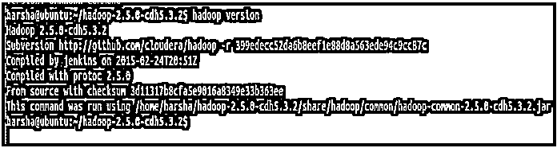

#### 2.ls 命令

Hadoop 中的 ls 命令用于指定上述路径中的目录列表。ls 命令将 hdfs 路径作为参数，并返回路径中存在的目录列表。

**语法:** `hdfs dfs  -ls  <hdfs file path>`

**示例:** hdfs dfs -ls /user/harsha

对于递归模式，我们也可以使用-lsr

语法:HDFS DFS–LSR

#### 3.Cat 命令

[Cat 命令](https://www.educba.com/cat-command-in-linux/)用于向控制台显示文件的内容。该命令将 hdfs 文件路径作为参数，并显示文件的内容。

**语法:** `hdfs dfs  -cat <hdfs file path>`

**示例:**HDFS DFS-cat/user/harsha/EMP new . txt

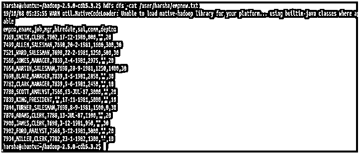

#### 4.mkdir 命令

[mkdir 命令用于](https://www.educba.com/mkdir-command-in-linux/)在 hdfs 文件系统中创建一个新目录。它将 hdfs 路径作为参数，并在指定的路径中创建新目录。

**语法:** `hdfs  dfs  -mkdir  <hdfs path>`

**示例:**HDFS DFS-mkdir/用户/示例

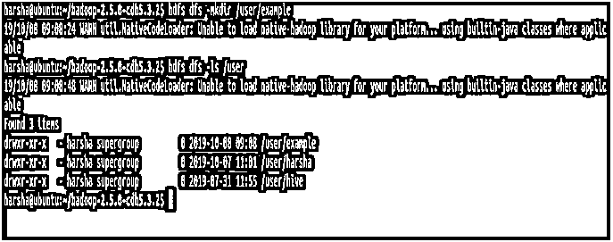

在上面的屏幕截图中，可以清楚地看到我们正在使用 mkdir 命令创建一个名为“example”的新目录，使用 ls 命令也可以看到同样的情况。

同样对于 mkdir 命令，我们可以给出'-p '选项。如果缺少父目录，它会在路径中创建父目录。

**示例:**HDFS DFS-mkdir-p/user/test/Example 2

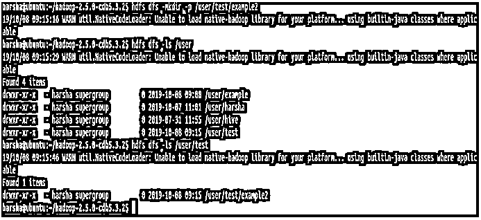

在上面的截图中，很明显我们有-p 选项，并且在路径/user/test/example2 中，创建了 tests 和 example2 目录。

#### 5.上传命令

hdfs path 命令用于将文件从给定的源位置复制到目标 HDFS 路径。这里，源位置可以是本地文件系统路径。put 命令有两个参数，第一个是源目录路径，第二个是目标 HDFS 路径

**语法:** `hdfs  dfs  -put  <source path>  <destination path>`

**示例:**HDFS DFS-put/home/harsha/EMP new . txt/user/test/Example 2

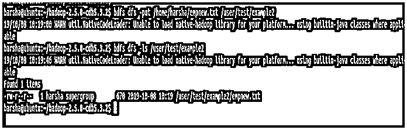

在上面的截图中，我们可以清楚地看到文件是从源复制到目的的。

#### 6.copyFromLocal 命令

HDFS 的 copyFromLocal 命令用于将文件从源路径复制到目标路径。该命令中的源代码仅限于本地文件系统

**语法:** `hdfs  dfs  -copyFromLocal  /home/harsha/empnew.txt/user/harsha/example`

**put 命令和 copyFromLocal 命令的区别:**这两个 hdfs shell 命令没有太大区别。它们都用于从本地文件系统复制到目标 HDFS 文件路径。

但是 put 命令更有用，也更健壮，因为它允许将多个文件或目录复制到 HDFS 目的地

hdfs dfs -put<source1><source2><destination></destination></source2></source1>

#### 7.获取命令

hdfs 中的 get 命令用于将给定的 hdfs 文件或目录复制到目标本地文件系统路径。它有两个参数，一个是源 hdfs 路径，另一个是目标本地文件系统路径

**语法:** `hdfs  dfs  -get  <source hdfs>  <destination local file system>`

**示例:**HDFS DFS-get/user/test/Example 2/home/harsha

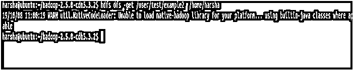

#### 8.copyToLocal 命令

hdfs 中的 copyToLocal 命令用于将 hdfs 中的文件或目录复制到本地文件系统。在这个命令中，目标被固定到本地文件系统。这个 copyFromLocal 命令类似于 get 命令。

**语法:** `hdfs dfs  -copyToLocal  <source hdfs>  <local file system>`

**示例:**HDFS DFS-copy to local/user/harsha/Example/home/harsha

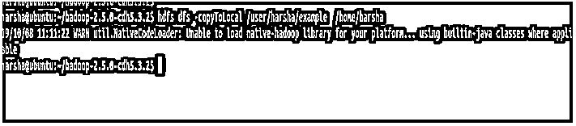

#### 9.计数命令

hdfs 中的 count 命令用于计算给定路径中存在的目录数量。count 命令将一个给定的路径作为参数，并给出该路径中存在的目录数。

**语法:** `hdfs  dfs  -count  <path>`

**示例:**HDFS DFS-计数/用户

#### 10.mv 命令

hdfs 中的 mv 命令用于在 hdfs 之间移动文件。 [mv 命令从给定的源 hdfs 路径获取](https://www.educba.com/mv-command-in-linux/)文件或目录，并将其移动到目标 hdfs 路径。

**语法** : `hdfs  dfs  -mv <hdfs path>  <hdfs path>`

**示例**:HDFS DFS-mv/用户/测试/示例 2/用户/harsha

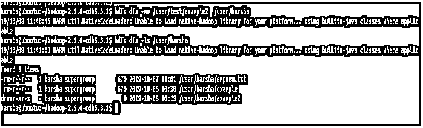

在上面的截图中，我们可以看到 example2 目录现在位于/user/harsha 中

#### 11.setrep 命令

hdfs 中的 setrep 命令用于更改给定文件的复制因子。默认情况下，hdfs 的复制因子为“3”。如果给定的路径是一个目录，该命令将改变该目录中所有文件的复制因子。

**语法:** `hdfs  dfs  -setrep [-R] [-w] <rep> <path>`

**-w:** 该标志指定命令应该等待复制完成。

**rep:** 复制因子

**示例:**HDFS DFS-set rep-w5/user/harsha/EMP new . txt

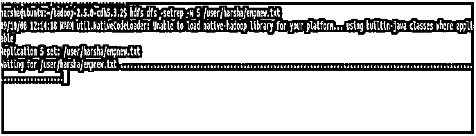

#### 12.杜命令

hdfs 中的 du 命令显示给定 hdfs 路径的磁盘利用率。它将 hdfs 路径作为输入，并以字节为单位返回磁盘利用率。

**语法** : `hdfs dfs  -du  <hdfs path>`

**示例:**HDFS DFS-du/user/harsha/EMP new . txt

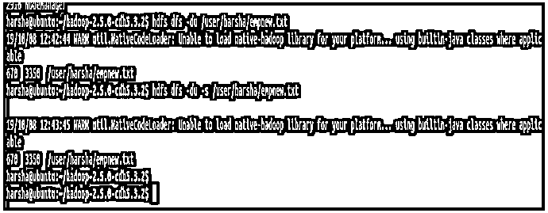

#### 13.rm 命令

hdfs 中的 rm 命令用于删除给定 hdfs 路径中的文件或目录。该命令将 hdfs 路径作为输入，并删除该路径中的文件。

**语法** : `hdfs  dfs  -rm  <hdfs path>`

**示例**:HDFS DFS-RM/user/harsha/Example

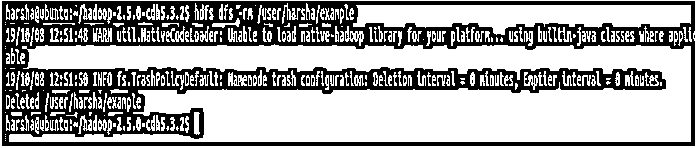

### 结论

我们由此开始了解各种 hdfs 命令，以及它们各自的语法和示例。我们应该注意启动任何 hdfs 命令，我们需要运行 bin/hdfs 脚本。hdfs 后面是一个名为 dfs 的选项，这表明我们正在使用 Hadoop 分布式文件系统。借助上述命令，我们可以与 HDFS 文件系统进行协商。

### 推荐文章

这是 Hadoop FS 命令的指南。在这里，我们讨论了基本、中级和高级命令以及有效使用的提示和技巧。您也可以阅读以下文章，了解更多信息——

1.  [Hadoop 架构](https://www.educba.com/hadoop-architecture/)
2.  [HADOOP 框架](https://www.educba.com/hadoop-framework/)
3.  [安装 Hadoop](https://www.educba.com/install-hadoop/)
4.  [Hadoop 工具](https://www.educba.com/hadoop-tools/)

