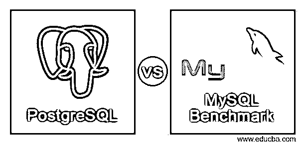
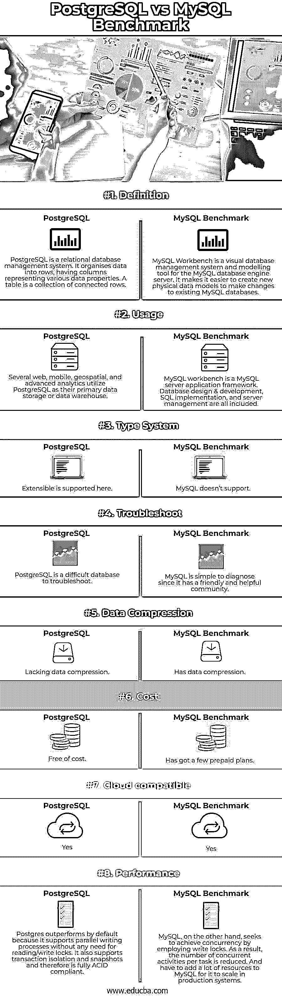

# PostgreSQL 与 MySQL 基准测试

> 原文：<https://www.educba.com/postgresql-vs-mysql-benchmark/>




## PostgreSQL 与 MySQL 基准测试的区别

以下文章提供了 PostgreSQL 与 MySQL 基准测试的概要。MySQL 和 Postgres 之间的速度差距在现代更新中已经基本消除。MySQL 最新版本提供的数据安全性和交易处理支持对任何组织都非常有益，尤其是对于经常进行货币交易的电子商务公司。

**什么是 PostgreSQL？**

<small>Hadoop、数据科学、统计学&其他</small>

PostgreSQL 非常适合复杂的任务和并发性，并确保数据完整性，尽管它对于读密集型活动来说是昂贵的。重要的云服务提供商，即亚马逊、谷歌和微软，都参与其中。在 PostgreSQL 中，创建并区分一个和多对多关联。

**代码:**

```
UPDATE name SET segment = "mainhello" WHERE age > 20; Here everything is case sensitive.
```

**什么是 MySQL 基准测试？**

MySQL Workbench 是 Oracle 开发的可视化工具，用于管理 MySQL 数据库。MySQL 非常适合这样的跨平台程序，允许它在各种操作系统上运行，包括 Windows、Linux 和 Mac OS x。MySQL work bench 包括信息建模、SQL 创建和各种配置工具。它还有一个图形用户界面，系统地允许你处理数据库。例如，使用 MySQL Workbench，可以开发统计方法并处理结构化数据。MySQL 以严格遵守 SQL 规则为代价，追求速度和可靠性。

**代码:**

```
UPDATE name SET segment = "mainhello" WHERE age > 20; Sql Benchmark is not case sensitive.
```

MySQL 和 PostgreSQL 都没有足够的日志监控程序。因此，从内置日志中提取有意义的情报是一件苦差事。关系数据库管理系统处理一个流行和最简单的数据库，包括内存使用、磁盘和 CPU 消耗(RDMS)。MySQL 社区版是一个由活跃的在线社区支持的免费下载软件。

### PostgreSQL 与 MySQL 基准测试的直接比较(信息图表)

以下是 PostgreSQL 与 MySQL 基准测试的 8 大区别:




### PostgreSQL 与 MySQL 基准测试的主要区别

让我们讨论一下 PostgreSQL 与 MySQL 基准测试之间的一些主要差异:

*   MySQL 以牺牲并发性为代价，作为读取密集型应用程序的高速数据库而闻名。
*   MySQL benchmark 是轻量级的，允许它依靠高速度和可靠性，使其成为网站和互联网支付的理想选择。尽管如此，PostgreSQL 适合于更复杂的分析操作。
*   PostgreSQL 国际开发小组创建了 PostgreSQL，下面以相当于 MIT 许可证的开源许可证的形式提供。MySQL 的源代码在 GNU 许可和一些私人合同下对公众开放。然而，甲骨文公司现在拥有它，它必须提供各种收费的商业版本。
*   PostgreSQL 是独一无二的，因为它是对象关系的、ACID 兼容的、NoSQL 兼容的和高度并发的。
*   表分区和函数重载是 PostgreSQL 的特性，平均而言，它可以更好地管理并发性。相反，SQL 适用于更简单的应用程序，通常会利用更多的存储空间。
*   尽管 PostgreSQL 支持 JSON 对象，允许用户模拟 MongoDB 功能，但我们可以说，SQL 基准测试要复杂得多，在许多情况下，比 NoSQL 数据库更好处理。
*   最著名的海量数据系统是 MySQL，一种 Oracle 支持的 RDBMS。它是一个开源操作系统，支持许多网络应用和网站。它的设置很简单，只需要很小的微调就能产生良好的效果。然而，由于其复杂的底层技术，PostgreSQL 已经成为执行高级和高数据处理的组织的首选。

### PostgreSQL 与 MySQL 基准测试的比较表

让我们讨论一下 PostgreSQL 与 MySQL 基准测试之间的一些比较:

|  | **PostgreSQL** | **MySQL 基准测试** |
| **定义** | PostgreSQL 是一个关系数据库管理系统。它将数据组织成行，列代表各种数据属性。表是连接的行的集合。 | MySQL Workbench 是 MySQL 数据库引擎服务器的可视化数据库管理系统和建模工具。它使得创建新的物理数据模型来修改现有的 MySQL 数据库变得更加容易。 |
| **用途** | 一些 web、移动、地理空间和高级分析利用 PostgreSQL 作为他们的主要数据存储或数据仓库。 | MySQL workbench 是一个 MySQL 服务器应用程序框架。数据库设计和开发、SQL 实施和服务器管理都包括在内。 |
| **类型系统** | 这里支持可扩展。 | MySQL 不支持。 |
| **故障排除** | PostgreSQL 是一个很难排除故障的数据库。 | MySQL 很容易诊断，因为它有一个友好和有益的社区。 |
| **数据压缩** | 缺乏数据压缩。 | 有数据压缩。 |
| **成本** | 免费的。 | 有一些预付的计划。 |
| **云兼容** | 是 | 是 |
| **性能** | 默认情况下，Postgres 的性能优于，因为它支持并行写入过程，而不需要读/写锁。它还支持事务隔离和快照，因此完全符合 ACID。 | 另一方面，MySQL 试图通过使用写锁来实现并发。因此，每个任务的并发活动数量减少了。并且必须向 MySQL 添加大量资源来扩展生产系统。 |

虽然这两个数据库有许多相似之处，但它们也有显著的差异。因此，即使我们已经提供了两者的全面比较，在最后，人们必须检查个人情况，选择哪个数据库更适合业务需求。

### 结论

PostgreSQL 和 MySQL 各有优缺点，但是知道哪些特性最适合一个项目并结合这些特性将会提高速度。如果我们想开发一个更复杂和定制的系统，PostgreSQL 可以很容易地与许多技术联系起来。

### 推荐文章

这是 PostgreSQL vs MySQL 基准测试指南。在这里，我们讨论 PostgreSQL 和 MySQL 基准测试的主要区别，并提供信息图表和比较表。您也可以看看以下文章，了解更多信息–

1.  [PostgreSQL vs 红移](https://www.educba.com/postgresql-vs-redshift/)
2.  [PostScript vs PCL](https://www.educba.com/postscript-vs-pcl/)
3.  [PostgreSQL vs SQLite](https://www.educba.com/postgresql-vs-sqlite/)
4.  [PostgreSQL vs MariaDB](https://www.educba.com/postgresql-vs-mariadb/)


