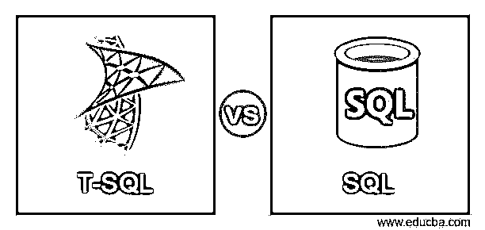
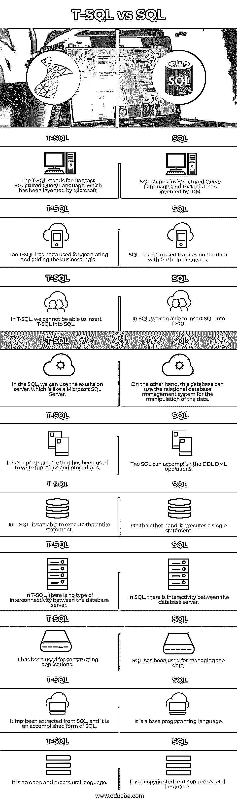

# T-SQL 与 SQL

> 原文：<https://www.educba.com/t-sql-vs-sql/>

## T-SQL 与 SQL 的区别

下面的文章提供了 T-SQL 与 SQL 的概要。T-SQL 是 SQL server 使用的过程语言，因为我们不能在 SQL 中使用 T-SQL；它可以编写查询，以便所有命令在服务器上同时产生。它的语句也用于执行对数据库的事务。相比之下，SQL 是用于处理和操作数据的编程语言，它可以允许在服务器上提交每个单独的语句，我们可以在 T-SQL 中使用 SQL。报告是 SQL 的主要目的。

T-SQL:T-SQL 代表 Transact 结构化查询语言，因为它是已经在微软服务器中使用的 SQL 语言的扩展，并且它具有 SQL 的所有功能以及附加功能；让我们明白，它与 SQL 相同，但它有一些额外的功能，这就是为什么它是独立的。我们可以说，它与 SQL 方言相同，它可以执行清晰和固定的标识，以便数据库公司能够添加其扩展来调整它们，使它们与其他产品分开；因此，我们可以说它是软件的中心，它允许在软件下运行更多的操作。

<small>Hadoop、数据科学、统计学&其他</small>

**SQL:**SQL 代表结构化查询语言，是一种可用于与数据库交互的编程语言；这种语言已经被用于保存、计算和更新存储在数据库中的数据，我们可以说它允许许多公司操作存储的数据，例如，零售商可以在数据库中保存订单和客户信息，SQL 中的语句可以一次执行，因此它是一种非过程化语言，其中 T-SQL 和 SQL 都被用在数据库中。

### T-SQL 与 SQL 的直接比较(信息图表)

下面是 T-SQL 与 SQL 之间的主要比较:

### T-SQL 与 SQL 的主要区别

以下是 T-SQL 和 SQL 之间的主要区别:

*   **语言:** T-SQL 是一种事务性的结构化查询语言，可以在 SQL 编程中用于各种事务性活动，当用户可以使用 T-SQL 时，他们就可以利用各种编程技术，而 SQL 是一种结构化查询语言，尤其可以用于执行具有各种操作的查询，如插入、更新、删除和选择，其中用户不能一次执行各种语句。
*   **用途:**T-SQL 已被用于借助各种编程技术执行应用程序的后台事务，特别是已被用于在固定程序中添加业务逻辑；它还用于构建特定应用程序的应用程序逻辑，而 SQL 语句用于生成定期报告、网页和屏幕，它有助于帮助应用程序，如果我们想在应用程序中进行更新，我们必须执行查询，并且它的语句也用于报告。
*   **标准:** SQL 是结构化查询语言，有 ANSI/ISO 的标准，而 T-SQL 是 SQL 语言的实现，也遵循 SQL。
*   **面向数据和程序:** T-SQL 是事务性语言，可用于生成应用程序，也可用于在应用程序的后端追加业务逻辑，而 SQL 是面向数据的语言，可用于在生成查询的帮助下操作数据。
*   **对象:**T-SQL 已经被用于编写过程、函数和触发器，它们被称为对象，而 SQL 已经被用于通过使用 DDL 和 DML 语句进行通信。
*   **执行:**根据执行情况，T-SQL 有不同的 SQL 语句，依次执行，而 SQL 可以同时执行一条语句。
*   **对数据库的指令:**让我们讨论一下 T-SQL 和 SQL 如何告诉数据库指令。因此，T-SQL 是告诉数据库如何进行活动的事务性语言。相比之下，SQL 有声明性语句，告诉数据库做什么，但不能告诉如何做活动。

### T-SQL 与 SQL 比较表

以下是 T-SQL 与 SQL 之间的十大对比:

| **T-SQL** | **SQL** |
| T-SQL 代表微软发明的 Transact 结构化查询语言。 | SQL 代表结构化查询语言，是 IDM 发明的。 |
| T-SQL 用于生成和添加业务逻辑。 | SQL 已经被用来在查询的帮助下关注数据。 |
| 在 T-SQL 中，我们无法将 T-SQL 插入 SQL。 | 在 SQL 中，我们可以将 SQL 插入到 T-SQL 中。 |
| 我们可以在 SQL 中使用扩展服务器，它类似于 Microsoft SQL 服务器。 | 另一方面，这个数据库可以使用关系数据库管理系统来操作数据。 |
| 它有一段用于编写函数和过程的代码。 | SQL 可以完成 DDL DML 操作。 |
| 在 T-SQL 中，它能够执行整个语句。 | 另一方面，它执行单个语句。 |
| 在 T-SQL 中，数据库服务器之间没有任何类型的互连。 | 在 SQL 中，数据库服务器是交互式的。 |
| 它已被用于构建应用程序。 | 使用 SQL 来管理数据。 |
| 它是从 SQL 中提取出来的，SQL 是 SQL 的一种完整形式。 | 它是一种基础编程语言。 |
| 它是一种开放的程序性语言。 | 它是一种受版权保护的非过程语言。 |

### 结论

在本文中，我们得出结论，SQL 是编程语言，T-SQL 是过程语言，这意味着 T-SQL 为 SQL 功能提供了额外的附加信息，我们已经讨论了它们之间的主要差异和比较差异，因此本文将有助于理解 SQL 和 t SQL 之间的差异。

### 推荐文章

这是 T-SQL 与 SQL 之间最大区别的指南。在这里，我们还将讨论 T-SQL 与 SQL 的主要区别，包括信息图表和比较表。您也可以看看以下文章，了解更多信息–

1.  [Oracle vs SQL Server](https://www.educba.com/oracle-vs-sql-server/)
2.  [Oracle vs MSSQL](https://www.educba.com/oracle-vs-mssql/)
3.  [PostgreSQL vs 红移](https://www.educba.com/postgresql-vs-redshift/)
4.  [左连接 vs 右连接](https://www.educba.com/left-join-vs-right-join/)

