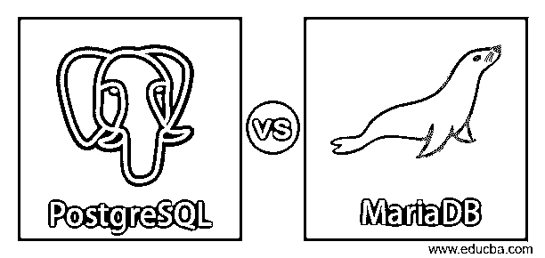
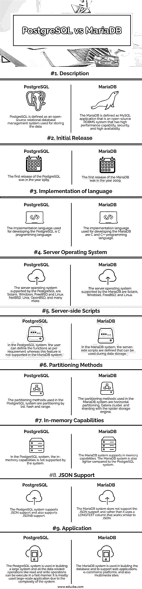

# PostgreSQL vs MariaDB

> 原文：<https://www.educba.com/postgresql-vs-mariadb/>

## PostgreSQL 与 MariaDB 的区别

PostgreSQL 被定义为一种类型的数据库系统，其被分类为对象关系型数据库系统，该数据库系统可作为开放源代码数据库系统，其被设计用于基于 UNIX 的系统、Solaris、Mac OS、Windows 和其他操作系统，以将数据存储在 PostgreSQL 数据库中。MariaDB 是市场上提供的另一种开源数据库服务器，它充当 SQL 接口，以便可以在各个部门(如银行和数据管理至关重要的其他部门)轻松访问和使用数据。

### PostgreSQL 与 MariaDB 的面对面比较(信息图表)

以下是 PostgreSQL 与 MariaDB 之间的 9 大区别:

<small>Hadoop、数据科学、统计学&其他</small>

### PostgreSQL 和 MariaDB 的主要区别

以下是 PostgreSQL 与 MariaDB 的主要区别:

*   MariaDB 和 PostgreSQL 系统的主要区别之一是性能。PostgreSQL 和 MariaDB 系统都是高性能系统，可以用于企业的数据管理。当在两个系统之间进行比较时，PostgreSQL 系统在周转时间方面表现出比 MariaDB 系统更好的性能。与 MariaDB 系统相比，PostgreSQL 中的读写操作要快得多，而且在为业务组织选择系统时，数据的访问也很重要。
*   两个数据库系统的另一个区别是特性。PostgreSQL 系统提供了部分索引和物化视图，有助于提高数据库的性能。另一方面，在 MariaDB 系统中，不支持这种有助于提高数据库性能的特性。在 MariaDB 系统中，使用的架构是主-从复制和主-主复制。另一方面，在 PostgreSQL 中，所使用的架构仅仅是主从复制。
*   PostgreSQL 和 MariaDB 系统之间的另一个主要区别是大小和分区。当 MariaDB 系统与 PostgreSQL 系统相比时，根据操作系统版本，MariaDB 系统的大小较小。与 PostgreSQL 数据库系统相比，MariaDB 系统中的内存分配很少，而且 MariaDB 数据库也更轻。在分区的基础上比较 MariaDB 系统和 PostgreSQL 时，MariaDB 使用各种分区技术，而 PostgreSQL 不支持分区。
*   PostgreSQL 系统和 MariaDB 系统的另一个主要区别是使用数据库。PostgreSQL 数据库系统由大型组织使用，可以用于不同的部门，如金融、教育、商业、技术、媒体和许多更大规模的项目。使用 MariaDB 数据库的组织有阿里巴巴、谷歌、脸书、维基百科和许多大型组织。
*   PostgreSQL 和 MariaDB 系统的另一个主要区别是数据库的部署。PostgreSQL 数据库系统是用 C 编程语言编写的，支持多种编程语言，如 C、C++、Java、Python 和 Perl。PostgreSQL 系统有不同的二进制格式，源代码也可以从官方网站下载。MariaDB 系统是用 C 和 C++编程语言编写，支持多种编程语言，如 C、C#、Erlang、Java、Python、PHP、Perl 和许多其他编程语言。MariaDB 数据库系统也有不同的二进制格式，源代码也是可用的。这两种数据库系统都支持多种操作系统，如 Windows、Solaris、Linux、Mac OS 以及更多操作系统。
*   两个系统之间的另一个关键区别是一致性概念。PostgreSQL 系统和 MariaDB 系统支持一致性功能，这有助于非常快速地写入数据和读取数据，并且该功能增加了可由大规模组织使用的这两种系统的普及性。
*   两个数据库系统都支持事务概念。MariaDB 系统和 PostgreSQL 系统 ACID 包括原子性、一致性、完整性和持久性。这一特性有助于用户维护大量数据并正确管理数据。

### PostgreSQL 与 MariaDB 比较表

让我们来讨论一下 PostgreSQL 与 MariaDB 之间的顶级比较:

| **因子** | **马里亚布** | **PostgreSQL** |
| **描述** | MariaDB 被定义为 MySQL 应用程序，它是一个开源的 RDBMS 系统，具有高性能、安全性和高可用性。 | PostgreSQL 被定义为用于存储数据的开源关系数据库管理系统。 |
| **初始发布** | MariaDB 的首次发布是在 2009 年。 | PostgreSQL 的第一次发布是在 1989 年。 |
| **实现语言** | 用于开发 MariaDB 的实现语言是 C 和 C++编程语言。 | The implementation language used for developing the PostgreSQL is the C programming language. |
| **服务器操作系统** | MariaDB 支持的服务器操作系统有 Solaris、Windows、FreeBSD 和 Linux。 | PostgreSQL 支持的服务器操作系统有 Solaris、Windows、FreeBSD 和 Linux、NetBSD、Unix、OpenBSD 等等。 |
| **服务器端脚本** | 在 MariaDB 系统中，定义了可以在数据存储期间使用的服务器端脚本。 | 在 PostgreSQL 系统中，用户可以根据需要定义函数，而在 MariaDB 系统中不支持该功能。 |
| **分区方法** | MariaDB 系统中使用的分区方法是水平分区、Galera 集群和使用 spider 存储引擎的分片。 | PostgreSQL 系统中使用的分区方法是通过列表、散列和范围进行分区。 |
| **内存功能** | MariaDB 系统支持内存功能。与 PostgreSQL 系统相比，MariaDB 系统也更轻便。 | 在 PostgreSQL 系统中，系统不支持内存中的功能。 |
| **JSON 支持** | MariaDB 系统不支持 JSON 支持，而是使用一个类似于 JSON 的 LONGTEXT 列。 | PostgreSQL 系统支持 JSON 支持，也支持 JSONB 支持。 |
| **应用** | MariaDB 系统用于建立数据库和支持网络应用程序、电子商务平台以及多媒体网站。 | PostgreSQL 系统用于构建大型系统，所有与数据相关的操作(如读写操作)都可以快速执行。由于系统的复杂性，它主要用于大规模应用。 |

### 结论

MariaDB 和 PostgreSQL 是一种关系数据库系统，它是一种开源的数据库系统，个人团体和大型组织可以使用它来管理数据。这两个系统都提供了稳定性、可靠性、可维护性和易部署性。正确系统的选择完全取决于用户需求和组织的需求。

### 推荐文章

这是 PostgreSQL vs MariaDB 的指南。在这里，我们还讨论了 PostgreSQL 和 MariaDB 的主要区别，包括信息图表和比较表。您也可以看看以下文章，了解更多信息–

1.  [SQL Server vs PostgreSQL](https://www.educba.com/sql-server-vs-postgresql/)
2.  [Oracle vs PostgreSQL](https://www.educba.com/oracle-vs-postgresql/)
3.  [Oracle vs PostgreSQL](https://www.educba.com/oracle-vs-postgresql/)
4.  [格拉法纳 vs 基巴纳](https://www.educba.com/grafana-vs-kibana/)

