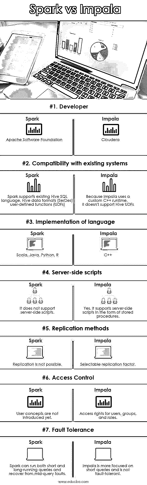
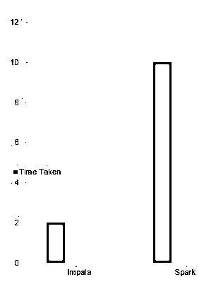

# 火花 vs 黑斑羚

> 原文：<https://www.educba.com/spark-vs-impala/>

## Spark 和 Impala 的区别

这是 Spark vs Impala 的一个轮廓。随着我们生活在一个数据驱动的世界，大数据行业正在快速发展，它改变了人们通常对数据的看法。与之相关的工具和技术也在自我升级。市场上可用的各种工具通过提供快速、交互式的分析工具，使数据工程师的生活变得轻松。然而，经常想到的问题是，这些工具中哪一个更好？在这场大数据战争中，我们有两个伟大的战士，Spark 和 Impala。让我们看看哪一个更好。

当我们开始谈论具有快速和交互式数据处理模式的数据分析工具时，我想到的两个名字是 Apache Spark 和 Impala。这是大数据分析中两种常用的工具。在开始区分 Spark 和 Impala 之前，让我们先了解一下它们。

<small>Hadoop、数据科学、统计学&其他</small>

### 黑斑羚是什么？

Impala 是一个 MPP(大规模并行处理)SQL 查询引擎，用于处理存储在运行 Apache Hadoop 的计算机集群中的海量数据。这是一个用 C++/Java 编写的免费软件。它提供了比其他 Hadoop SQL 引擎更低的延迟和更好的性能。该项目于 2012 年宣布，灵感来自于谷歌 F1 的开源等价物；后来 Cloudera 开发了它。

换句话说，Impala 是一个 SQL 引擎，提供类似 RDBMS 的体验，提供最快的方式来访问存储在 Hadoop 集群中的数据。

**黑斑羚的特征:**

*   可以查询 Parquet、Avro、Text 等多种文件格式。
*   它支持存储在 HDFS、HBase 和亚马逊 S3 的数据。
*   它支持多种压缩编解码器:Snappy，Gzip 等。
*   它允许使用 UDF 和 UDAFs。
*   允许多用户并发查询。
*   它在内存中缓存频繁访问的数据。
*   它计算统计数据(用 COMPUTE STATS)。
*   它为更高级的 SQL 分析功能提供了窗口函数(从版本 2.0 开始)。
*   它允许外部连接和聚合，如果操作的内部状态超过了内存大小，则允许操作溢出到磁盘。
*   启用一些 OLAP 功能(汇总、分组集)

### 什么是火花？

Spark 于 2014 年 3 月推出。它正式取代了 Shark，Shark 是为在 Spark 框架中使用 Hive 查询而开发的，但与 Spark 程序的集成有限。它最初是在伯克利的加州大学 Amp 实验室开发的，后来被捐赠给 Apache 软件基金会，该基金会现在维护它。" Spark 方便地缩小了 rdd 和关系表之间的界限."Spark 是一个用于大数据处理的快速通用引擎，内置了对其他 Spark 库的支持，如 Spark Streaming、Graph X 和 Mila。

**火花特征:**

*   支持 Parquet、Avro、JSON 等多种文件格式。
*   支持 Parquet、Avro、Text、JSON、ORC 等多种文件格式。
*   它支持存储在 HDFS 和亚马逊 S3 的数据。
*   它支持经典的 Hadoop 编解码器，如 gzip、snappy 和 Lzo。
*   它通过“共享秘密”的身份验证来提供安全性
*   保存事件日志。
*   它支持自定义项。
*   它支持并发查询，并管理任务的内存分配。
*   它支持使用模式 RDD 列格式在内存中缓存数据。
*   它支持嵌套结构。

### Spark 与 Impala 之间的直接对比

以下是 Spark 和 Impala 的 7 大对比:

### Spark 和 Impala 的主要区别

以下几点描述了 Spark 和 Impala 的主要区别。

*   #### Use case

我采集了 30 GB 大小的样本数据。这个数据在 Hive 数据库里。我们将对这些数据进行分析(聚合和不同操作),并比较 Spark 和 Impala 的表现。

*   #### Cluster configuration

我已经为 Spark 和 Impala 使用了相同的集群。这是一个 20 节点集群，内存为 252 GB，每个节点有 48 个内核。

*   #### Spark

我已经编写了一个 spark 应用程序，使用 hive context 从 Hive 获取[数据，然后在其上使用 SQL 计算结果，并将其存储在 HDFS 中。Spark 大大提高了缓存数据的性能，因此我缓存了中间数据集并重用了它。Spark 查询的最佳性能是 5 分钟。](https://www.educba.com/what-is-a-hive/)

*   #### Impala

简单的 Impala 脚本由两个查询组成(一个用于聚合，一个用于区分)并被执行。Impala 查询的最佳性能是 2 分钟。

Impala 执行查询的速度比 Spark 快得多。当给定足够的内存来执行时，它比 Impala 查询慢 5 倍。

### Spark 与 Impala 对比表

下面是 Spark 和 Impala 的对比表:

| **比较的基础** | **火花** | **黑斑羚** |
| **开发商** | 阿帕奇软件基金会 | Cloudera |
| **与现有系统的兼容性** | Spark 支持现有的 Hive SQL 语言、Hive 数据格式(SerDes)、用户定义函数(UDF) | 因为 Impala 使用定制的 C++运行时，它不支持 Hive UDFs |
| **实现语言** | Scala，Java，Python，R | C++ |
| **服务器端脚本** | 它不支持服务器端脚本 | 是的，它支持存储过程形式的服务器端脚本 |
| **复制方法** | 复制是不可能的 | 可选复制因子 |
| **访问控制** | 用户概念尚未引入 | 用户、组和角色的访问权限 |
| **容错** | Spark 可以运行短期和长期查询，并从查询中的故障中恢复。 | Impala 更侧重于短查询，不具备容错能力。 |

### 结论

上述结果证明，Impala 比 Spark 快，但它只是用于分析的即席查询选项。Impala 不支持 Spark 这样的复杂功能。黑斑羚不具备容错能力；如果查询在执行过程中失败了怎么办，Impala 不能重新运行那个部分并给出结果。Spark 是批量 ETL 应用程序的首选，在这些应用程序中，可靠性比查询延迟更重要。

另一方面，如果应用程序不是那么复杂或关键，Impala 可以用来运行多个查询，作为对 Hive 的替代。希望这篇关于 Spark vs Impala 的文章，能帮助你在大数据的博弈中，在这两位勇士之间做出选择。

### 推荐文章

这是火花 vs 黑斑羚的攻略。在这里，我们将讨论直接比较、主要差异、信息图表比较表。您也可以阅读以下文章，了解更多信息——

1.  [Spark SQL vs Presto–找出 7 个有用的对比](https://www.educba.com/spark-sql-vs-presto/)
2.  [Apache Hive vs Apache Spark SQL–13 个惊人的差异](https://www.educba.com/apache-hive-vs-apache-spark-sql/)
3.  [Splunk 与 Spark–需要了解的 8 个重要差异](https://www.educba.com/splunk-vs-spark/)
4.  [蜂巢 vs 黑斑羚——你应该知道的 20 件最有用的事情](https://www.educba.com/hive-vs-impala/)

