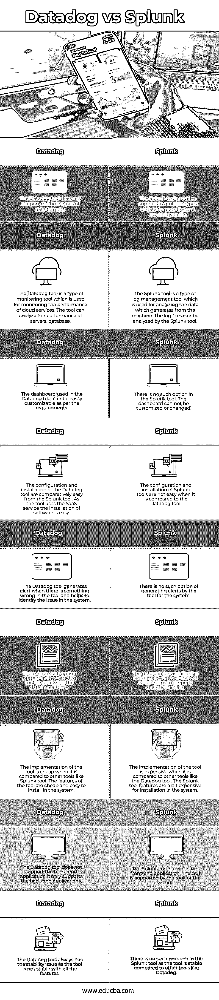

# 数据狗 vs Splunk

> 原文：<https://www.educba.com/datadog-vs-splunk/>

## Datadog 与 Splunk 的区别

Datadog 是一种监控工具，主要用于基于云的应用程序，以监控数据库、服务、服务器和其他设备，并测量应用程序的性能。Datadog 工具使用软件作为在应用程序中实现的服务(SaaS)平台。Splunk 是一种用于设备日志管理的工具，可分析设备生成的数据。Splunk 工具分析机器生成的数据，然后将非结构化的原始数据转换为某种人类可读的形式。

### data dog 与 Splunk 的面对面比较(信息图表)

以下是 Datadog 与 Splunk 的 6 大区别:

<small>Hadoop、数据科学、统计学&其他</small>

 

### data dog 与 Splunk 的主要区别

以下是 Datadog 与 Splunk 的主要区别:

#### Datadog Tool

*   Datadog 工具可以归类为分析或监控工具，开发运维部门和 IT 部门可以使用它来监控云服务和其他基础架构的性能。
*   Datadog 工具用于监控服务器、工具和数据库的性能。
*   Datadog 工具支持不同的操作系统，即 Linux、Windows 和 Mac 操作系统。该设备可以部署为 SaaS(软件即服务)。
*   data dog 工具使用的后端技术是 Kafka、Apache Cassandra、PostgreSQL。
*   data dog 工具支持网络的多重云可见性，有助于监控云服务的数据和性能。
*   该工具使用的仪表板可以根据需求进行定制，IT 和 DevOps 团队可以使用该工具来监控云服务的性能。
*   该工具可用于集成其他几个产品，以便更好地衡量云服务的性能。
*   当服务中出现任何问题时，该工具可用于生成警报，以便能够立即处理。
*   data dog 工具支持的编程语言是 PHP，Go，。NET、Ruby、JAVA、Node 和 python。
*   Datadog 工具的实施和安装非常简单，并提供了不同的功能。工具中实现的功能较少。

#### Splunk 工具

*   当需要管理设备生成的数据时，Splunk 工具就派上了用场。
*   安装在网络中的机器生成连续的数据，这需要一些工具来分析这些数据，并从生成的数据中得出一些结果。
*   该工具用于监控和分析各种机器产生的数据。Splunk 工具将数据转换为人类可读的形式，以便开发人员可以正确地分析数据。
*   Splunk 工具将机器生成的原始数据转换为人类可读的形式，以分析设备的数据和日志。
*   Splunk 工具中有三个阶段用于处理数据。在第一阶段，确定数据和数据分析的适当解决方案。在第二阶段，数据转换就在那里。在最后阶段，报告是由数据转换而成的。
*   从机器生成的数据可以是任何形式的，包括结构化和非结构化形式。该工具可以将非结构化数据转换为一些人类可读的结构，以便可以用来做出决定。
*   机器生成的日志文件也可以使用 Splunk 工具进行分析。该工具使用搜索处理语言在日志文件中查找任何术语。
*   该工具支持多种数据格式作为数据分析的输入文件。Splunk 工具支持的数据格式有。json，。xml 和。csv 格式。

### 数据狗与 Splunk 对比表

让我们讨论一下 Datadog 与 Splunk 之间的主要比较:

| **Datadog** | **Splunk** |
| Datadog 工具不支持多种类型的数据格式。 | Splunk 工具支持多种类型的数据格式，如. xml、.csv 和。json 文件。 |
| Datadog 工具是一种用于监控云服务性能的监控工具。该工具可以分析服务器、数据库的性能。 | Splunk 工具是一种日志管理工具，用于分析机器生成的数据。Splunk 工具可以分析日志文件。 |
| Datadog 工具中使用的仪表板可以根据需求轻松定制。 | Splunk 工具中没有此选项。不能自定义或更改仪表板。 |
| 从 Splunk 工具中配置和安装 Datadog 工具相对容易。由于该工具使用 SaaS 服务，软件的安装很容易。 | 与 Datadog 工具相比，Splunk 工具的配置和安装并不容易。 |
| 当工具中出现问题时，Datadog 工具会生成警报，并帮助识别系统中的问题。 | 该工具没有为系统生成警报的选项。 |
| Datadog 工具中没有这样的选项来实时分析数据。 | Splunk 工具可以实时显示数据，有助于正确分析数据。 |
| 与 Splunk 工具等其他工具相比，该工具的实施成本较低。该工具的特点是价格低廉，易于安装在系统中。 | 与其他工具(如 Datadog 工具)相比，该工具的实现非常昂贵。在系统中安装 Splunk 工具功能有点贵。 |
| Datadog 工具不支持前端应用程序，它只支持后端应用程序。 | Splunk 工具支持前端应用程序。GUI 由系统的工具支持。 |
| Datadog 工具总是有一个稳定性问题，因为该工具的所有功能都不稳定。 | Splunk 工具不存在这样的问题，因为与其他工具(如 Datadog)相比，该工具非常稳定。 |

### 结论

Datadog 工具是云服务的性能测量工具，有助于测量数据库和服务器的性能。Splunk 工具是一种日志管理工具，允许分析从机器生成的日志文件，并将原始数据转换为某种人类可读的形式。

### 推荐文章

这是关于 Datadog 和 Splunk 之间的主要区别的指南。在这里，我们还将讨论信息图和比较表的主要区别。你也可以看看下面的文章来了解更多-

1.  [吉拉 vs 特雷罗](https://www.educba.com/jira-vs-trello/)
2.  [GitLab vs 吉拉](https://www.educba.com/gitlab-vs-jira/)
3.  [SOAP vs HTTP](https://www.educba.com/soap-vs-http/)
4.  [Matlab vs Octave](https://www.educba.com/matlab-vs-octave/)

