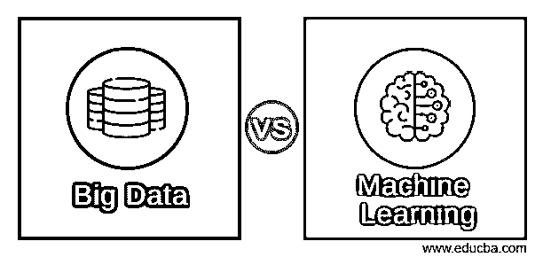
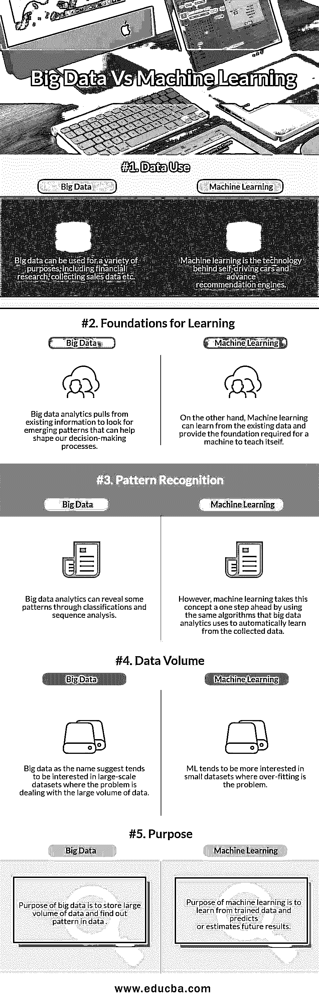

# 大数据 vs 机器学习

> 原文：<https://www.educba.com/big-data-vs-machine-learning/>

## 大数据和机器学习的区别

[**大数据**分析是收集和分析大量数据集(称为大数据)的过程](https://www.educba.com/what-is-big-data-analytics/)，以发现有用的隐藏模式和其他信息，如客户选择和市场趋势，从而帮助组织做出更加明智和以客户为导向的商业决策。大数据是一个描述具有 3v 特征的数据的术语:数据量极大、数据类型种类繁多，以及数据处理速度极快。可以分析大数据以获得洞察力，从而做出更好的决策和战略性业务举措。

**机器学习**是 AI(人工智能)的一个领域，[软件应用](https://www.educba.com/office-suite-applications/)可以通过学习来提高它们对预期结果的准确性。通俗地说，机器学习就是教育计算机如何执行人类不知道如何完成的复杂任务的方法。机器学习领域是如此广阔和流行，以至于在我们的日常生活中有很多机器学习活动，并且很快它将成为我们日常生活中不可或缺的一部分。

<small>Hadoop、数据科学、统计学&其他</small>

那么，你在日常生活中注意到这些机器学习活动了吗？

*   你知道你在网飞或亚马逊上得到的那些电影/节目推荐吗？机器学习会帮你做到这一点。
*   优步/Ola 如何决定您的出租车价格？一旦你叫到车，他们是如何将等待时间减到最少的？这些服务如何将你与其他乘客最佳匹配，以最大限度地减少弯路？所有这些问题的答案都是机器学习。
*   金融机构如何确定一项交易是否属于欺诈性交易？在大多数情况下，由于其非常高的日交易量，人工审查每笔交易是困难的。相反，人工智能被用来创建从可用数据中学习的系统，以检查哪些类型的交易是欺诈性的。
*   有没有想过自动驾驶谷歌汽车背后的技术是什么？答案还是机器学习。

现在我们知道什么是大数据与机器学习，但要决定在哪个地方使用哪个，我们需要看看两者之间的差异。

### 大数据和机器学习之间的直接比较

以下是大数据和机器学习的 8 大区别:

### 大数据和机器学习的主要区别

以下是大数据和机器学习之间的主要区别:

数据挖掘和机器学习都植根于数据科学。它们经常相互交叉或混淆。他们叠加彼此的活动，这种关系最好用互利来描述。只有其中一个是不可能看到未来的。但是仍然有一些独特的身份将它们在定义和应用方面分开。下面来看看大数据和机器学习之间的一些差异，以及如何使用它们。

1.  通常，大数据讨论包括存储、接收和提取工具，通常是 Hadoop。而机器学习是计算机科学和/或人工智能的一个子领域，它赋予计算机无需显式编程就能学习的能力。
2.  [大数据分析](https://www.educba.com/big-data-analytics-techniques/)顾名思义就是通过发现隐藏的模式或从中提取信息来分析大数据。因此，在大数据分析中，分析是在大数据上完成的。简单来说，机器学习就是通过[使用各种机器学习模型](https://www.educba.com/machine-learning-models/)，教会机器如何对未知输入做出响应，并给出想要的输出。
3.  虽然大数据和机器学习都可以设置为自动寻找特定类型的数据和参数以及它们之间的关系，但大数据无法像机器学习那样深入了解现有数据之间的关系。
4.  正常的大数据分析都是关于提取和转换数据以提取信息，然后这些信息可以用于输入到机器学习系统，以便进行进一步的分析来预测输出结果。
5.  大数据与高性能计算有更多的关系，而机器学习是[数据科学](https://www.educba.com/data-science-and-its-growing-importance/)的一部分。
6.  机器学习执行与人类互动无关的任务。鉴于，[大数据分析](https://www.educba.com/big-data-analytics-techniques/)包括增强[决策](https://www.educba.com/right-decision/)系统的数据结构和建模，因此需要人工交互。

### 大数据和机器学习对照表

下面是大数据 vs 机器学习的对比表。

| **比较依据** | **大数据** | **机器学习** |
| **数据使用** | 大数据可用于各种目的，包括金融研究、收集销售数据等。 | 机器学习是自动驾驶汽车和提前推荐引擎背后的技术。 |
| **学习基础** | 大数据分析从现有信息中寻找新兴模式，以帮助塑造我们的决策流程。 | 另一方面，机器学习可以从现有的数据中进行学习，并为机器自学提供所需的基础。 |
| **模式识别** | 大数据分析可以通过分类和序列分析揭示一些模式。 | 然而，机器学习通过使用大数据分析用来从收集的数据中自动学习的相同算法，将这一概念向前推进了一步。 |
| **数据量** | 顾名思义，大数据倾向于对大规模数据集感兴趣，其中的问题是处理大量数据。 | ML 倾向于对小数据集更感兴趣，过拟合是问题所在 |
| **目的** | 大数据的目的是存储大量数据并发现数据中的模式 | [机器学习的目的是](https://www.educba.com/machine-learning-feature/)从训练数据中学习，并预测或估计未来的结果。 |

### 大数据与机器学习的未来

据福布斯报道，到 2020 年，我们积累的数字数据将从 4.4 兆字节增长到 44 兆字节。我们还将为地球上的每个人每秒钟创造 1.7 兆字节的新信息。

对于大数据和机器学习的能力，我们只是在[摸](https://www.educba.com/scratch-programming-examples/)皮毛。他们都关心同一个问题，而不是关注他们的差异:“我们如何从数据中学习？”归根结底，唯一重要的是我们如何收集数据，以及我们如何从中学习以构建面向未来的解决方案。

### 推荐文章

这是大数据和机器学习的指南。在这里，我们讨论了大数据和机器学习的直接比较、关键差异以及信息图和比较表。您也可以阅读以下文章，了解更多信息——

1.  [大数据与数据科学——它们有什么不同？](https://www.educba.com/big-data-vs-data-science/)
2.  [找出小数据与大数据的 10 大区别](https://www.educba.com/small-data-vs-big-data/)
3.  [统计学与机器学习的巨大差异](https://www.educba.com/statistics-vs-machine-learning/)
4.  [为什么创新是大数据最关键的方面？](https://www.educba.com/why-innovation-is-the-most-critical-aspect-of-big-data/)

