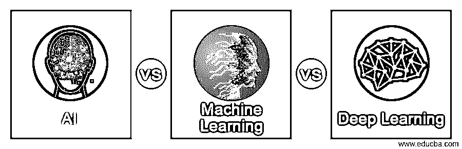
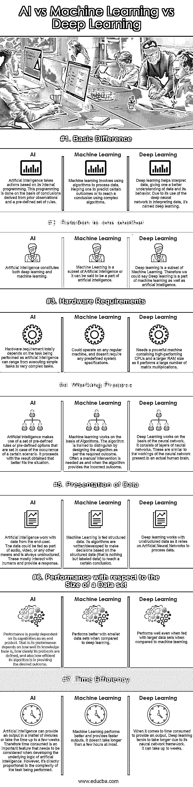

# AI vs 机器学习 vs 深度学习

> 原文：<https://www.educba.com/ai-vs-machine-learning-vs-deep-learning/>

## 人工智能与机器学习和深度学习的区别

这是一个关于 AI vs 机器学习 vs 深度学习的大纲。随着我们继续生活在 Siri、Alexa 和 Cortana 的时代，可以肯定地说，在使用人工智能和与人工智能交互方面，我们并不陌生。它已经成为我们生活中不可或缺的一部分。我敢肯定，我们中的许多人仍然觉得向内置于我们的数字化先进设备中的微小声音发出指令很有趣。

你有没有想过人工智能是如何处理我们的请求的？它如何解释我们的口头指令？当他们没有正确地解释你的要求时，你是否经常被激怒？嗯，我当然是。然而，我相信你一定已经注意到他们的技能随着时间的推移有所提高。今天，他们与人类互动和解释人类指令的能力比几年前更好更先进。那是怎么发生的？深度学习和机器学习对人工智能作为终端产品的发展和进化有相当大的作用。深度学习和机器学习的研究和结果对人工智能的成功做出了巨大贡献。

<small>Hadoop、数据科学、统计学&其他</small>

在这篇文章中，我们来看看人工智能、机器学习和深度学习之间的区别。

### 人工智能与机器学习和深度学习的面对面比较(信息图)

以下是所描述的要点以及人工智能与机器学习和深度学习之间的主要区别:

### 人工智能与机器学习和深度学习的主要区别

*   人工智能、机器学习和深度学习之间的一个主要关键差异是它们处理数据的方法。深度学习使用神经网络，并受到人脑功能的启发。另一方面，机器学习严重依赖人类设计的算法来达到预期的结果。最后，人工智能依赖于输入其系统的预定义的基于场景的选项和规则。
*   深度学习是人工智能领域的最新发展，由于与机器学习相比，它能够提供更准确的结果，因此正迅速受到欢迎。
*   在深度学习的情况下，与机器语言相比，训练其神经网络需要更长的时间。
*   深度学习需要高性能系统通过其多层神经网络来处理数据。在机器学习的情况下，不需要这样的要求。它可以在任何普通系统上运行。
*   深度学习可以处理大规模数据集。而机器学习对于中小规模的白泽数据集效果更好。

### AI vs 机器学习 vs 深度学习对比表

以下是 AI vs 机器学习 vs 深度学习的区别:

| **比较的基础** | **人工智能** | **机器学习** | **深度学习** |
| **基本差异** | 人工智能基于其内部编程采取行动。这种编程是基于从先前的观察和预定义的一组规则得出的结论来完成的。 | 机器学习涉及使用算法来处理数据。帮助人们预测某些结果或使用复杂的算法得出结论。 | 深度学习有助于解释数据，让人们更好地理解数据及其行为。由于它在解释数据时使用了深度神经网络，因此被命名为深度学习。 |
| **彼此的关系** | 人工智能构成了深度学习和机器学习。 | 机器学习是人工智能的子集或者可以说是人工智能的一部分。 | 深度学习是机器学习的一个子集。因此，我们可以说深度学习是机器学习和人工智能的一部分。 |
| **硬件要求** | 硬件要求完全取决于正在执行的任务，因为人工智能可以从执行简单的任务到非常复杂的任务。 | 可以在任何常规机器上运行，不需要任何预定义的系统规范。 | 需要包含高性能 CPU 和更大 RAM 的强大机器，因为它执行大量矩阵乘法。 |
| **工作过程** | 人工智能利用一组预定义的规则或预定义的选项，这些规则或选项是在特定场景发生的情况下设置的。它继续得到更符合情况的结果。 | 机器学习是在算法的基础上工作的。通过根据所需结果设计算法来训练算法以进行区分。当算法提供不正确的结果时，通常需要人工干预。 | 深度学习基于神经网络工作。它由多层神经网络组成。这些类似于真实人脑中存在的神经网络的工作方式。 |
| **数据呈现** | 人工智能处理来自终端用户的数据。数据可以作为音频、视频或任何其他方式的一部分提供，并且始终是非结构化的。这些大多与人类互动，并提供回应。 | 机器学习被输入结构化数据。它的算法被编写/开发为基于结构化数据(只不过是标记数据)做出决策，以得出某个结论。 | 深度学习处理非结构化数据，因为它依赖人工神经网络来处理数据。 |
| **关于数据集大小的性能** | 性能完全取决于其作为最终产品的能力。也就是说，它的性能取决于它的知识库有多好，它的协议定义有多清晰，以及它的算法在提供期望的结果方面有多有效。 | 与深度学习相比，在较小的数据集上表现更好。 | 与机器学习相比，即使在有较大数据集的情况下也能表现良好。 |
| **时间效率** | 人工智能可以在几分钟内提供一个输出，或者需要几周的时间。因此，当开发人工智能的底层逻辑时，消耗的时间是需要考虑的重要特征。然而，它与正在执行的任务的复杂性成正比。 | 机器学习表现更好，提供更快的输出。最多不超过几个小时。 | 当涉及到提供一个输出所消耗的时间时，深度学习由于其神经网络框架而往往需要更长的时间。可能需要几周时间。 |

### 结论

人工智能可以追溯到 20 世纪 50 年代。是约翰·麦卡锡首先发现了“人工智能”这个术语。多年来，人工智能一直在动态发展。然而，直到 21 世纪，人工智能才开始普及。今天，人工智能已经在其内部产生了许多不同的领域，这些领域专门以不同的方式处理输入数据，如机器学习和深度学习。在本文中，我们已经看到了这些字段之间的区别。

### 推荐文章

这是一本关于 AI vs 机器学习 vs 深度学习的指南。这里我们讨论 AI vs 机器学习 vs 深度学习的区别，用信息图对比表格。您也可以看看以下文章，了解更多信息–

1.  [机器学习和人工智能](https://www.educba.com/machine-learning-vs-artificial-intelligence/)
2.  [机器学习 vs 统计学](https://www.educba.com/machine-learning-vs-statistics/)
3.  [机器学习框架](https://www.educba.com/machine-learning-frameworks/)
4.  [监督学习和深度学习](https://www.educba.com/supervised-learning-vs-deep-learning/)

