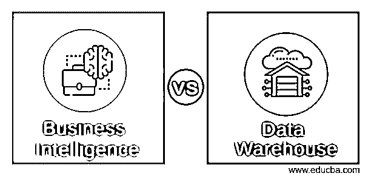
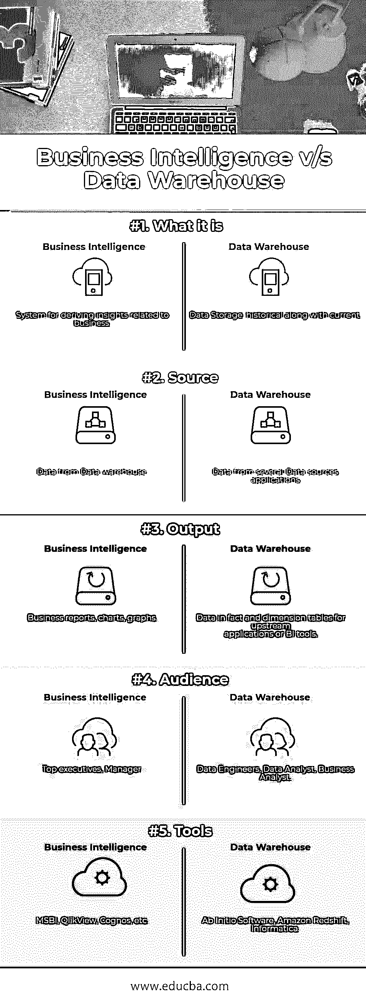

# 商业智能与数据仓库

> 原文：<https://www.educba.com/business-intelligence-vs-data-warehouse/>

## 商业智能与数据仓库的区别

**商业智能(BI)** [是一套方法和工具](https://www.educba.com/what-is-business-intelligence/)，组织使用这些方法和工具来访问和探索来自不同来源系统的[数据](https://www.educba.com/data-science-vs-software-engineering/)，以更好地了解企业的表现，做出更明智的决策，从而提高绩效并创造新的战略增长机会。

**数据仓库(DW)** 简单来说就是[整合来自各种来源的数据](https://www.educba.com/what-is-data-warehouse/)，为商业智能奠定基础，帮助做出更好的战略和战术决策。因此，我可以说数据仓库包含了业务意义。数据库以通用格式存储不同来源的数据，而仓库就像仓库(大建筑)，可以存储许多东西，但使用智能算法，如索引，有助于轻松定位和检索，并且基于相同的概念数据-仓库工作。

<small>Hadoop、数据科学、统计学&其他</small>

数据仓库类似于关系数据库，旨在查询和分析数据，而不是进行事务处理。它通常包含来自交易数据的历史数据，但也可以包含来自各种[数据源](https://www.educba.com/database-management-system/)的数据。数据仓库在事实表(包含收入和成本等数字的表)和维度(按地区、办公室或周等不同属性对事实进行分组)中保存数据。

我将使用某些缩写，如商业智能的***【BI】***和数据仓库的 ***DW*** ，因为这很容易写。到目前为止，我希望你已经对商业智能和数据仓库概念有了足够的了解，这些概念在[数据分析](https://www.educba.com/big-data-analytics-techniques/)领域中非常常用。这些是如此错误地使用，以至于即使是在这个领域工作的人也不确定什么时候使用什么。

现在让我们确切地理解什么是[商业智能](https://www.educba.com/business-intelligence-tool/)，它在[分析](https://www.educba.com/data-science/courses/tableau-training/)行业造成了如此多的混乱，因为一些人互换使用这两个术语，并且互联网上正在进行大量的讨论。

BI 基本上是一个商业智能系统，它告诉你*在你的业务中已经发生了什么，或者正在发生什么*——它向你描述情况。不仅如此，一个好的商业智能平台会以一种精细、准确和可展示的形式向你实时描述这一点。

但是它能够这样做的依据是什么，来源是什么。它如何帮助我做出战略决策？

我会告诉你为什么它如此智能，很简单，它利用了 ***数据*** 。从几个不同的来源积累了大量时间的数据。

但是现在一个非常基本的问题出现了，这些数据在哪里。这些数据存储在数据仓库(DDS，Cubes)中。BI 系统利用数据仓库数据，让您将选择的指标应用于潜在的巨大、非结构化数据集，并涵盖查询、[数据挖掘](https://www.sisense.com/glossary/data-mining-basics/)、在线分析处理()、报告以及业务绩效监控、预测和说明性分析。

那么现在我们来比较一下商业智能和数据仓库，通过比较来加深理解。

### 商业智能和数据仓库之间的直接比较(信息图表)

下面是商业智能和数据仓库之间的五大比较:

### 商业智能与数据仓库的主要区别

以下是商业智能和数据仓库之间的区别:

*   BI 意味着通过利用来自数据仓库(DW)的数据来发现描绘业务当前状况(如何和什么)的洞察力。
*   BI 是关于访问和探索组织的数据，而数据仓库是关于收集、转换和存储数据。
*   DW 概述了实际的数据库创建和集成过程以及数据分析和业务验证规则，而商业智能则利用侧重于计数、统计和可视化的工具和技术来提高业务绩效。
*   BI 处理 OLAP、数据可视化、[数据挖掘](https://www.educba.com/data-mining-techniques/)和查询/报告工具，而 DW 处理数据采集、元数据管理、数据清理、数据转换、数据分发和数据恢复/备份规划。
*   DW 团队使用从头开始软件、[亚马逊红移](https://www.educba.com/hadoop-vs-redshift/)、Informatica 等工具。而 BI 团队则使用 Cognos、MSBI、Oracle BI、Pentaho、QlikView 等工具。
*   软件工程师主要是数据工程师处理数据仓库，而高级管理人员和经理处理商业智能。

### 商业智能与数据仓库对照表

下面是提到的商业智能和数据仓库的对比表。

| **比较依据** | **商业智能** | **数据仓库** |
| **这是什么** | 用于获得与业务相关的洞察力的系统。 | 数据存储:历史与当前。 |
| **来源** | 来自[数据仓库](https://www.educba.com/data-warehouse-design/)的数据。 | 来自多个数据源、应用程序的数据。 |
| **输出** | 商业报告、图表、图形 | 上游应用程序或 BI 工具的事实数据和维度表。 |
| **观众** | 高层管理人员、经理 | 数据工程师、数据分析师、业务分析师。 |
| **工具** | MSBI、 [QlikView](https://www.educba.com/qlikview-tools/) 、Cognos 等。 | 从头软件，亚马逊红移，信息 |

### 结论

最后，我想总结一下这篇文章，因为像 QlikView、MSBI、Oracle BI 这样的 BI 工具都是从数据仓库访问数据的。让企业用户创建更精细、更直观的报告、图表，帮助高层管理人员在不同的职能领域做出更有效的商业决策，如财务、供应链、人力资源、[销售&营销](https://www.educba.com/digital-marketing-manager/)和客户服务。

我想进一步说明这一点，因为现在对于分析来说，我们正在转向大数据生态系统来处理大量数据，但无论如何，我们正在转向具有分布式系统和 Map Reduce 处理的企业数据中心或像 [Spark](https://www.educba.com/apache-spark/) 这样的内存执行引擎。

现在我希望它已经清楚地区分了商业智能和数据仓库，并通过评论部分让我知道你的想法。

### 推荐文章

这是商业智能与数据仓库的指南。在这里，我们讨论了商业智能与数据仓库的直接比较、关键差异以及信息图和比较表。您也可以阅读以下文章，了解更多信息——

1.  [12 种重要的商业智能工具(优势)](https://www.educba.com/business-intelligence-tool/)
2.  [必须知道的 10 项重要商业管理技能(有帮助)](https://www.educba.com/business-management-skills-helpful/)
3.  [10 种流行的数据仓库工具和技术](https://www.educba.com/10-popular-data-warehouse-tools/)
4.  [数据仓库职业](https://www.educba.com/career-in-data-warehousing/)
5.  [Weblogic 和 Tomcat](https://www.educba.com/weblogic-vs-tomcat/)

