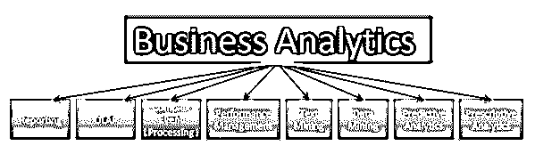
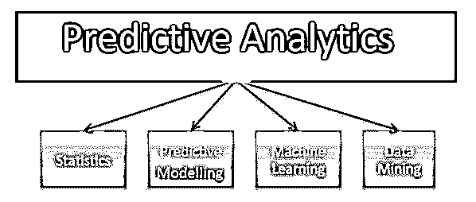
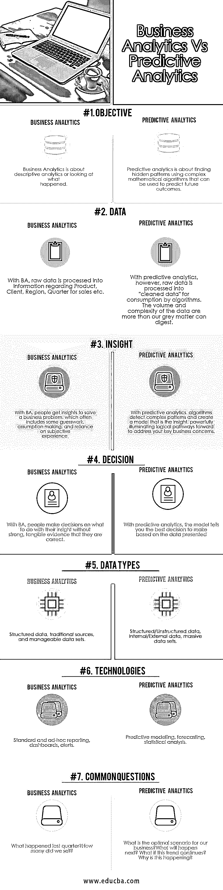

# 商业分析与预测分析

> 原文：<https://www.educba.com/business-analytics-vs-predictive-analytics/>

## 商业分析与预测分析的区别

在现代社会，业务流程中使用的[技术](https://www.educba.com/information-technology-benefits/)会让很多人感到困惑。许多技术看似做着同样的工作，但实际上，根据使用方式的不同，它们的功能也大不相同。其中一个例子就是[商业分析](https://www.educba.com/business-intelligence-vs-business-analytics/)和预测分析之间的混淆。甚至公司也经常混淆商业分析和预测分析，或者认为一旦他们使用[商业分析](https://www.educba.com/career-in-business-analytics/)来分析他们的数据，他们就会尽一切努力从中获得数据洞察力。因此他们没有充分利用他们所拥有的数据的潜力。

预测分析和[业务分析](https://www.educba.com/what-is-business-analytics/)它们看起来是一样的，但请相信我，它们并不一样，如果您只是将数据用于业务分析应用，那么几乎可以肯定，您不会从中获得尽可能多的价值。但是预测分析和商业分析到底有什么不同呢？在这篇文章中，让我们试着找出商业分析和预测分析的区别。

<small>Hadoop、数据科学、统计学&其他</small>

### 什么是商业分析？

**商业分析**帮助不同的组织更好地[决策](https://www.educba.com/right-decision/)利用各种最新的工具和方法。BA 涉及[数据分析](https://www.educba.com/challenges-of-big-data-analytics/)、[数据挖掘](https://www.educba.com/data-mining-techniques/)和[大数据流程](https://www.educba.com/big-data-analytics/)和程序，帮助制定更好的[业务决策](https://www.educba.com/right-decision/)。随着 BA 工具的最新发展，用户可以自己生成报告和可视化，而无需依赖 IT 人员。

我们可以在哪里使用商业分析？

### 什么是预测分析？

**预测分析**是当今商业和信息技术领域的热点问题。预测分析超越了这些向后看的观点，并使用您在企业中已经拥有的数据来展望未来，并告诉您未来将会发生什么。不仅如此。[预测建模](https://www.educba.com/data-science/courses/predictive-modeling-course/)可以让你预测未来的结果，它还可以告诉你未来可能发生的下一件好事是什么。良好的预测分析工具将为您自动完成这一过程，以便您的业务决策变得基于事实和真正的数据驱动，而不是基于主观判断和预感。

你的商业分析工具可以告诉你你的产品目前卖得最好，并显示你的产品销售趋势。但是如果你想知道一个特定的产品将来会卖得多好呢？也许你正在策划一场广告活动。这次活动对未来的产品销售会有什么影响？您的哪些客户最有可能对该活动做出回应？这是预测分析可以告诉你的。

我们可以在哪里使用预测分析？

### 预测分析如何工作？

预测分析使用各种模型来分析数据。最常见的是[预测模型](https://www.educba.com/predictive-modeling/)算法，专注于个人客户行为。使用具有已知属性的样本数据，对模型进行训练，使其能够分析新数据并确定其行为。这些信息可以用来预测客户下一步的行为。

### 业务分析和预测分析之间的直接比较(信息图表)

以下是业务分析和预测分析之间的 7 大对比:

### 业务分析和预测分析的主要区别

商业分析和预测分析的区别如下:

1.传统业务分析的作用是向用户提供有关其业务运营过去绩效的信息，主要用于报告目的。

[预测分析](https://www.educba.com/predictive-analytics-vs-data-science/)使用预测技术来帮助解决商业环境中的复杂问题。它还使用先进的定量方法，包括描述性和预测性[数据挖掘](https://www.educba.com/data-mining-techniques/)，与业务分析使用的传统方法相比，模拟可以提供更好的业务洞察力。

2.业务分析依赖于查询、报告、仪表板和 OLAP 等方法，使用一组侧重于过去绩效的指标。

另一方面，[预测分析有助于预测未来事件](https://www.educba.com/what-is-predictive-analytics/)，并有助于探索可能更复杂的检测模式。

3.使用业务分析，分析被设计为基于报告模板的更具重复性，该模板提取与业务相关的特定信息以评估历史绩效。

预测分析首先提出一个问题，然后执行一系列分析，使用统计和定量数据以及算法进行深入研究，以提供对该问题的见解。

### 业务分析和预测分析对照表

商业分析和预测分析的对照表如下。

| **比较依据** | **商业分析** | **预测分析** |
| **目标** | [商业分析是](https://www.educba.com/what-is-business-analytics/)关于描述性分析或观察发生的事情。 | [预测分析是](https://www.educba.com/what-is-predictive-analytics/)使用复杂的数学算法来发现隐藏的模式，这些算法可以用来预测未来的结果。 |
| **数据** | 利用 BA，原始数据被处理成关于产品、客户、区域、销售季度等的信息。 | 然而，使用预测分析，原始数据被处理成“干净的数据”供算法使用。这些数据的数量和复杂性超出了我们大脑灰质的消化能力。 |
| **洞察力** | 通过 BA，人们可以获得解决业务问题的洞察力，这通常包括一些猜测、假设和对主观经验的依赖。 | 借助预测分析，算法可以检测复杂的模式，并创建一个具有洞察力的模型，为解决您的关键业务问题提供强有力的逻辑路径。 |
| **决定** | 有了 BA，人们在没有强有力的、切实的证据证明他们是正确的情况下，用他们的洞察力做决定。 | 借助预测分析，该模型会根据提供的数据告诉您最佳决策 |
| **数据类型** | 结构化数据、传统来源和可管理的数据集。 | 结构化/非结构化数据、内部/外部数据、海量数据集。 |
| **技术** | 标准和临时报告、仪表板、警报。 | 预测模型，预测，统计分析。 |
| **常见问题** | What happened last quarter?我们卖了多少？ | What is the optimal scenario for our business?接下来会发生什么？如果这种趋势继续下去呢？为什么会这样？ |

### 结论

预测分析将业务分析提升到一个新的水平，从基于历史数据的一组回顾性答案转移到一组着眼于未来前景的答案，这有助于预测绩效和提出建议。

无论如何，你仍然需要业务分析来了解过去发生了什么，但你也需要预测分析来知道你未来能做什么。

### 推荐文章

这是商业分析与预测分析的指南。在这里，我们讨论了业务分析与预测分析的直接比较、关键差异以及信息图表和比较表。您也可以阅读以下文章，了解更多信息——

1.  [13 个最有用的预测分析工具(helical)](https://www.educba.com/predictive-analytics-tool/)
2.  [商业分析 vs 商业智能](https://www.educba.com/business-intelligence-vs-business-analytics/)
3.  [你的分析可以告诉你的 9 个重要博客见解](https://www.educba.com/blogging-insights-your-analytics-can-tell-you/)
4.  [13 种最佳预测分析工具](https://www.educba.com/predictive-analytics-tool/)
5.  [预测分析和预测](https://www.educba.com/predictive-analysis-vs-forecasting/)
6.  [预测分析与数据科学](https://www.educba.com/predictive-analytics-vs-data-science/)
7.  [商业智能 vs 数据仓库](https://www.educba.com/business-intelligence-vs-data-warehouse/)

