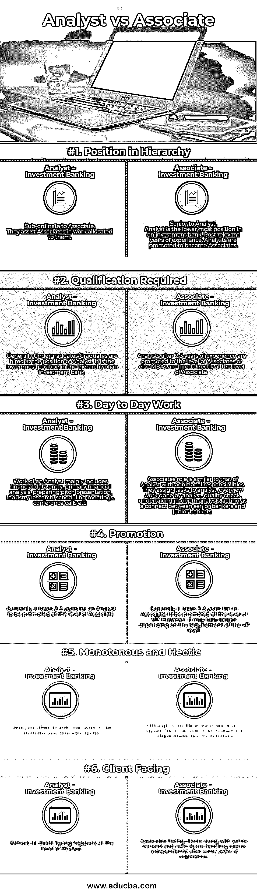

# 分析师与助理

> 原文：<https://www.educba.com/analyst-vs-associate/>

## 分析师和助理之间的区别

投资银行分析师是投资银行层级中最低的职位。就投资银行分析师的工作生活而言，它包括长时间在电脑前苦干、大量的工作压力、单调的活动、大量的 excel 数据输入等。然而，一旦你往上爬，开始自己处理交易，获得丰厚的报酬和良好的激励，所有这些都会变得富有成效。一名助理需要处理大量的事情，同时进行各种活动。员工逐渐积累业务领域的专业知识，并开始发现所在行业的商机。

**让我们更详细地研究一下分析师和助理:**

<small>下载企业估值、投行、会计、CFA 计算器&其他</small>

投资银行是帮助公司、政府和机构开展以下活动的金融机构:

*   [合并&收购](https://www.educba.com/what-is-mergers-and-acquisitions/)。
*   通过股权市场筹集资金(即股权资本市场交易)。
*   通过债务市场筹集资金(即债务资本市场交易)。

一些[知名的投资银行家](https://www.educba.com/investment-banking-career/)有:

*   JP 摩根
*   美银美林
*   花旗银行
*   巴克莱资本
*   高盛
*   摩根斯坦利
*   主要经营银行）
*   瑞士信贷集团
*   德意志银行

投资银行的典型组织层级如下(从低到高):

*   分析师
*   联想
*   副总统
*   高级副总裁
*   总经理

通过增加一些中间职位，上面提到的层级可以因组织而异，但或多或少保持相同的顺序。

在这篇分析师与助理的文章中，我们将讨论分析师与助理在投资银行中的角色。分析师和助理在投资银行的前端和后端角色中都存在，但这里我们将讨论投资银行的前端角色(即面向客户的角色)。

之前，从比较开始，以下是在投资银行工作所需的一些关键技能:

*   [金融建模。](https://www.educba.com/financial-modeling-techniques/)
*   关系管理。
*   [谈判技巧。](https://www.educba.com/how-to-develop-effective-negotiation-skills/)
*   手册准备和[演示技巧。](https://www.educba.com/presentation-skills-training/)
*   [商业估价。](https://www.educba.com/business-valuation-methods/)
*   销售、营销和业务发展。

### 分析师与助理之间的面对面比较(信息图表)

以下是分析师与助理之间的六大区别:

### 分析师与助理之间的主要区别

分析师和助理都是市场上的热门选择；让我们讨论一些主要差异:

#### 分析师

一般来说，顶尖大学的毕业生会在两年或三年的项目中被聘用为分析师。但是，像摩根大通等顶级投行。聘请顶级学院的特许会计师、特许金融分析师和 MBA 担任投资银行分析师。显然，被聘为投资银行分析师的毕业生和被聘为同一级别的 MBA/CA/CFA 之间的薪资差距很大。尽管是一家投资银行的入门级点，但顶尖大学的最优秀学生入围了该角色，只有最优秀的学生才能通过严格的面试过程。

候选人需要有足够的技能来胜任投资银行分析师的角色。需要的一些关键技能是:

*   良好的财务知识。
*   良好的 Excel 技能。
*   良好的沟通技巧。
*   良好的 PowerPoint 技能。
*   理解宏观和微观经济及其影响的能力。

投资银行分析师的日常工作主要围绕以下活动:

*   财务数据输入。
*   推介演示。
*   行业和公司的初步分析。
*   安排会议、集会等。
*   关联宏观和微观经济参数。

#### 联想

在做了 2-3 年的投资银行分析师后，基于你的能力和发展的技能，你最有可能被提升为助理投资银行家。投资银行更喜欢内部晋升，而不是在助理级别横向招聘，因为与它们一起工作的分析师训练有素，更了解组织文化。然而，要想获得在投资银行横向招聘的资格，你需要有足够的在另一家投资银行工作的经验。

投资银行通常有三个主要的垂直业务，即[合并](https://www.educba.com/merger-vs-amalgamation/) &收购、[股权资本市场和债务资本市场](https://www.educba.com/debt-vs-equity/)。分析师支持所有这三种功能，并根据需求汇集在一起。然而，在助理级别，投资银行家是根据专业领域来划分的。展望未来，各个垂直业务领域的合作伙伴将专注于拓展他们的业务范围。

助理的日常工作类似于分析师的工作，但更加复杂、细致和专业化。助理监督在他们手下工作的分析师，并根据要求指导他们，他们审查分析师的工作，进行深入的公司分析，进行尽职调查，注意合规性，陪同高级人员参加客户会议，客户演示，并最终自己处理完整的交易。合伙人的工作生活同样忙碌，但相对来说没那么单调。在做了 2-3 年助理之后，他有资格被提升到副总裁级别。

### 分析师与助理对比表

以下是分析师与助理之间的最高层比较:

| **比较的基础** | **投资银行分析师** | **投资银行业务助理** |
| **层级中的位置** | Sub-ordinate to Associate.他们协助同事完成分配给他们的工作。 | Senior to Analyst.分析师是投资银行的最低职位。在相关的工作经验之后，分析师会被提升为助理。 |
| **所需资格** | 一般本科生/毕业生都是在分析师岗位上被录用的。这是投资银行层级中的最低职位。 | 有 2-3 年工作经验的分析师会被提升到助理级别，或者直接以助理级别聘用工商管理硕士。 |
| **日常工作** | 分析师的工作主要包括财务数据输入、初步财务分析、准备推介、行业研究、安排会议、电话会议等。 | 助理的角色类似于承担额外责任的分析师。他们向分析师分配任务，概述分析师完成的工作，进行质量检查，进行深入分析，充当资深银行家和初级银行家之间的桥梁。 |
| **促销** | 一般来说，分析师需要 2-3 年才能晋升到助理级别。 | 一般来说，助理需要 2-3 年才能晋升到副总裁级别。但是，根据副总裁级别的要求，可能需要更长时间。 |
| **单调而忙乱** | 分析师经常发现他们的工作单调且非常忙碌。 | 虽然助理级别的工作和分析师一样忙碌，但相对来说不那么单调。 |
| **面向客户端** | 几乎没有面向客户的案例发生在分析师层面。 | 与资深银行家一起面对客户，甚至在几年的经验后开始独立处理客户。 |

### 结论

虽然投资银行对新获得资格的求职者来说似乎是一个非常迷人和高薪的职业机会，但它同样具有挑战性，需要大量的辛勤工作和努力。许多人加入投资银行时，只看到了它迷人的一面，但最终往往会因为无力应对与之相关的压力而离开这个职业领域。在投资银行，人们必须保持警觉，以便在别人之前发现并抓住机会。因此，这是一个很好的职业选择，因为它可能会是一个颠簸的旅程，但如果你能够度过难关，这同样是值得的。

### 推荐文章

这是分析师与助理之间最大差异的指南。在这里，我们还讨论了分析师与员工之间的关键差异，包括信息图和对比表。您也可以看看以下文章，了解更多信息–

1.  [流动性与偿付能力](https://www.educba.com/liquidity-vs-solvency/)
2.  [会计 vs 财务管理](https://www.educba.com/accounting-vs-financial-management/)
3.  [EBIT vs EBITDA](https://www.educba.com/ebit-vs-ebitda/)
4.  [资本支出与运营支出](https://www.educba.com/capex-vs-opex/)

