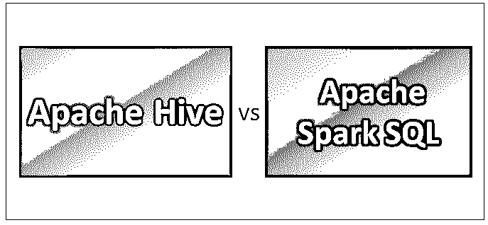
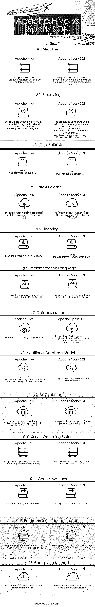

# Apache Hive vs Apache Spark SQL

> 原文：<https://www.educba.com/apache-hive-vs-apache-spark-sql/>

## Apache Hive 和 Apache Spark SQL 之间的区别

随着今天大数据技术的大量增长，为每个流程使用正确的工具变得非常重要。该过程可以是任何东西，如数据摄取、数据处理、数据检索、数据存储等。在本帖中，我们将阅读两个这样的数据检索工具，Apache Hive 和 Apache Spark SQL。一方面，Hive 因其利用类似 SQL 的 HQL(Hive 查询语言)的高效查询处理而闻名，并用于存储在 Hadoop 分布式文件系统中的数据，而 Spark SQL 利用结构化查询语言，并确保所有的在线读写操作都得到处理。众所周知，Hive 是大数据生态系统的组成部分，其中需要传统的映射器和简化器来处理来自 [HDFS](https://www.educba.com/hdfs-vs-hbase/) 的数据，而 Spark SQL 是 Apache Spark API 的组成部分，它使大数据生态系统的处理更加简单和实时。当今大多数专业人士的一个主要误解是 hive 只能与传统的[大数据技术](https://www.educba.com/trends-of-big-data/)和诸如 PIG、HDFS、Sqoop、Oozie 等工具一起使用。这种说法并不完全正确，因为 Hive 不仅与传统工具兼容，还与基于 Spark 的其他组件兼容，[如 Spark Streaming](https://www.educba.com/spark-streaming/) 。使用它们背后的想法是减少工作量，为企业带来更好的产出。让我们详细研究一下 Apache Hive 和 Apache Spark SQL。

### Apache Hive 和 Apache Spark SQL 的直接比较(信息图表)

下面是 Apache Hive 和 Apache Spark SQL 之间的前 13 名比较:

<small>Hadoop、数据科学、统计学&其他</small>

### Apache Hive 和 Apache Spark SQL 之间的主要区别

Apache Hive 和 Apache Spark SQL 之间的差异将在以下几点进行讨论:

1.  众所周知,[Hive](https://www.educba.com/what-is-a-hive/)使用 HQL (Hive 查询语言),而 [Spark SQL](https://www.educba.com/what-is-apache-spark/) 使用结构化查询语言来处理和查询数据
2.  Hive 提供模式灵活性，对表进行划分和存储，而 Spark SQL 执行 SQL 查询，只能从现有的[Hive 安装中读取数据。](https://www.educba.com/hive-installation/)
3.  Hive 为用户、角色以及组提供访问权限，而 Spark SQL 没有为用户提供访问权限
4.  Hive 为数据的冗余存储提供了选择性复制因子的功能，而 spark SQL 则不提供任何用于存储数据的复制因子
5.  由于 JDBC、ODBC 和 thrift 驱动程序在 Hive 中可用，我们可以使用它们来生成结果，而在 Apache Spark SQL 的情况下，如果 Spark SQL 使用另一种[编程语言](https://www.educba.com/java-programming-language-features/)运行，我们可以以数据集和[data frame](https://www.educba.com/spark-dataframe/)API 的形式检索结果
6.  有几个限制:

*   使用 Apache Hive 无法进行行级更新和[实时](https://www.educba.com/real-time-analytics/) OLTP 查询，而使用 Spark SQL 可以进行行级更新和实时在线事务处理。
*   为交互式数据浏览提供可接受的高延迟，而在 Spark SQL 中，所提供的延迟达到了增强性能的最小值。
*   与 SQL 语句和查询一样，Hive 支持联合类型，而 Spark SQL 不支持联合类型。

### apache hive 和 apache spark sql 比较表

下面是 Apache Hive 和 Apache Spark SQL 的对比表。

| **比较的基础** | **阿帕奇蜂巢** | **Apache Spark SQL** |
| **结构** | 基于 Hadoop 构建的开源数据仓库系统 | 主要用于结构化数据处理，通过使用结构化查询语言来检索更多信息。 |
| **处理** | 存储在 hadoop 文件中的大型数据集被分析和查询。主要使用 SQL 执行处理。 | Apache [Spark SQL 的处理涉及](https://www.educba.com/spark-sql-dataframe/)执行的繁重计算，因此需要正确的优化技术。可以通过不同的方式与 Spark SQL 进行交互，例如数据集和数据框架 API。 |
| **初始发布** | Hive 于 2012 年首次发布 | Spark SQL 于 2014 年首次发布 |
| **最新发布** | Hive 的最新版本于 2017 年 11 月 18 日发布:2.3.2 版本 | Apache Spark SQL 的最新版本于 2018 年 2 月 28 日发布:2.3.0 |
| **发牌** | 它是 Apache 版本 2 开源的 | 通过 Apache 版本 2 开源 |
| **实现语言** | Java 语言主要可以用来实现 apache Hive | Spark SQL 可以在 Scala、Java、 [R 以及 Python](https://www.educba.com/r-vs-python/) 上实现 |
| **数据库模型** | 它的数据库模型主要是 RDBMS | 虽然 Spark SQL 能够与任何 NoSQL 数据库集成，但它的数据库模型主要是 RDBMS |
| **附加数据库模型** | 附加数据库模型是一个键值存储，它可以以 JSON 的形式接收数据 | 键值存储是附加的数据库模型 |
| **开发** | Hive 最初是由脸书开发的，但后来捐赠给了阿帕奇软件基金会 | 它最初是由 Apache 软件基金会自己开发的 |
| **服务器操作系统** | 它支持具有 Java 虚拟机环境的所有操作系统 | 它支持多种操作系统，如 Windows、X、Linux 等。 |
| **访问方式** | 它支持 ODBC，JDBC 和节俭 | 它只支持 ODBC 和 JDBC |
| **编程语言支持** | C++、PHP、Java、Python 等几种编程语言。受到支持 | 支持多种编程语言，如 Java、R、Python 和 Scala |
| **分区方法** | 数据分片方法用于在不同的节点上存储数据 | 它使用 Apache Spark 核心在不同的节点上存储数据 |

### 结论

我们不能说 Apache Spark SQL 是 [Hive](https://www.educba.com/hadoop-vs-hive/) 的替代品，反之亦然。只是 Spark SQL 可以被看作是一个开发人员友好的基于 Spark 的 API，旨在使编程更容易。Hive 具有在引擎之间频繁切换的特殊能力，因此是查询大型数据集的有效工具。选择什么的使用和实现取决于您的目标和需求。他们无论是 Apache Hive 还是 [Apache Spark SQL 都是各自领域的玩家](https://www.educba.com/apache-interview-questions/)。我希望在看完这篇文章后，你会对贵公司的需求有一个相当清楚的了解。关注我们的博客，获取更多类似的帖子，我们会确保提供促进您业务发展的信息。

### 推荐文章

这是 Apache Hive vs Apache Spark SQL 的指南。在这里，我们讨论了它们的含义、直接比较、主要差异以及信息图和比较表。您也可以阅读以下文章，了解更多信息——

1.  [Java 与 Node JS 的差异](https://www.educba.com/java-vs-node-js/)
2.  [Hadoop 与 Hive–找出最佳差异](https://www.educba.com/hadoop-vs-hive/)
3.  [关于 Apache Spark 的 7 件重要有用的事情(指南)](https://www.educba.com/apache-spark/)
4.  [在配置单元中使用 ORDER BY 函数](https://www.educba.com/hive-group-by/)

