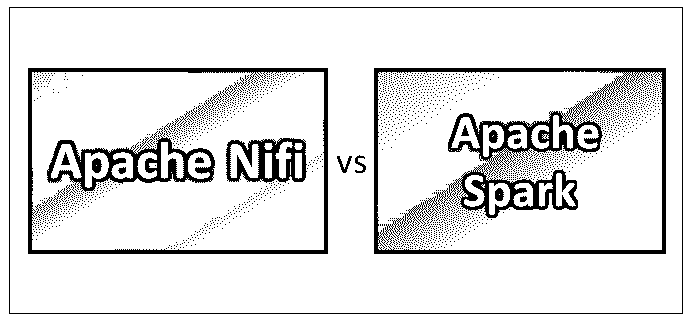
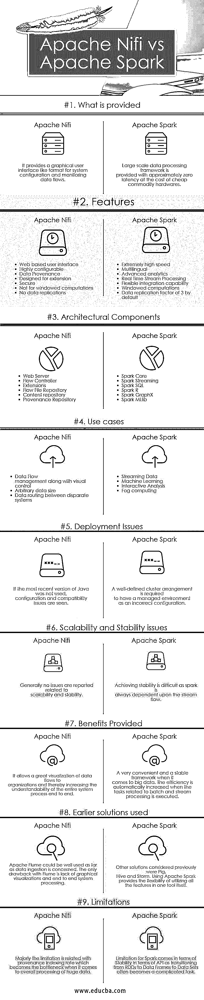

# 阿帕奇 Nifi vs 阿帕奇 Spark

> 原文：<https://www.educba.com/apache-nifi-vs-apache-spark/>

## Apache Nifi 和 Apache Spark 的区别

Apache Nifi(是 NiagaraFiles 的缩写)是另一个软件项目，旨在自动化软件系统之间的数据流。该设计基于基于流的编程模型，该模型提供了包括集群操作能力在内的特性。这是一个易于使用、可靠且功能强大的数据处理和分发系统。它支持用于数据路由、系统中介和转换逻辑的可伸缩有向图。Apache Spark 是一个集群计算开源框架，旨在提供一个接口，用于编程具有隐式容错和数据并行性的整个集群集。它利用 RDDs(弹性分布式数据集)并以离散化流的形式处理数据，该离散化流进一步用于分析目的。

### Apache Nifi 和 Apache Spark 的面对面比较(信息图)

下面是 Apache Nifi 和 Apache Spark 的 9 大对比

<small>Hadoop、数据科学、统计学&其他</small>

### Apache Nifi 和 Apache Spark 之间的主要区别

以下几点解释了 Apache Nifi 和 Apache Spark 之间的差异:

1.  Apache Nifi 是一个数据摄取工具，用于提供一个易于使用、功能强大且可靠的系统，以便在资源上处理和分发数据变得容易，而 Apache Spark 是一种速度极快的集群计算技术，旨在通过有效利用交互式查询、内存管理和流处理功能来加快计算速度。
2.  Apache Nifi 在独立模式和集群模式下工作，而 Apache Spark 在本地或独立模式、Mesos、Yarn 和其他类型的大数据集群模式下工作良好。
3.  Apache Nifi 的功能包括保证数据交付、高效数据缓冲、优先排队、特定于流的 QoS、数据来源、滚动缓冲恢复、可视化命令和控制、流模板、安全性、并行流功能，而 apache spark 的功能包括闪电般的高速处理能力、多语言、内存计算、商用硬件系统的高效利用、高级分析、高效集成功能。
4.  Apache Nifi 通过提供可视化功能和拖放特性，提供了更好的可读性和对系统的全面理解。使用传统的技术和流程可以很容易地管理和控制数据流，而在 Apache Spark 的情况下，为了查看这些类型的可视化，需要像 Ambari 这样的集群管理系统。Apache Spark 本身并不提供可视化功能，只在编程方面有优势。对于处理大量数据来说，这是一个非常方便和稳定的系统。
5.  Apache Nifi 的局限性与它的优势有关。当涉及到将它与其他组件和工具集成时，唯一的拖放功能提供了不能伸缩和提供健壮性的限制，而在 Apache Spark 的情况下，主要的限制伴随着大量商用硬件的使用，并且管理它们有时成为一项乏味的任务。另一个报告的限制是其与离散流和窗口或批处理流相关的流能力，其中 rdd 到数据帧和数据集的转换有时会导致不稳定。

### Apache Nifi 与 Apache Spark 对照表

| **比较的基础** | Apache nifi | **阿帕奇火花** |
| 提供什么 | 它提供了一个图形用户界面，类似于系统配置和监控数据流的格式。 | 大规模数据处理框架以廉价的商品硬件为代价提供了近似零延迟。 |
| 特征 | 

*   User interface based on Web
*   Highly configurable
*   data source
*   Designed for expansion.
*   safe
*   Not used for window calculation
*   No data replication

 | 

*   Speed
*   multilingual
*   Advanced analysis
*   Real-time streaming
*   Flexible integration capability
*   Window calculation
*   By default, the data replication coefficient is 3.

 |
| 建筑构件 | 

*   web server
*   flow controller
*   Expansion module
*   Traffic file library
*   Content library
*   Source library

 | 

*   火花核心
*   火花流
*   Spark SQL
*   火花河
*   火花图 x
*   火花 MLlib

 |
| 用例 | 

*   Data flow management and visual control
*   Arbitrary data size
*   Data routing between different systems

 | 

*   Stream data
*   machine learning
*   interaction analysis
*   fog computing

 |
| 部署问题 | 如果没有使用最新版本的 Java，就会出现配置和兼容性问题 | 定义明确的集群安排需要将托管环境作为不正确的配置 |
| 可扩展性和稳定性问题 | 通常，没有报告与可伸缩性和稳定性相关的问题 | 达到稳定是困难的，因为火花总是取决于气流。 |
| 提供的福利 | 它允许对流向组织的数据流进行可视化，从而增加了整个系统流程的可理解性 | 一个非常方便和稳定的大数据框架。当执行与批处理和流处理相关的任务时，效率会自动提高。 |
| 使用的早期解决方案 | 就数据摄取而言，Apache Flume 可以很好地使用。Flume 的唯一缺点是缺乏图形可视化和端到端的系统处理 | 之前考虑的其他解决方案有 Pig、Hive 和 Storm。使用 Apache Spark 提供了在一个工具本身中利用所有特性的灵活性。 |
| 限制 | 这种限制主要与出处索引率有关，当涉及到大数据的整体处理时，出处索引率成为瓶颈 | Spark 的局限性在于 API 的稳定性，因为从 rdd 到数据帧再到数据集的转换通常是一项复杂的任务。 |

### 结论

最后，可以说阿帕奇火花是一匹重型战马，而阿帕奇尼菲是一匹敏捷的赛马。两者在各自的领域都有各自的优点和局限性。您需要为您的业务选择合适的工具。敬请关注我们的博客，了解更多与大数据新技术相关的文章。

### 推荐文章

这是 Apache Nifi vs Apache Spark 的指南。在这里，我们讨论头对头比较，关键差异，信息图表比较表。您也可以阅读以下文章，了解更多信息——

1.  [关于 Apache Spark 的 7 件重要事情(指南)](https://www.educba.com/apache-spark/)
2.  Apache hbase
3.  [什么是阿帕奇 Spark？](https://www.educba.com/what-is-apache-spark/)
4.  [Apache Spark 架构](https://www.educba.com/apache-spark-architecture/)

