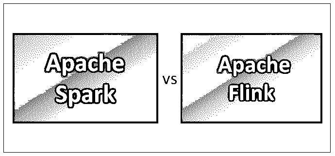
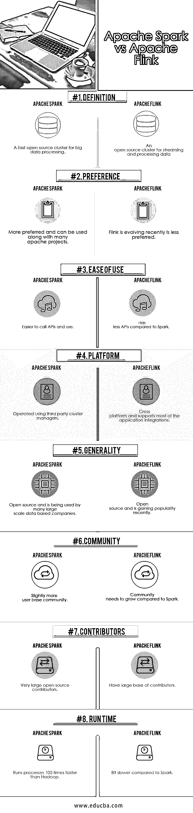

# 阿帕奇火花 vs 阿帕奇弗林克

> 原文：<https://www.educba.com/apache-spark-vs-apache-flink/>

## 阿帕奇 Spark 和阿帕奇 Flink 的区别

Apache Spark 是由 Apache Software 开发的开源集群计算框架。Apache Spark 速度非常快，可以用于大规模数据处理。它是大数据技术领域现有大规模数据处理工具的替代方案。Apache Flink 是一个开源框架，用于数据流应用程序的流处理，以实现分布式应用程序的高可用性、高性能、稳定性和准确性。Apache Flink 在流媒体引擎中提供低延迟、高吞吐量，并在数据引擎或机器出现故障的情况下提供容错功能。

**让我们详细研究一下 Apache Spark 和 Apache Flink:**

<small>Hadoop、数据科学、统计学&其他</small>

*   Spark 是由 Apache 软件基金会开发的开源集群计算框架，最初由加州大学伯克利分校开发，后来捐赠给 Apache 基金会使其开源。
*   Apache Flink 是由 Apache 软件基金会开发的开源软件框架。Flink 的核心组件是用 Java 和 Scala 编写的分布式流和数据处理引擎。
*   Apache Spark 速度非常快，可以用于大规模数据处理，目前这种处理发展很快。它已经成为大数据技术领域中许多现有大规模数据处理工具的替代方案。
*   在 Hadoop 环境中，Apache Spark 运行程序的速度比 Map Reduce 快 100 倍，因此更受欢迎。Spark 还可以通过创建 Amazon EC2(弹性云计算)实例或独立集群模式在 Hadoop 或 Amazon AWS 云上运行，还可以访问 Cassandra、Amazon Dynamo DB 等不同的数据库。,

### Apache Spark 和 Apache Flink 的面对面比较(信息图)

以下是阿帕奇 Spark vs 阿帕奇 Flink 的前 8 名对比

### Apache Spark 和 Apache Flink 的主要区别

以下是主要区别:

1.  Spark 是一组应用程序编程接口(API ),来自现有的 30 多个 Hadoop 相关项目。Apache Flink 之前是一个名为同温层的研究项目，后来被其创建者改名为 Flink。
2.  Spark 提供 Java、Python、Scala、r 等不同编程语言的高级 API，2014 年 Apache Flink 被 Apache 项目组接受为 Apache 孵化器项目。
3.  Spark 拥有 Spark Core、Spark SQL、MLib(机库)、GraphX(用于图形处理)和 [Spark Streaming](https://www.educba.com/spark-streaming/) 等核心特性，Flink 用于通过迭代集合来执行循环和迭代过程。
4.  Apache Spark 和 Apache Flink 都是大数据环境中的通用流或数据处理平台。Spark 集群模式可用于在不同的集群上流式传输和处理大规模数据，以实现快速和并行处理。
5.  Spark 集群模式将应用程序作为集群中的独立进程运行。Flink 是一个强大的高性能工具，用于批处理作业和作业调度过程。
6.  Spark cluster 的组件包括驱动程序管理器、驱动程序和工作节点。Flink 的另一个特点是良好的兼容模式，以支持不同的 Apache 项目，如 Apache storm 和 map reduce 在其执行引擎上的作业，以提高数据流性能。
7.  Spark 提供不同类型的集群管理器，如 HADOOP Yarn 集群管理器、独立模式(前面已经讨论过)、Apache Mesos(通用集群管理器)和 Kubernetes(用于自动化部署的实验性开源系统)。与拥有不同核心组件的 Spark 相比，Flink 只有数据处理引擎。
8.  Spark 集群组件函数在一个 worker 节点中有任务、缓存和执行器，其中一个集群管理器可以有多个 worker 节点。Flink architecture 的工作方式是不需要每次都打开和关闭流。
9.  Spark 和 Flink 都有内存管理。当 Spark 耗尽内存但具有容错能力时，它会使节点崩溃。Flink 有一种不同的内存管理方法。当内存耗尽时，Flink 会写入磁盘。
10.  Apache Spark 和 Apache Flink 都使用 LinkedIn 开发的 Apache Kafka 项目，该项目也是一个强大的数据流应用程序，具有高容错能力。
11.  Spark 可以在驻留于其中的不同应用程序之间共享内存，而 Flink 具有显式内存管理，可以防止 Apache Spark 中偶尔出现的峰值。
12.  Spark 的配置属性较多，而 Flink 的配置属性较少。
13.  Flink 可以近似批处理技术，Spark 拥有统一的引擎，可以通过连接到许多其他集群管理器和存储平台或服务器，在 Hadoop 之上独立运行。
14.  当 Apache Spark 被触发时，它在作业开始时对网络的使用较少，这会导致作业执行的一些延迟。Apache Flink 从一开始就使用网络，这表明 Flink 有效地使用了它的资源。
15.  Apache Spark 中资源利用率较低会导致生产率较低，而 Apache Flunk 中资源利用率较高会导致生产率更高，结果更好。

### Apache Spark 与 Apache Flink 对比表

以下是顶级对比:

| **比较的基础** | **阿帕奇火花** | **Apache 小册子** |
| **定义** | 面向大数据处理的快速开源集群 | 用于流式传输和处理数据的开源集群 |
| **偏好** | 更受欢迎，可以与许多 Apache 项目一起使用 | Flink 最近正在发展，不太受欢迎 |
| **易用性** | 更容易调用和使用 API | 与 Spark 相比，API 较少 |
| **平台** | 使用第三方集群管理器运行 | 跨平台，支持大多数应用程序集成 |
| **通用性** | 开放源码，被许多大型数据公司使用 | 开放源码，最近越来越受欢迎 |
| **社区** | 略多的用户群 | 与 Spark 相比，社区需要发展 |
| **贡献者** | 非常大的开源贡献者 | 有大量的贡献者 |
| **运行时间** | 运行进程的速度比 Hadoop 快 100 倍 | 与 Spark 相比稍慢 |

### 结论

两者都是通用数据流处理应用程序，其中它们提供的 API 以及架构和核心组件是不同的。Spark 有多个核心组件来执行不同的应用要求，而 Flink 只有数据流和处理能力。

根据业务需求，可以选择软件框架。Spark 是几年前才出现的，而 Flink 目前正在行业中逐步发展，Apache Flink 有可能超过 Apache Spark。

为了在分布式环境中支持多个应用程序，Spark 比 Flink 更适合与多个框架集成。

### 推荐文章

这是 Apache Spark vs Apache Flink 的指南，包括它们的含义、直接比较、主要区别、比较表和结论。您也可以阅读以下文章，了解更多信息——

1.  [了解 Apache Spark 的最佳途径(指南)](https://www.educba.com/apache-spark/)
2.  [关于 MapReduce vs Spark 你需要知道的 15 件事](https://www.educba.com/mapreduce-vs-spark/)

