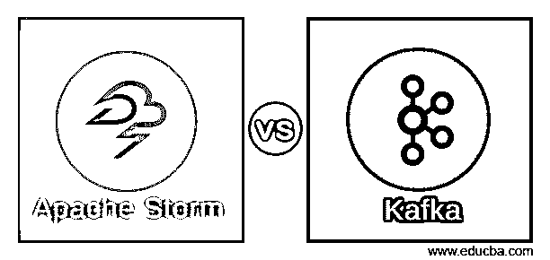
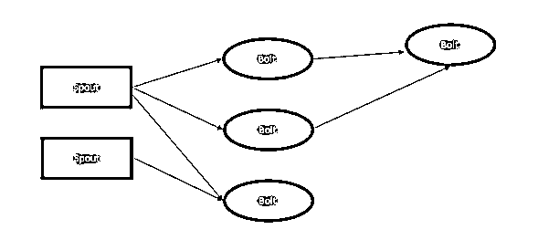
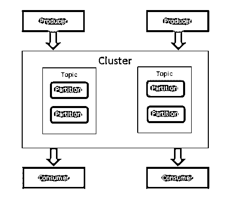
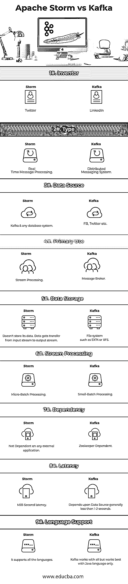

# 阿帕奇风暴 vs 卡夫卡

> 原文：<https://www.educba.com/apache-storm-vs-kafka/>

## 阿帕奇风暴和卡夫卡的区别

Apache Kafka 用于在几秒钟内处理大量数据。它是一个分布式消息代理，依赖于主题和分区。 **Apache Storm** 是一个容错的分布式框架，用于实时计算和处理数据流。它从各种数据源(如 HBase、Kafka、Cassandra 和许多其他应用程序)获取数据，并实时处理数据。已经用 Clojure 和 Java 写好了。

**让我们详细研究一下阿帕奇风暴 vs 阿帕奇卡夫卡**T2:

<small>Hadoop、数据科学、统计学&其他</small>

**图 1** ，Apache Storm 基本流处理图

**在图 1** 中，进行基本流处理。 **Spout** 和 **Bolt** 是 Apache Storm 的两个主要组件，两者都是**Storm**T8】拓扑的一部分，后者从数据源获取**数据流**进行处理。

**拓扑**:风暴拓扑是喷口和螺栓的组合。它与 Hadoop 中的 Map 和 Reduces 相同。

**流:**流可以被认为是数据管道，它是我们从数据源接收到的实际数据。

**Spout:** Spout 从不同的数据源(如 API)接收数据。它不断从数据源接收数据，并将其发送给 Bolt 进行处理。

**Bolt:** 逻辑处理单元从 Spout 获取数据，并执行逻辑操作，如聚合、过滤、连接&与数据源和数据库交互。

**Apache Kafka** 提供实时数据流。它从脸书、Twitter 和 API 等不同网站获取数据，并将数据传递给 Hadoop 环境中的任何不同处理应用程序(Apache Storm)。

**图 2，**阿帕奇卡夫卡的架构和组件。

Kafka 存储它从称为“**生产者**”的不同数据源接收的消息/数据。一旦接收到数据，它就通过不同的“**主题**”内的“**分区**”对消息进行分区。

[Kafka Cluster 是主题](https://www.educba.com/what-is-embedded-systems/)和分区的组合。分区索引并存储消息。**消费者**从分区获取消息并查询消息。阿帕奇卡夫卡可以和阿帕奇 HBase、[阿帕奇火花](https://www.educba.com/apache-spark/)和阿帕奇风暴一起使用。

下面是处理 Kafka 集群中所有消息传递(发布和订阅)数据的 API。

1) **生产者 API:** 它向应用程序提供发布记录流的许可。

2) **消费者 API:** 这个 API 用于订阅主题。

3) **Stream API:** 该流提供将输入流转换为输出流后的结果。

4) **连接器 API:** 这将主题与现有的应用程序链接起来。

Apache [Kafka 的主要用途是用于网站活动跟踪](https://www.educba.com/what-is-kafka/)、度量、日志聚合、事件源和其他实时数据流捕获。它有利于在应用程序或系统之间可靠地获取数据的流式传输

### 阿帕奇风暴和卡夫卡的正面比较(资料图)

以下是阿帕奇风暴和卡夫卡的 9 大区别:

### 阿帕奇风暴和卡夫卡的主要区别

以下是阿帕奇风暴和卡夫卡的主要区别:

1) Apache Storm 确保全面的数据安全，而 Kafka 则不保证数据丢失，但数据丢失率非常低，例如网飞每天 700 万条消息的数据丢失率仅为 0.01%。

2) Kafka 可以将其数据存储在本地文件系统上，而 Apache Storm 只是一个数据处理框架。

3) Storm 工作于一个实时信息系统，而 Kafka 用于在处理之前存储收到的信息。

4) Apache [Kafka 用于](https://www.educba.com/kafka-applications/)处理实时数据，而 Storm 用于转换数据。

5) Kafka 从实际的数据源获取数据，而 Storm 从 Kafka 本身获取数据以进行进一步处理。

6) Kafka 是将实时应用数据从源应用传送到另一个应用的应用，而 Storm 是聚合和计算单元。

7) Kafka 是一个实时流单元，而 Storm 工作在从 Kafka 拉的流上。

8)设置卡夫卡《彼岸风暴》时必须有阿帕奇动物园管理员，不依赖动物园管理员。

9) Kafka 就像一条水管道，它存储并转发数据，而 Storm 则从这种管道中获取数据并对其进行进一步处理。

10) Kafka 是 Storm 的重要数据源，而 Storm 可用于处理 Kafka 中存储的数据。

11) Apache Storm 具有自动重启其守护程序的内置功能，而 Kafka 由于 Zookeeper 而具有容错功能。

### 阿帕奇风暴和卡夫卡对照表

下面是阿帕奇风暴和卡夫卡的对比表。

|  **比较点** | **风暴** | **卡夫卡** |
|  **发明者** |  [推特](https://www.educba.com/twitter-homepage/) |  [LinkedIn](https://www.educba.com/linkedin-website/) |
|  

**类型**

 |  实时信息处理 |  分布式消息传递系统 |
|  **数据来源** |  Kafka &任何数据库系统 |  FB，Twitter 等… |
|  **主要用途** |  流处理 |  消息代理 |
|  **数据存储** |  不存储它的数据。数据从输入流传输到输出流 |  文件系统，如 EXT4 或 XFS |
|  **流处理** |  微批量加工 |  

小批量加工

 |
|  **依赖关系** |  不依赖任何外部应用 |  依赖动物园管理员 |
|  **等待时间** |  毫秒延迟 |  取决于数据源一般不到 1-2 秒。 |
|  **语言支持** |  它支持所有的语言 |  Kafka 适用于所有语言，但只适用于 Java 语言 |

### 结论

Apache Storm vs Kafka 都是独立的，在 [Hadoop 集群](https://www.educba.com/what-is-hadoop-cluster/)环境中有不同的用途。

Apache storm 与 Kafka 都是相互独立的，但是建议将 Storm 与 Kafka 一起使用，因为 [Kafka 可以将数据](https://www.educba.com/install-kafka/)复制到 Storm，以防数据包丢失，并且在将数据发送到 Storm 之前进行验证。

Kafka 的角色是作为中间件工作，它从各种来源获取数据，然后快速处理信息。在线投票的计数和分离是 Apache Storm 的实时例子。

Apache Storm 和 Kafka 都拥有强大的实时数据流能力和非常强大的系统来执行实时分析。

### 推荐文章

这是阿帕奇风暴 vs 卡夫卡的指南。在这里，我们讨论了 Apache Storm 与 Kafka 的直接比较、关键差异以及信息图和比较表。您也可以阅读以下文章，了解更多信息——

1.  [了解 Hadoop 与 Redshift 之间的 10 个有用差异](https://www.educba.com/hadoop-vs-redshift/)
2.  [关于 Apache Spark 你必须知道的 7 件事(指南)](https://www.educba.com/apache-spark/)
3.  如何利用实时分析的力量？

