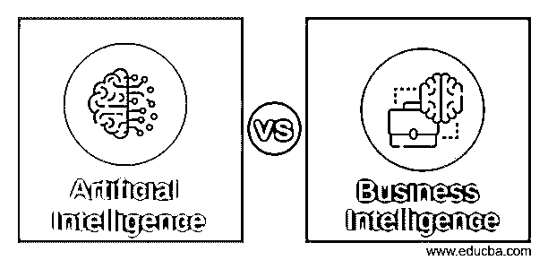
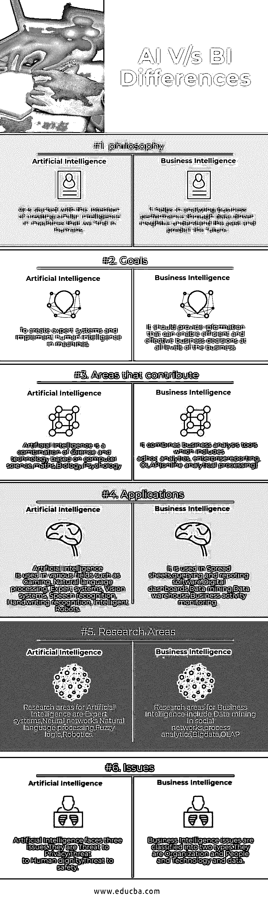

# 人工智能 vs 商业智能

> 原文：<https://www.educba.com/artificial-intelligence-vs-business-intelligence/>

## 人工智能与商业智能的区别

[商业智能是](https://www.educba.com/what-is-business-intelligence/)一种用于收集、存储、访问和分析数据以帮助商业用户做出更好决策的技术，另一方面，人工智能是一种制造像人类一样智能思考的计算机、计算机控制的机器人或[软件](https://www.educba.com/course/software-project-management-training/)的方法。[人工智能是](https://www.educba.com/what-is-artificial-intelligence/)基于对人类如何思考、学习、决策和工作以解决问题的研究，然后使用这项研究的结果作为开发智能软件和系统的基础。

### 人工智能和商业智能的面对面比较(信息图)

以下是人工智能和商业智能之间的六大对比:

<small>Hadoop、数据科学、统计学&其他</small>

### 人工智能和商业智能对照表

下面是人工智能和商业智能的对比表。

| **比较的基础** | **人工智能** | **商业智能** |
| **哲学** | 人工智能始于创造类似人类智能的机器的意图 | 它有助于通过数据驱动的洞察力分析业务绩效，即了解过去和预测未来 |
| **目标** | 创建专家系统并在机器中实现人类智能 | 它应该提供能够在业务的所有级别上实现高效和有效的业务决策的信息。 |
| **做出贡献的领域** | 人工智能是以计算机科学、数学、生物学、心理学为基础的科学技术的结合 | 它结合了[业务分析工具](https://www.educba.com/business-analysis-tools/)，其中包括即席分析、企业
报告、 [OLAP](https://www.educba.com/what-is-olap/) (在线分析处理) |
| **应用程序** | 人工智能用于各种领域，例如游戏、自然语言处理、专家系统、视觉系统、语音识别、手写识别、智能机器人。 | 它用于电子表格、查询和报告软件、数字仪表板、[数据挖掘](https://www.educba.com/data-mining-techniques/)、[数据仓库](https://www.educba.com/10-popular-data-warehouse-tools/)、业务活动监控。 |
| **研究领域** | 人工智能的研究领域包括专家系统、神经网络、自然语言处理、[模糊逻辑](https://www.educba.com/what-is-fuzzy-logic/)、机器人技术。 | 商业智能的研究领域包括社交网络中的数据挖掘、[流程分析](https://www.educba.com/data-science/courses/data-science-course/)、[大数据](https://www.educba.com/big-data-analytics-techniques/)、OLAP |
| **问题** | 人工智能面临三个问题。它们是对隐私的威胁，对人类尊严的威胁，对安全的威胁。 | 商业智能问题分为两种类型。它们是组织、人、技术和数据 |

### 人工智能与商业智能中的算法

人工智能和商业智能中的算法解释如下:

| **人工智能算法** | **商业智能算法** |
| ***广度优先搜索算法***
它从根节点开始，首先探索邻居节点，然后移动到下一级邻居节点。它提供了解决方案的最短路径，并且[可以使用 FIFO](https://www.educba.com/fifo-vs-lifo/) 来实现 | [***决策树算法***](https://www.educba.com/decision-tree-algorithm/)
这种以人类可理解的规则的形式提取预测信息，这些规则可以是 if-then-else 从而得出预测信息 |
| ***深度优先搜索算法***
该算法采用 LIFO(后进先出)数据结构实现。它创建的节点与广度优先搜索相同，只是顺序不同。在每次迭代中，它从根到叶存储节点，并且不能检查重复的节点。 | [***朴素贝叶斯***](https://www.educba.com/naive-bayes-algorithm/)
它通过使用贝叶斯算法进行预测，该算法从数据中观察到的基础证据中导出概率预测。 |
| ***均匀代价搜索算法***
在这种算法中，排序是按路径到某个节点的代价递增来完成的。它总是扩展最小成本节点。如果每个转换具有相同的成本，则该搜索与广度优先搜索相同。它以成本递增的顺序探索路径。 | ***广义线性模型***
对二元目标分类实现逻辑回归，对连续目标实现线性回归。它支持预测概率的置信界限，也支持预测的置信界限。 |
| ***迭代深化深度优先搜索***
它在第一层执行深度优先搜索并重新开始，然后执行一个完整的深度优先搜索到第二层，继续下去直到得到解。 | ***最小描述长度***
这是一个信息论模型选择原则。它假设最简单、最紧凑的数据表示是解释数据的最佳方式 |
| ***纯启发式搜索***
它按照启发式值的顺序展开节点。它创建两个列表，一个是已展开节点的封闭列表，另一个是已创建但未展开节点的开放列表。这样，较短的路径被保存，而较长的路径被丢弃。 | ***K-Means 算法***
它是一种基于距离的聚类算法，将数据划分成预先确定数量的簇。每个聚类都有一个质心 |
| ***旅行推销员问题***
在这个算法中，主要目标是找到一个从一个城市出发，恰好访问一次途中所有城市并在同一个城市开始结束的低价旅行。 | ***Apriori 算法***
它通过发现集合内共现的项目来执行基于市场的分析。此算法查找支持度大于指定最小支持度且可信度大于指定最小可信度的规则。 |
| ***爬山搜索***
[它是一种迭代](https://www.educba.com/hill-climbing-in-artificial-intelligence/)算法，从问题的任意解决方案开始，通过增量改变解决方案的单个元素，试图找到更好的解决方案。如果这个变化产生了一个更好的解决方案，一个增量的变化被认为是一个新的解决方案。重复这个过程，直到没有进一步的改善。 | ***支持向量机***
不同版本的 SVM 使用不同的核函数来处理不同类型的数据集。支持线性和高斯(非线性)内核。SVM 分类法试图以尽可能大的幅度来区分目标类别。SVM 回归试图找到一个连续函数，使得最大数量的数据点位于围绕它的ε-宽的管内。 |
| 还有其他算法，如模拟退火、局部波束搜索、A*搜索、双向搜索。 | BI 支持/使用非负矩阵分解，一类支持向量机，正交分割聚类，最大熵。 |

### 人工智能与商业智能的融合

人工智能和商业智能是绝配。人工智能和商业智能是通过人工智能驱动的警报来见证的，从基本的阈值警报到高级神经网络警报，并通过在事情发生时立即发出警报来帮助企业保持对关键成功因素的完全控制。当与创新的商业仪表板相结合时，这些人工智能进展将继续彻底改变商业智能的前景。所有这些业务都将摆脱挖掘数据以发现趋势并对代价高昂的问题做出反应的耗时过程。

### 结论

[人工智能](https://www.educba.com/importance-of-artificial-intelligence/)是一家新企业建立智能计算模型的核心。主要的假设是人类的智力可以用符号结构和符号运算来表示，这些可以在[数字计算机](https://www.educba.com/digital-marketing-planning/)中编程。商业智能使组织内的团队能够从业务数据中获得可操作的洞察力，并利用这些洞察力来满足标准。商业智能解决方案以基本操作系统报告或电子表格分析无法实现的规模、复杂性和速度提供以业务为中心的分析，从而提供巨大的价值。

### 推荐文章

这是一本关于人工智能和商业智能的指南。在这里，我们讨论了人工智能与商业智能的直接比较、关键差异以及信息图和比较表。您也可以阅读以下文章，了解更多信息——

1.  [商业智能与数据挖掘——哪个更有用](https://www.educba.com/business-intelligence-vs-data-mining/)
2.  [12 种重要的商业智能工具(优势)](https://www.educba.com/business-intelligence-tool/)
3.  [关于商业智能和数据仓库，你必须知道的 5 件事](https://www.educba.com/business-intelligence-vs-data-warehouse/)

