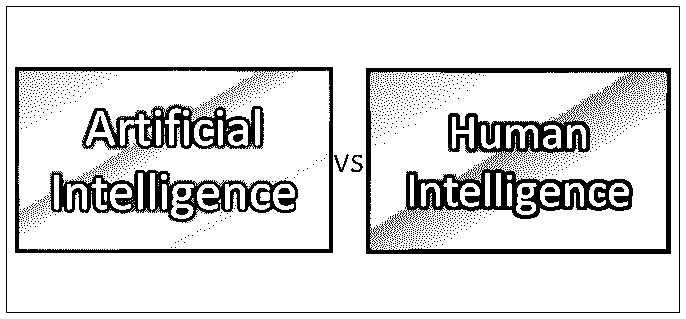
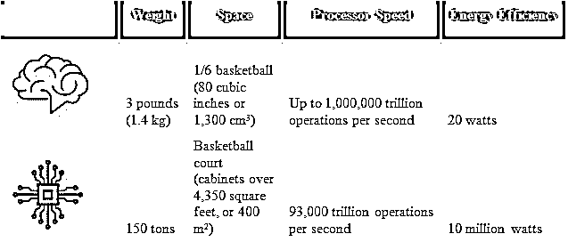
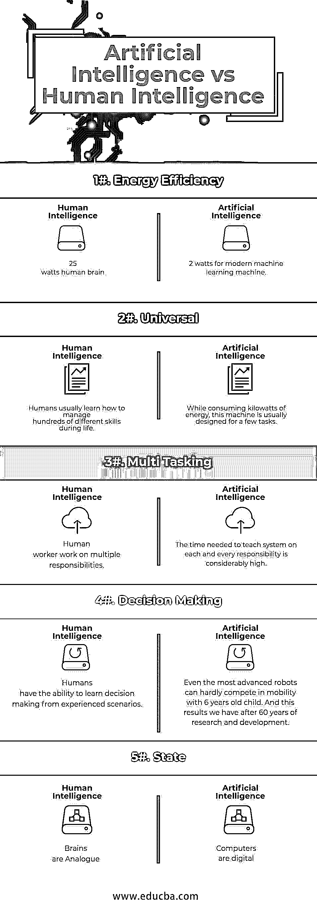

# 人工智能 vs 人类智能

> 原文：<https://www.educba.com/artificial-intelligence-vs-human-intelligence/>

## 人工智能与人类智能的区别

智力可以被定义为推理、解决问题和学习的一般心理能力。因为它的一般性质，智能整合了认知功能，如感知、注意力、记忆、语言或规划。根据这一定义，智力可以通过标准化测试进行可靠的测量，所获得的分数可以预测几个广泛的社会结果，如教育成就、工作表现、健康和寿命。所以我们来详细研究一下人工智能和人类智能的区别。

### 人工智能

[人工智能是](https://www.educba.com/what-is-artificial-intelligence/)对智能代理的研究和设计，这些[智能代理具有](https://www.educba.com/intelligent-agents/)分析环境并产生最大限度成功的行动的能力。

<small>Hadoop、数据科学、统计学&其他</small>

人工智能研究使用许多领域的工具和见解，包括计算机科学、心理学、哲学、神经科学、认知科学、语言学、运筹学、经济学、控制论、概率论、最优化和逻辑学。人工智能研究还与机器人、控制系统、调度、数据挖掘、物流、语音识别、面部识别和许多其他任务重叠。

### 人类智力

人类智能被定义为由从过去的经验中学习的能力、适应新情况的能力、处理抽象概念的能力和利用获得的知识改变他/她自己的环境的能力组成的思维品质。

人类的智能可以提供几种信息。它可以提供旅行者、难民、逃跑的友军战俘等在旅行或其他事件中的观察。它可以提供主体具有特定知识的事物的数据，这可以是另一个人类主体，或者在叛逃者和间谍的情况下，他们可以访问的敏感信息。最后，它可以提供人际关系和兴趣网络的信息。

### 大脑与超级计算机的比较

### 人工智能相对于人类智能的优势

*   **执行速度–**一名医生可以在 10 分钟内做出诊断，而人工智能系统可以在同一时间做出 100 万个诊断。
*   **较少偏见—**他们不涉及对决策过程的偏见
*   **运营能力–**他们不希望因为饱和而停止工作
*   **精度—**输出精度明显提高
*   人工智能在许多任务中具有显著的优势，尤其是在单调的判断方面。

### 人工智能与人类智能的面对面比较

以下是人工智能和人类智能之间的 5 大区别:

### 人工智能和人类智能的主要区别

以下是一些要点，描述了人工智能和人类智能之间的主要区别:

**存在的本质**

人类的智能围绕着使用几种认知过程的组合来适应环境。

人工智能领域专注于设计能够模仿人类行为的机器。

**内存使用量**

人类使用内容记忆和思维，而机器人使用由科学家设计的内置指令。

**创作模式**

人类的智能更大，是因为它创造的神和人工智能顾名思义是人为的，很少的，暂时的由人类创造的。此外，人类智能是人工智能的真正创造者，但他们不能创造出具有优越性的人类。

**学习过程**

人类的智力是基于他们在生活中遇到的变化和他们得到的反应，这可能会导致他们生活中数百万种功能。然而，人工智能只是为特定的任务定义或开发的，它在其他任务上的适用性可能不容易实现。

**支配地位**

人工智能可以在某些特定领域击败人类智能，例如在国际象棋中，超级计算机已经击败了人类棋手，因为它能够存储迄今为止所有人类下的所有棋，并能够提前 10 步思考，而人类棋手可以提前 10 步思考，但不能存储和检索国际象棋中的棋数。

**点注意事项**

*   技术变革的加速速度使得人们有可能在未来几十年既有计算能力又有科学知识来创造 AGI。
*   拥有 AGI 将有益于人类。例如，它可能使人类能够缓解气候变化等全球性问题。
*   它还可能导致经济增长率和生产水平的提高。
*   智能和超智能机器是人类的未来。

### 人工智能与人类智能对照表

以下是显示人工智能和人类智能之间的比较的一组点:

| **Comparison****因子** | **人类智力** | **人工智能** |
| **能效** | 25 瓦的人脑 | 2 watts for modern machine learning machine |
| **通用** |  人类通常在生活中学习如何管理数百种不同的技能。 |  

虽然消耗千瓦的能源，这种机器通常是为少数任务而设计的。

 |
| **多任务处理** | 人类工作者承担多重责任 |  对每个响应教导系统所需的时间相当长 |
| **决策制定** | 人类有能力从经验丰富的场景中学习决策。 |  即使是最先进的机器人也很难在机动性上与 6 岁的孩子竞争。这是我们经过 60 年的研究和发展取得的成果。 |
| **状态** | 大脑是相似的 | 电脑是数字化的 |

### 结论

人类的智能围绕着使用几种认知过程的组合来适应环境。人工智能领域专注于设计能够模仿人类行为的机器。然而，人工智能研究人员能够实现弱人工智能，但不能实现强人工智能。事实上，一些人认为，由于人脑和计算机之间的各种差异，强人工智能永远不可能实现。因此，目前，仅仅模仿人类行为的能力被认为是人工智能。

此外，人工智能的应用肯定会在未来几年使人类的生活更加方便，甚至迫使人类发展他们的技能，这种机器也许永远不可能完全取代人力资源。

### 推荐文章

这是人工智能和人类智能之间差异的指南。在这里，我们讨论了直接比较、关键差异以及信息图和比较表。您也可以阅读以下文章，了解更多信息——

1.  [数据科学 vs 人工智能](https://www.educba.com/data-science-vs-artificial-intelligence/)
2.  [人工智能 vs 商业智能](https://www.educba.com/artificial-intelligence-vs-business-intelligence/)
3.  [机器学习 vs 人工智能](https://www.educba.com/machine-learning-vs-artificial-intelligence/)
4.  [商业智能 vs 大数据](https://www.educba.com/business-intelligence-vs-big-data/)

