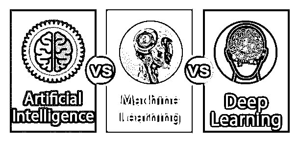

# 人工智能 vs 机器学习 vs 深度学习

> 原文：<https://www.educba.com/artificial-intelligence-vs-machine-learning-vs-deep-learning/>

## 人工智能 vs 机器学习 vs 深度学习的区别

人工智能(AI)是计算机科学的分支，用于创造智能机器。人工智能是指人类的智能或由机器模仿人类的行为。人工智能主要分为三类是狭义的 AI，指的是事物被训练以某种方式执行特定任务。机器学习(ML)被称为人工智能(AI)的子集。它允许计算机通过训练、分析、观察和经验来处理情况。所有的机器学习都算人工智能，但所有的 AI 都不算机器学习。它被认为是适合商业的最佳人工智能工具之一。深度学习(DL)被称为机器学习的子集。它通常被称为深度人工神经网络，这些算法集对于声音识别、图像识别等问题非常准确。深度学习也被定义为它使计算机能够在没有编程的情况下学习。

第二个是人工通用智能(AGI)，这意味着这是人类级别的人工智能，以及执行分配给它的广泛任务的能力。第三类是超智能人工智能，领先一步。在创造力、智慧、技能等各个领域，人工智能都比人脑聪明。简单来说，就是机器比人类聪明。机器学习的原理是机器在从各种资源获取数据的帮助下进行自我学习。机器学习允许机器基于对复杂数据模式和集合的识别做出预测，ML 不同于需要特定指令才能完成任务的硬编码软件程序。当它暴露于越来越多的数据时，它有能力改变自己，机器学习本身是动态的，并且不需要任何人为干预来进行某些改变。深度是指神经网络层的技术术语。只有一个隐藏层的浅层网络和深层网络有多个层。这些层允许网络获取数据特征。

<small>Hadoop、数据科学、统计学&其他</small>

### 人工智能与机器学习和深度学习之间的面对面比较(信息图)

下面是人工智能 vs 机器学习 vs 深度学习的 6 大区别

### 人工智能与机器学习和深度学习的关键区别

让我们讨论一下人工智能、机器学习和深度学习之间的一些主要区别。

1.人工智能像反应机一样有不同的类型；系统只有反应，不像洗衣机那样有记忆。机器学习使机器能够根据过去的数据做出决策。深度学习使机器能够在人工神经网络的帮助下做出决定。

2.人工智能类型的记忆是有限的。机器学习主要作用于少量的训练数据。深度学习主要需要大量的训练数据。

3.人工智能的其他类型是心灵理论，这意味着系统能够理解人类的情绪，并根据人类的理解调整行为。机器学习在低端系统上工作。深度学习需要高端系统才能工作。

4.人工智能是用来让系统像有自我意识一样；它意味着系统意识到自己并理解其状态，预测其他人的感觉，并据此采取行动。机器学习的大部分特征都需要提前识别，手动编码。在深度学习中，机器从提供给它的数据中学习特征。

5.人工智能主要作用于整个问题。在机器学习中，问题被分成几个部分并单独解决，然后将其全部组合起来。在深度学习中，问题是以端到端的方式解决的。

6.人工智能需要很长时间来测试应用程序。机器学习比深度学习需要更长的时间。深度学习测试过程需要的时间更少。

7.人工智能已经定义了规则。机器学习有清晰的规则来告诉我们为什么要做出决定。在深度学习中，系统根据自己的逻辑做出决定，有时很难解释。

8.未来的人工智能将用于在犯罪发生前发现犯罪，并成为人工智能的助手。机器学习将在未来用于提高医疗保健的效率，并将提供更好的营销技术。未来深度学习将用于日益个性化和超智能的个人助理。

### 人工智能 vs 机器学习 vs 深度学习对比表

下面是 6 个最上面的比较

| **比较的基础** | **人工智能** | **机器学习** | **深度学习** |
| **定义** | 人工智能是机器展示的人类智能 | 这是实现人工智能的一种途径 | 它是一种实现 ML 的技术。 |
| **子集** | 人工智能不是机器或深度学习的子集 | 机器学习是人工智能的一个子集 | 深度学习是机器学习的一个子集。 |
| **编程** | 人工智能需要完全编程的东西来制造系统 | 机器学习不需要任何硬代码算法 | 深度学习不需要任何编程来实现事情 |
| **复杂** | 人工更复杂，因为一个人必须知道一切 | 机器学习没有人工智能复杂 | 深度学习没有机器学习复杂。 |
| **存在** | 它出现在 1956 年 | 大约在 20 世纪 80 年代 | 大约在 2000 年 |
| **例题** | 亚马逊回声 | 搜索引擎结果提炼 | 自动翻译。 |

### 结论

人工智能 vs 机器学习 vs 深度学习都是相互关联的，动机都是为了更快更快的完成事情。正如我们已经讨论过的，机器学习是人工智能的子集，深度学习是机器学习的子集。人工智能是在计算机和信息技术世界中实现各种事情的更大图景和核心事物。从上面，我们能够看到三者之间的区别以及它们未来的用途。因此，今天和未来的世界是人工智能及其组件，如[机器学习和深度学习](https://www.educba.com/deep-learning-vs-machine-learning/)以及其他组件。

### 推荐文章

这是人工智能、机器学习和深度学习之间最大差异的指南。在这里，我们还讨论了人工智能与机器学习和深度学习的关键差异，并提供了信息图表和对比表。你也可以看看下面的文章来了解更多。

1.  [监督学习 vs 深度学习](https://www.educba.com/supervised-learning-vs-deep-learning/)
2.  [数据科学家 vs 机器学习](https://www.educba.com/data-scientist-vs-machine-learning/)
3.  [人工智能 vs 商业智能](https://www.educba.com/artificial-intelligence-vs-business-intelligence/)
4.  [机器学习 vs 统计学](https://www.educba.com/machine-learning-vs-statistics/)

