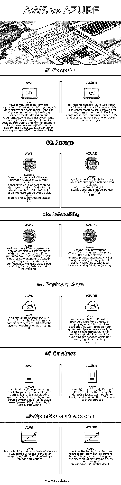

# AWS vs AZURE

> 原文：<https://www.educba.com/aws-vs-azure/>

## AWS 和 AZURE 的区别

亚马逊网络服务(AWS)是亚马逊的云服务平台，提供不同领域的服务，如计算、存储、交付和其他功能，帮助企业扩展和增长。我们可以以服务的形式利用这些领域，这些服务可用于在云平台中创建和部署不同类型的应用程序。Microsoft Azure 是微软的云服务平台，提供不同领域的服务，如计算、存储、数据库、网络、开发工具和其他功能，帮助组织扩展和发展业务。 [Azure 服务](https://www.educba.com/azure-services/)大致分为平台即服务(PaaS)、软件即服务(SaaS)和基础设施即服务(IaaS)，开发者和软件员工可以使用这些服务通过云创建、部署和管理服务和应用。

### 什么是 AWS？

AWS 服务是以这样的方式设计的，即它们相互协作并产生可伸缩的和高效的结果。AWS 提供的服务分为 3 种类型，如基础设施即服务(IaaS)、软件即服务(SaaS)和平台即服务(PaaS)。 [AWS 于 2006 年推出](https://www.educba.com/what-is-aws/)，成为目前可用云平台中最好的云平台。云平台提供了各种优势，如管理开销减少、成本最小化等。

<small>Hadoop、数据科学、统计学&其他</small>

### 什么是 AZURE？

微软 Azure 于 2010 年推出，现已成为最大的商业云服务提供商之一。它提供了广泛的集成云服务和功能，如分析、计算、网络、数据库、存储、移动和 web 应用程序，可与您的环境无缝集成，以实现效率和可扩展性。

### AWS 和 AZURE 的面对面比较(信息图)

下面是 AWS 和 AZURE 的 6 大对比

### AWS 和 Azure 的主要区别

两者都是市场上的热门选择；让我们讨论一些主要差异:

*   AWS EC2 用户可以配置自己的虚拟机或预配置的映像，而 Azure 用户需要选择虚拟硬盘来创建由第三方预配置的虚拟机，并需要指定所需的内核和内存数量。
*   AWS 提供临时存储，当实例启动时会分配临时存储，当实例终止时会销毁临时存储，并为对象存储提供 S3。而 Azure 通过页面 blob 为虚拟机提供临时存储，通过块 blob 为对象存储提供临时存储。
*   AWS 提供虚拟私有云，以便用户可以在云中创建隔离网络，而 Azure 提供虚拟网络，通过虚拟网络，我们可以创建隔离网络、子网、路由表、私有 IP 地址范围，与 AWS 中相同。
*   Azure 对混合云系统开放，而 AWS 对私有或第三方云提供商不太开放。
*   AWS 遵循按需付费，按小时收费，而 Azure 也遵循按需付费模式，按分钟收费，这提供了比 AWS 更精确的定价模式。
*   AWS 有更多的特性和配置，它提供了很多灵活性、功能和定制，并支持许多第三方工具集成。然而，如果我们熟悉 windows，Azure 将很容易使用，因为它是一个 windows 平台，很容易将本地 windows 服务器与云实例集成，以创建一个混合环境。

### AWS 与 AZURE 对比表

以下是要点列表，描述了比较结果:

| **比较的基础** | **AWS** | **蔚蓝色** |
| **计算** | 我们有计算机来执行数据的计算、处理和运算，并且我们可以根据我们的要求在云服务提供商的帮助下扩展到数千个处理节点。AWS 使用弹性计算云(EC2)作为可扩展计算的主要解决方案，并使用 Docker 或 Kubernetes 管理软件容器。它使用 ECS (EC2 容器服务)并使用 EC2 容器注册表。 | 出于计算目的，Azure 使用虚拟机，并在很大程度上使用虚拟机规模集进行扩展，对于软件管理，在 Docker 容器中，它使用容器服务(AKS ),并使用 Docker 容器注册表的容器注册表。 |
| **存储** | 对于云提供商来说，存储仅次于主要服务。AWS 使用比 Azure 运行时间更长的 S3(简单存储服务),它提供了大量的文档和教程。它提供冰川旁边的归档存储、数据归档和 S3 非频繁访问(IA) | Azure 使用存储块 blob 进行由块组成的存储，并高效地上传大 blob。它使用 Storage cool 和 storage archive 来归档数据。 |
| **联网** | 云提供商提供不同的合作伙伴和网络，这些合作伙伴和网络将使用不同的产品与数据中心互联。AWS 使用虚拟私有云进行联网，并使用 API 网关进行跨场所连接。AWS 在联网过程中使用弹性负载平衡进行负载平衡。 | Azure 使用虚拟网络进行联网或内容交付，并使用 VPN 网关进行跨场所连接。对于内容交付期间的负载平衡，它通过负载平衡器和应用网关进行管理 |
| **部署应用** | AWS 还提供类似的解决方案，如弹性豆茎、批处理、Lambda、容器服务等。但它在应用程序托管端没有太多功能。 | 云提供商的优势之一是部署应用程序的简单流程。作为一名开发人员，我们希望通过使用 PaaS 特性在多台服务器上部署我们的应用程序。Azure 有多种应用部署工具，如云服务、容器服务、函数、批处理、应用服务等。 |
| **数据库** | 几乎所有的云提供商都提供了在 SQL 和 NoSQL 解决方案中实现数据库的能力。AWS 通过使用 RDS 将关系数据库用作服务，对于 NoSQL，它使用 Dynamo DB，缓存使用 Elastic Cache。 | Azure 将 SQL 数据库、MySQL 和 PostgreSQL 用于关系数据库，将 Cosmos DB 用于 NoSQL 解决方案，将 Redis 缓存用于缓存目的。 |
| **开源开发者** | AWS 非常适合开源开发者，因为它欢迎 Linux 用户，并为不同的开源应用程序提供了几个集成。 | Azure 为企业用户提供了便利，使他们可以使用当前的 active directory 帐户在 Azure 云平台上签名和运行。在 Windows、Linux 和 MacOS 上使用. net framework。 |

### 结论

最后，它概述了 AWS 与 AZURE 云提供商之间的差异。我希望你能更好地了解这些 AWS vs AZURE 提供商提供的服务，并根据你的需求选择云提供商。如果您正在寻找基础架构即服务或广泛的服务和工具，那么您可以选择 AWS。如果你正在寻找 windows 集成或一个好的平台即服务(PaaS)云提供商，那么你可以选择 Azure。

### 推荐文章

这是 AWS 和 AZURE 之间差异的有用指南，在这里我们讨论了它们的含义、直接比较、关键差异和结论。您也可以阅读以下文章，了解更多信息——

1.  [角度 vs 敲除](https://www.educba.com/angular-vs-knockout/)
2.  [角度与自举](https://www.educba.com/angular-vs-bootstrap/)
3.  【Azure Paas 与 Iaas 之间有价值的差异[–](https://www.educba.com/azure-paas-vs-iaas/)
4.  [软件工程师 vs 软件开发人员](https://www.educba.com/software-engineer-vs-software-developer/)
5.  [Angular vs JQuery](https://www.educba.com/angular-vs-jquery/)
6.  [Java 堆 vs 栈](https://www.educba.com/java-heap-vs-stack/)
7.  [数据分析](https://www.educba.com/data-analytics-vs-data-analysis/) [vs 数据分析–主要差异](https://www.educba.com/data-analytics-vs-data-analysis/)
8.  [Heroku 和 AWS 的区别](https://www.educba.com/heroku-vs-aws/)

