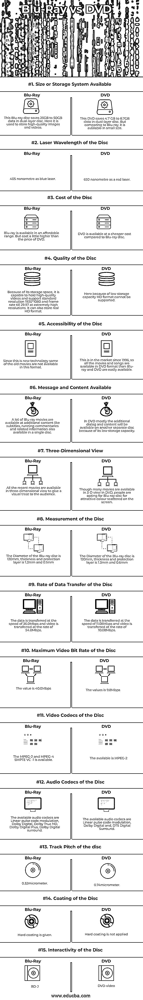

# 蓝光与 DVD

> 原文：<https://www.educba.com/blu-ray-vs-dvd/>

## 蓝光和 DVD 的区别

蓝光指的是蓝色激光，通常被称为蓝光光盘，它以数字格式存储数据，并被制造来打破 DVD 的需求，并具有超高清的高存储容量。该盘的尺寸为周长 120 毫米，厚度 1.2 毫米，双层 50GB，符合行业标准。市场上有 100GB 和 128GB 的三层和四层。蓝光是一组多媒体格式，以每秒 60 帧的速度提供 2160p 的分辨率。DVD 是一种用于存储数字数据的数字多功能光盘，主要应用于保存文件和程序的软件中，并且可以存储比光盘大的数据。让我们详细研究一下蓝光和 DVD 的区别。

### 蓝光和 DVD 的直接对比(信息图)

以下是两者之间的 15 大差异:

<small>Hadoop、数据科学、统计学&其他</small>

### 蓝光和 DVD 的主要区别

下面讨论了两者的独特差异:

*   蓝光和 DVD 中应用的激光技术用于读取存储在光盘上的数据。当光盘旋转时，光盘上的激光使我们能够读取信息，并将视频和音频传输到电视上。在 DVD 中，它使用红色激光对数据进行编码，并将图像和音频传输到电视上。在蓝光中，蓝色激光传播速度很快，能够以良好的音频质量呈现明亮而精确的图像和视频
*   蓝光光盘和 DVD 的光盘结构相似。这两种设备都有凹陷的底层，允许激光穿透来读取支持信息。光盘有一个最上面的保护层，以避免划伤导致信息丢失。
*   图像的图像分辨率是通过画面中有限的垂直和水平光线计算出来的。穿过屏幕的水平线表示为 1080、720 或 480。分辨率越高，图像的清晰度越高，视频或图像的清晰度越高。DVD 的设计标准分辨率为 520，非常适合利用屏幕上可用像素的显像管电视，如果应用于高清电视，它的可视粒度更大。最近几天，蓝光是潮流的引领者，它有 1080 的显示屏，在高清电视上看起来很棒。
*   播放器兼容性每天都在改进。它们在怀疑论中可用，并且所有的蓝光播放器都支持 DVD，但是 DVD 不能有效地支持蓝光光盘，因为 DVD 播放器太大了，无法读取蓝光光盘中的迷你凹坑。根据预算，市场上有不同规格的蓝光播放器。但是很容易将数据从蓝光光盘转移到 DVD 光盘，反之亦然。蓝光的最大优势是其比标准 DVD 更高的图像分辨率和兼容性。
*   蓝光已经成功地赢得了高清晰度图像的战争，但其发展中的技术仍在不断增强其功能。但人们混淆了蓝光和 DVD，它们在本质上相似，但在行为上不同，如图像分辨率、存储容量、技术和传输速率都有清楚的解释。蓝光的独特之处在于使用了波长更短的蓝色激光，这种激光可以存储更多的数据，并具有高密度的镜头规格和 0.85 NA 的数值孔径率

### 对照表

让我们来讨论一下蓝光与 DVD 之间的主要对比:

| **组件** | **蓝光** | **DVD** |
| **可用的尺寸或存储系统** | 这种蓝光光盘可在双层光盘中存储 25GB 至 50GB 的数据。在这里，它被用来存储高质量的图像和视频 | 此 DVD 在双层光盘中存储 4.7 GB 至 8.7GB 的数据。但是与蓝光相比，它的尺寸很小 |
| **光盘的激光波长** | 405 纳米蓝光激光器 | 650 纳米作为红色激光 |
| **光盘成本** | 蓝光光盘价格适中。但是比 DVD 的价格稍高一些 | DVD is available at a cheaper cost compared to Blu-ray disc.. |
| **光盘质量** | 由于其存储空间，它能够容纳高质量的视频，并支持标准的分辨率 1920*1080 和帧率高达 29.97 的极高分辨率。它还可以存储真正的高清格式 | 这里由于存储容量低，不能支持 HD 格式。 |
| **光盘的可访问性** | 由于这是新技术，一些老电影无法以这种格式播放 | 这是自 1996 年以来在市场上，所以所有的电影和歌曲都可以在 DVD 格式比蓝光和 DVD 容易获得 |
| **可用消息和内容** | 许多蓝光电影都有附加内容，如字幕、解说词和相关信息也可以在一张盘片中找到。 | 在 DVD 中，由于其低存储容量，附加的对话和内容将在另一个单独的盘上可用 |
| **三维视图** | 所有最近上映的电影都是三维立体的，给观众一种视觉享受 | 尽管许多电影都有 3d DVD 版本，但人们还是会选择蓝光光盘，因为它能在屏幕上呈现出迷人的色彩 |
| **圆盘的测量** | 蓝光光盘的直径是 120 毫米，厚度和保护层是 1.2 毫米和 0.1 毫米 | 蓝光光盘的直径是 120 毫米，厚度和保护层是 1.2 毫米和 0.6 毫米 |
| **光盘的数据传输速率** | 数据传输速率为 36.0Mbps，视频传输速率为 54.0Mbps | 数据传输速率为 11.08Mbps，视频传输速率为 10.08Mbps |
| **光盘的最大视频比特率** | 该值为 40.0Mbps | 该值为 9.8Mbps |
| **光盘的视频编解码器** | The MPEG-2 and MPEG-4

SMPTE VC -1 可用

 | 可用的是 MPEG-2 |
| **光盘的音频编解码器** | The available audio codecs are Linear pulse code modulation, Dolby Digital, Dolby True HD, Dolby Digital Plus, Dolby Digital surround | 可用的音频编解码器有线性脉冲编码调制、杜比数字和 DTS 数字环绕 |
| **光盘的轨道间距** | 0.32 微米 | 0.74 微米 |
| **光盘涂层** | 给出了硬涂层 | 没有应用硬涂层 |
| **光盘的交互性** | BD-J | DVD-视频 |

### 推荐文章

这是蓝光与 DVD 的对比指南。在这里，我们讨论蓝光与 DVD 的介绍，信息图的主要区别，以及一个比较表。您也可以浏览我们推荐的其他文章，了解更多信息——

1.  [信息学与数据阶段](https://www.educba.com/informatica-vs-datastage/)
2.  [数据分析 vs 数据分析](https://www.educba.com/data-analytics-vs-data-analysis/)
3.  [计算机网络 vs 数据通信](https://www.educba.com/computer-network-vs-data-communication/)
4.  [数据科学家 vs 大数据](https://www.educba.com/data-scientist-vs-big-data/)

