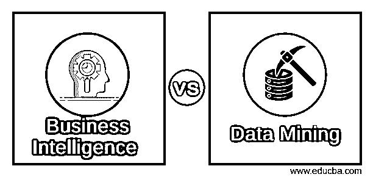

# 商业智能与数据挖掘

> 原文：<https://www.educba.com/business-intelligence-vs-data-mining/>

## 商业智能与数据挖掘的区别

商业智能将数据转化为可操作的信息。它有助于使用应用程序、基础架构和工具以及最佳实践来优化组织的战略和战术业务决策，以便于访问组织的运营事实和数据。[数据挖掘是从不同的角度评估大量原始数据中未识别模式的](https://www.educba.com/what-is-data-mining/)过程，将数据分类为有用的信息，从而获得商业洞察力，提前解决问题。

### 商业智能(BI)

通俗地说，商业智能将分析一个组织的复杂原始数据，并将它们转换为业务所需的有用信息。通过使用这些有用的信息，企业将知道什么是有效的，什么是无效的，什么是未来，以及你如何改进你的业务。

<small>Hadoop、数据科学、统计学&其他</small>

以下是商业智能中涉及的流程:

*   汇总一个组织的复杂原始数据
*   分析数据
*   以有意义的可视化方式呈现数据
*   基于这些事实，企业将为组织的健康做出明智的决定

市场上有许多商业智能工具，任何组织都可以使用这一工具来改善其业务:

*   微观战略
*   活人画
*   QlikView
*   西森斯
*   Oracle 企业商务智能服务
*   IBM [Cognos](https://www.educba.com/what-is-cognos/) 智能
*   icCube
*   准确的商业情报和报告工具(BIRT)
*   多莫
*   SAP 业务对象

### 数据挖掘

用外行人的语言如词本身解释，就是对有用信息或知识的挖掘。数据挖掘有助于从海量数据中找到有用的信息或知识。

组织中有大量可用的数据。除非您将数据转化为有价值的信息，否则数据没有任何价值。需要分析这些数据并将它们转换成有价值的信息。因此，数据挖掘将有助于从大量可用数据中提取这些有价值的信息。数据挖掘涉及的其他过程有:

*   清理数据

它将处理损坏的、不相关的、不准确的、不完整的数据

*   整合数据

将多个数据源组合成有意义的信息

*   数据选择

将从数据库中检索对分析有意义的数据

*   数据转换

将数据转换为与挖掘相关的特定形式

*   数据挖掘

将提取所需的数据模式

*   评估数据中的模式

将根据感兴趣的度量提取代表信息或知识的模式。

*   信息或知识的展示

将使用不同的可视化方式向企业展示挖掘出的知识

从数据挖掘中发现的有价值的信息或知识可以用于许多目的，例如:

*   管理分析
*   市场分析
*   [风险管理](https://www.educba.com/risk-management-in-banks/)
*   公司分析
*   客户管理
*   欺诈检测

有许多可用的数据挖掘工具，下面列出了一些市场上最好的工具:

*   r 程序设计
*   RapidMiner(耶鲁)
*   新西兰黑秧鸡
*   柑橘
*   Knime
*   数据融化
*   发动
*   [Hadoop](https://www.educba.com/hadoop-vs-hive/)

### 商业智能和数据挖掘之间的直接比较(信息图表)

以下是商业智能和数据挖掘之间的 7 大对比:

### 商业智能和数据挖掘的主要区别

以下几点描述了商业智能和数据挖掘之间的主要区别:

*   商业智能是数据驱动的，而数据挖掘分析数据中的模式。
*   商业智能有助于[决策](https://www.educba.com/career-making-decisions/)但是数据挖掘将解决特定的问题并有助于决策。
*   商业智能中涉及的数据量很大，而数据挖掘中的数据量很小。
*   商业智能涉及业务流程和数据分析方法，而在数据挖掘中，它使用计算智能来发现商业因素的解决方案。
*   商业智能包括数据的生成、聚合、分析和可视化。然而，在数据挖掘中，它包括清理、整合、转换和评估数据中的模式。
*   商业智能为[业务管理](https://www.educba.com/business-management/)和高管提供信息和便利，而数据挖掘则提供要在 BI 结果中呈现的 KPI。
*   BI 提供仪表板、报告和文档，以图形和图表的形式显示许多 KPI 的整合视图，而数据挖掘提供有助于决策的报告。
*   商业智能是组织决策的一部分，而数据挖掘是商业智能的一部分，有助于为决策创建 KPI。

### 商业智能和数据挖掘对照表

下面是商业智能和数据挖掘的对照表。

| **比较依据** | **商业智能** | **数据挖掘** |
| **意为** | [将原始](https://www.educba.com/what-is-business-intelligence/)数据转化为对业务有用的信息。 | 旨在探索数据并找到业务问题的解决方案。 |
| **商业用途** | 数据驱动有助于企业决策。 | 寻找商业问题的答案。 |
| **数据量** | 在维度/关系数据库上处理的大型数据集 | 小数据集只处理一小部分数据。 |
| **解决方案的质量** | 并使用可视化呈现准确的结果。 | 使用算法识别问题的准确模式，并识别盲点。 |
| **结果展示** | 由带有 KPI 的图形和图表表示的仪表板和报告 | 确定要在仪表板或报告中表示为 KPI 之一的问题的解决方案。 |
| **分析** | 依赖于小范围的过去数据，不涉及智能；管理层必须根据这些信息做出决定。 | 专注于小规模数据业务中的特定问题，使用算法找到解决方案。 |
| **焦点** | 显示价格价值、利润、总成本等。，作为 KPI 的 | 确定为 BI 创建新 KPI 的问题的解决方案 |

### 结论

虽然在这篇商业智能与数据挖掘的博客中，我只指出了一些特征上的不同，但结果表明商业智能与数据挖掘之间有着重要的实质性区别。

互联网、[移动应用](https://www.educba.com/mobile-application-testing-basics/)、不同软件和云服务在业务流程和 IT 中的使用越来越多，这使得企业对数据挖掘和商业智能的需求显著增加。因此，理解商业智能和数据挖掘过程之间的关键区别是很重要的。最重要的几点是:

*   使用商业智能解决方案的组织有很高的成功率，并且有更多的成熟度来处理所有的数据挖掘项目。数据挖掘发现的知识可以在 BI 解决方案上快速测试，并且结果是准确的。
*   BI 通过使用数据挖掘技术帮助解码复杂的原始数据，并使用不同的可视化方式(使用图形和图表)以可理解的方式呈现复杂的数据。这将有助于高层管理人员为公司的健康发展做出必要的决定。
*   数据挖掘和商业智能的结果将产生商业智能。但是，评估是否有必要满足一个公司的欲望是非常重要的。
*   数据从未停止到来，数据量及其复杂性倾向于与日俱增，而且数据也不会一成不变，它总是在变化。这表明了一个组织对 BI 解决方案和数据挖掘的需求在不断增长，以占据市场的顶端。

### 推荐文章

这是商业智能与数据挖掘的指南。在这里，我们讨论了商业智能与数据挖掘的直接比较、关键差异以及信息图和比较表。您也可以阅读以下文章，了解更多信息——

1.  [12 种重要的商业智能工具(优势)](https://www.educba.com/business-intelligence-tool/)
2.  [必须知道的 10 项重要商业管理技能(有帮助)](https://www.educba.com/business-management-skills-helpful/)
3.  [获得最佳结果的 7 种重要数据挖掘技术](https://www.educba.com/data-mining-techniques/)
4.  [成功企业的 8 项重要数据挖掘技术](https://www.educba.com/data-mining-techniques/)

