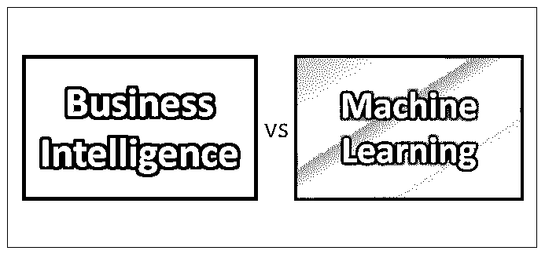
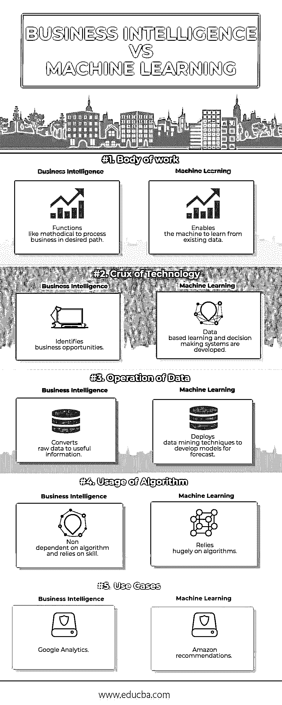
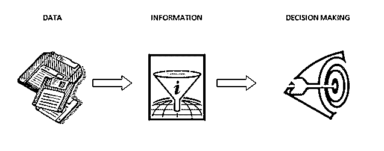

# 商业智能 vs 机器学习

> 原文：<https://www.educba.com/business-intelligence-vs-machine-learning/>

## 商业智能和机器学习的区别

BI(商业智能)已经成为数据分析的一个重要研究领域。并完成在商业战略方面取得成功任务；花时间收集、分析、解释和处理数据应该是唯一的目标。商业智能实际上不同于传统和现代的方法。现代商业智能使业务用户创建自己的内容，而不依赖于 IT 人员，而传统商业智能严重依赖于 IT 专业人员。

**机器学习**，一个简单的定义就是一台机器或一个系统根据输入给出完美的输出。近年来，这已经成为一个普遍的流行语。在机器学习之前，计算机必须被编程(要给出方向)。机器学习发明后，计算机可以自己思考。组织通过使用这种机器学习技术注意到新的发现和解决问题。

<small>Hadoop、数据科学、统计学&其他</small>

著名作家引用机器学习作为

“具有机器学习功能的软件在你安装的第一天所做的事情，与你运行它的第十天或第一百天所做的事情不同。”

### 商业智能和机器学习之间的直接比较(信息图表)

以下是商业智能与机器学习之间的 5 大对比

### 商业智能和机器学习的主要区别

#### 机器学习

ML 的工作程序很简单

*   我们输入数据，并在算法和模型的帮助下训练系统
*   一旦系统熟悉了数据，它就生成关于已知数据集的目标预测结果

现在，我们将尝试了解如何对 ML 进行分类以及其学习的相应功能:

| 特征 | 监督学习 | 无监督学习 | 强化学习 |
| 数据 | 标记数据 | 未标记数据 | 重复的 |
| 预言；预测；预告 | 基于先前的知识 | 没有数据的先验知识 | 基于以往经验的互动 |
| 意义 | 预测模型 | 描述性模型 | 基于经验的绩效 |

1.  **<u>监督学习</u>** :基于数据集的先前知识，预测新数据的输出。在这里，科学家向机器输入数据并期待结果。
2.  **<u>无监督学习</u>** :这种情况一般发生在一个人不知道从数据中期待什么的时候。通过输入数据，它试图检测模式，聚集算法并总结数据点，以便科学家通过有意义的见解得出结果。
3.  **<u>强化学习</u>** :这里机器关注环境内的交互，并通过整合交互来预测结果。

ML 识别在大量数据中难以追踪的人类模式。对于任何组织来说，ML 都在以下几个方面带来了机遇:

*   用户可以更快地获得商业智能项目的价值结果
*   让产品更具暗示性
*   为了降低实现的复杂性

#### 商业智能(BI)

该术语通常指为企业提供战略决策的技术、应用和实践。

BI 的功能也非常简单。它需要数据来处理。

然而，这里呈现的数据并不简单。我们正在谈论大数据。为了提供高效的商业机会，需要将这些大数据可视化。

下面简单介绍了商业智能(BI)的工作原理:

BI 通常用于两个目的:

*   目的 1。经营生意
*   目的 2。改变业务

在这里，我们将尝试理解 BI 如何应用于构成相同目的的目的及其特征:

| 特征 | 目的 1 | 目的 2 |
| 数据 | 结构化数据源 | 结构化和非结构化数据源的混合 |
| 支持 | 需要更好的数据质量 | 可以使用较少的合格数据 |
| 集中 | 面向数据标准和管理 | 面向数据挖掘和机会寻求 |
| 速度 | 不太重要 | 依靠速度和灵活性 |

### 商业智能与机器学习对照表

将机器学习与商业智能进行比较有点困难，因为机器学习将释放商业智能的力量。

商业智能(BI)侧重于自己分析数据(ML 没有这个技能)。凭借这一独特的技能组合，它预测商业战略的结果，对于辛迪加来说，这比他们的勇气和感情更可靠。

对于组织来说，BI 是一个以明智的方式利用信息的绝妙概念。在这里，策略的结果是基于数据而不是个人的本能

另一方面，机器学习(ML)按照术语运行。它的功能更像是在没有任何显式编程的情况下让系统理解。

用简单的方言来说，机器通过访问呈现给它们的数据并将这些数据转换成信息来进行自我学习

下表有助于您理解商业智能和机器学习对彼此的意义:

| **特性** | **商业智能** | **机器学习** |
| 大量工作 | 功能就像有条不紊地按照期望的路径处理业务 | 使机器能够从现有数据中学习 |
| 技术的症结 | 识别商业机会 | 开发了基于数据的学习和决策系统 |
| 数据操作 | 将原始数据转换成有用的信息 | 部署数据挖掘技术来开发预测模型 |
| 算法的使用 | 不依赖算法，依赖技巧 | 非常依赖算法 |
| 用例 | 谷歌分析 | 亚马逊推荐 |

### 结论

我相信，上述产生的信息确实使人理解商业智能和机器学习的意义。

商业智能和机器学习的重要性与数据的依赖性(结构化/非结构化)成正比。这是唯一需要解决的难题(不容易)，因为它依赖于有效数据和高质量算法的可用性。

因此，组织的工作是利用结构化和非结构化数据，并努力设计新的算法，这些算法更加有效，能够为这些工具提供所需的结果。

不要忘记，这些数据湖不仅能帮助组织，还能为最终用户提供大量价值。

罗马不是一天建成的，有效数据处理的进化也是如此；这需要时间。

然而，对于企业负责人来说，更专注于这一领域是至关重要的，因为解决这些挑战是前进的唯一途径。

### 推荐文章

这是商业智能与机器学习的指南，它们的意义，面对面的比较，主要差异，对照表和结论。您也可以阅读以下文章，了解更多信息——

1.  [数据科学与商业智能的 20 大最佳对比](https://www.educba.com/data-science-vs-business-intelligence/)
2.  [12 种重要的商业智能工具(优势)](https://www.educba.com/business-intelligence-tool/)
3.  [数据挖掘与机器学习——你需要知道的 10 件事](https://www.educba.com/data-mining-vs-machine-learning/)
4.  [数据科学与机器学习的 5 个最有用的区别](https://www.educba.com/data-science-vs-machine-learning/)
5.  [什么是强化学习？](https://www.educba.com/what-is-reinforcement-learning/)

