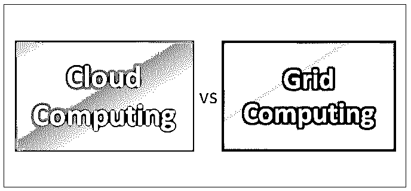
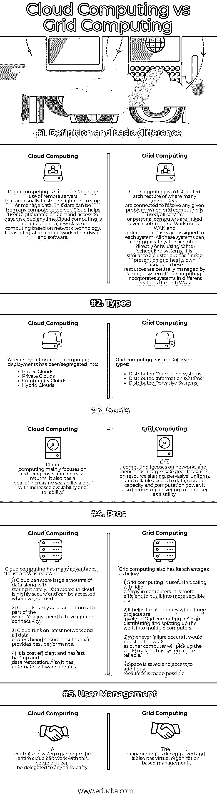

# 云计算与网格计算

> 原文：<https://www.educba.com/cloud-computing-vs-grid-computing/>

## 云计算和网格计算的区别

主要是云计算和网格计算都用来处理任务。然而，网格计算用于云计算，但它不是云，也不是云的一部分。它们都涉及到大规模的计算机基础设施和对它们的管理。云计算和网格计算概念都是为了分布式计算的目的而开发的，也就是说，在一个大的区域上计算一个元素，实际上是在通过某种方式分开的计算机上。

让我们来看看它们的区别，并帮助您理解云计算与网格计算的不同之处。

<small>Hadoop、数据科学、统计学&其他</small>

### 云计算和网格计算的直接比较(信息图表)

下面是云计算和网格计算之间的五大比较:

### 云计算和网格计算的主要区别

虽然云计算和网格计算技术都用于处理数据，但它们有一些显著的差异，如下所示:

*   云计算提供计算服务，如服务器、存储、数据库、网络、软件、分析以及互联网。提供这项服务的公司是[云提供商](https://www.educba.com/top-cloud-providers/)，根据你的使用情况向你收费。另一方面，网格计算是分布式计算。同一网络上有不同的计算机共享相同的资源。每种资源都在一台计算机上共享，使它成为一台超级计算机。处理能力、内存和数据存储需要由授权用户完成，而云计算则用于特定任务。
*   云计算有不同类型的服务，如 IaaS、PaaS 和 SaaS。这些是基础设施、平台和软件。通过这些服务，云提供服务器和虚拟机(VM)、用于开发、测试、交付和管理软件应用的按需环境，并且通过因特网按需提供软件应用，并且通常基于订阅。它还有不同的部署，如公共、私有和混合。这些有助于公开、私下或两者都部署资源。另一方面，网格计算有分布式计算和分布式普及系统。分布式计算体系结构由许多客户端机器组成，这些客户端机器安装有非常轻量级的软件代理，这些软件代理安装有一个或多个专用的分布式计算管理服务器。普适计算在日常对象中使用嵌入式微处理器，并允许它们交流信息。它有助于选择任何设备，如厨房电器或任何可以嵌入的芯片。
*   当云计算出现时，只使用单一所有权。而网格在网络中有许多系统，因此多个人可以拥有所有权。虚拟化有助于为云提供更好的安全性。
*   网格计算更经济。它将工作分开，并通过网络分配到计算机上，从而提高了效率。云计算成本更高，并且需要初始设置。但是它速度更快，数据恢复也更快。

### 云计算和网格计算对照表

以下是显示云计算和网格计算之间的比较的要点列表:

| **比较依据** | **云计算** | **网格计算** |
| **定义和基本区别** | Cloud computing are supposed to be the use of remote servers that are usually hosted on the internet to store or manage data. This data can be from any computer or server. Cloud helps a user to guarantee on-demand access to data on cloud anytime.云计算用于定义一种基于网络技术的新型计算。它集成了网络硬件和软件。 | Grid computing is a distributed architecture where many computers are connected to resolve any given problem. When grid computing is used, all servers or personal computers are linked over a common network using WAN and independent tasks are assigned to each system. All these systems can communicate with each other directly or by using some scheduling systems. It is similar to a cluster but each node present on the grid has its own manager. These resources are centrally managed by a single system.网格计算通过广域网将不同位置的系统结合在一起 |
| **类型** | After its evolution, cloud computing deployments has been segregated into:

*   公共云
*   私有云
*   社区云
*   混合云

 | 网格计算也有以下几种类型:

*   Distributed computing system
*   distributed information system
*   Distributed pervasive system

 |
| **目标** | 云计算主要着眼于降低成本，提高回报。它的目标还包括提高可伸缩性以及可用性和可靠性。 | 网格计算专注于网络，因此有一个大规模的目标。它侧重于资源共享、普遍、统一和可靠的数据访问、存储容量和计算能力。它还专注于将计算机作为一种工具来交付。 |
| **优点** | Cloud computing has many advantages. To list a few as below:1)云可以存储大量数据，同时安全地存储这些数据。存储在云中的数据是高度安全的，可以在任何需要的时候访问。2)从世界任何地方都可以轻松访问云。你只需要有互联网连接3)云运行在最新的网络上，所有数据中心都是安全的，确保其提供最佳性能。4)经济高效，备份和数据恢复速度快。它也有自动软件更新。 | Grid computing also has its advantages as below:

1)网格计算在处理计算机中的闲置能量方面是有用的。把它用在更明智的地方会更有效率。

2)当涉及大型项目时，它有助于节省资金。网格计算有助于将工作分配和分割到多台计算机上。

3)无论何时出现故障，它都不会停止工作，因为其他计算机将继续工作，使该系统更加可靠。

4)节省了空间，并且可以访问额外的资源。

 |
| **用户管理** | 管理整个云的集中系统可以使用这种设置，也可以委托给任何第三方。 | 管理是分散的，并且它还具有基于虚拟组织的管理。 |

### 结论

仍然需要服务器计算机来分发数据片段，并从网格上的参与客户机收集结果。云计算比网格计算提供更多的服务。事实上，互联网上几乎所有的服务都可以从云中获得，比如虚拟主机、多操作系统、数据库支持等等。网格被认为是更松散耦合的，与通常的集群系统相比，它们是不同的，但是可以从不同的地理位置访问。

### 推荐文章

这是云计算和网格计算之间差异的指南。在这里，我们用信息图和比较表来讨论云计算和网格计算之间的主要区别。您也可以阅读以下文章，了解更多信息——

1.  [云计算与 Hadoop——需要了解的 6 大差异](https://www.educba.com/cloud-computing-vs-hadoop/)
2.  [什么是云计算？|基本|概念|优势](https://www.educba.com/cloud-computing-benefits/)
3.  [云计算与虚拟化的十大有用对比](https://www.educba.com/cloud-computing-vs-virtualization/)
4.  [了解云计算与数据分析的 5 个最有用的区别](https://www.educba.com/cloud-computing-vs-data-analytics/)

