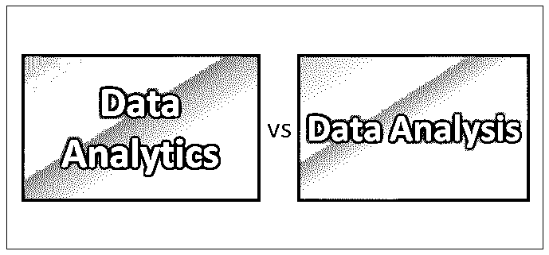
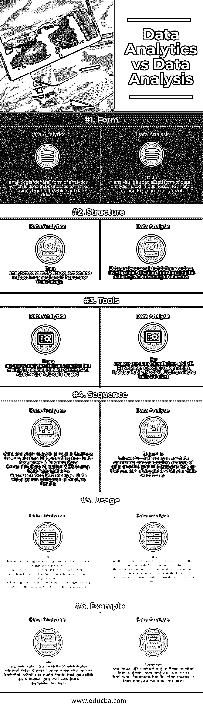

# 数据分析与数据分析

> 原文：<https://www.educba.com/data-analytics-vs-data-analysis/>

## 数据分析与数据分析的区别

数据分析是调查、清理、转换和训练数据的过程，目的是找到一些有用的信息、推荐结论并帮助决策。[数据分析工具](https://www.educba.com/data-analysis-tools/)有 Open Refine，Tableau public，KNIME，Google Fusion Tables，Node XL 等等。分析是利用数据、机器学习、统计分析和基于计算机的模型，从数据中获得更好的洞察力并做出更好的决策。分析被定义为“在组织决策和解决问题的背景下，通过分析和洞察将数据转化为行动的过程。”许多工具都支持分析，如 Microsoft Excel、 [SAS](https://www.educba.com/career-in-sas/) 、R、Python(库)、tableau public、Apache Spark 和 Excel。

### 数据分析和数据分析之间的直接比较

以下是数据分析和数据分析之间的 6 大区别:

<small>Hadoop、数据科学、统计学&其他</small>

### 数据分析和数据分析的主要区别

下面列出了一些要点，描述了数据分析和数据分析之间的主要区别:

1.  数据分析是一种传统的分析形式，在许多方面都有使用，如卫生部门、商业、电信和保险，以便根据数据做出决策并对数据执行必要的操作。数据分析是一种专门的数据分析形式，用于商业和其他领域，以分析数据并从数据中获取有用的见解。
2.  数据分析包括数据收集，一般来说，检查数据及其是否有一种或多种用途，而数据分析包括定义数据、调查、通过移除 Na 值或数据中存在的任何异常值来清理数据、转换数据以产生有意义的结果。
3.  要执行数据分析，必须学习许多工具来对数据执行必要的操作。要实现分析，你必须了解 R、Python、SAS、Tableau Public、Apache Spark、Excel 等等。对于数据分析，必须有动手工具，如 Open Refine、KNIME、Rapid Miner、Google Fusion Tables、Tableau Public、Node XL、Wolfram Alpha tools 等。
4.  数据分析生命周期包括业务案例评估、数据识别、数据获取和过滤、数据提取、数据验证和清理、数据聚合和表示、数据分析、数据可视化以及分析结果的利用。正如我们所知，数据分析是数据分析的一个子组件，因此数据分析生命周期也属于分析部分，它包括数据收集、数据清理、数据分析和精确解释数据，以便您可以理解数据想要表达的内容。
5.  每当有人想知道接下来会发生什么或接下来会发生什么，我们就会使用数据分析，因为数据分析有助于预测未来的价值。而在数据分析中，分析在过去的数据集上执行，以了解到目前为止数据发生了什么。数据分析和数据分析对于理解数据都是必要的，一个对于估计未来需求是有用的，另一个对于对数据执行一些分析以回顾过去是重要的。

### 数据分析和数据分析对照表

下面是数据分析和数据分析的对照表。

| **比较的基础** | **数据分析** | **数据分析** |
| **Form*****T3】*** | 数据分析是一种“通用”形式的分析，在企业中用于从数据驱动的数据中做出决策 | 数据分析是一种专门的数据分析形式，在企业中用于分析数据并从中获得一些见解。 |
|  **结构** | 数据分析通常由数据收集和检查组成，它有一个或多个用户。 | Data analysis consisted of defining data, investigating, cleaning, and transforming the data to give a meaningful outcome. |
| **工具** | 市场上有许多分析工具，但主要使用 R、Tableau Public、Python、SAS、Apache Spark 和 Excel。 | 为了分析 5555555555555566 数据，使用了 OpenRefine、KNIME、RapidMiner、Google Fusion Tables、Tableau Public、NodeXL、WolframAlpha 工具。 |
| **序列** | Data analytics life cycle consists of Business Case Evaluation, Data Identification, Data Acquisition & Filtering, Data Extraction, Data Validation & Cleansing, Data Aggregation & Representation, Data Analysis, Data Visualization, and Utilization of Analysis Results. | 数据分析中遵循的顺序是数据收集、数据清理、数据分析和精确地解释数据，以便您可以理解数据想要表达的内容。 |
| **用途** | 一般来说，数据分析可用于发现隐藏模式、匿名相关性、客户偏好、市场趋势和其他必要信息，这些信息有助于做出更明智的商业决策。 | 数据分析可以以各种方式使用，人们可以进行分析，如描述性分析、探索性分析、推理性分析、预测性分析，并从数据中获得有用的见解。 |
| **例子** | 假设您有 1gb 过去 1 年的客户购买相关数据，现在您必须找出我们的客户下一次可能的购买，您将为此使用数据分析。 | 假设您有 1gb 的过去 1 年的客户购买相关数据，并且您正在尝试查找到目前为止发生了什么，这意味着在数据分析中我们会查看过去。 |

### 结论

如今，数据使用量正在快速增长，并且跨组织收集了大量数据。数据可以与客户、业务目的、应用程序用户、相关访问者和利益相关者等相关。这些数据被搅动和分割以发现、理解和分析模式。数据分析是指涉及定性和定量方法的各种工具和技能，这些工具和技能利用收集的数据并产生结果，用于提高效率和生产力、降低风险和增加业务收益。根据组织的需求，数据分析技术因组织而异。

数据分析是数据分析的一个子组件，是一个专门的决策工具，使用不同的技术，如 tableau public、Open Refine、KNIME、Rapid Miner 等。并且在执行探索性分析和使用清理、转换、建模和可视化数据并产生结果来从数据中产生一些见解时是有用的。

### 推荐文章

这是数据分析与数据分析之间差异的指南。在这里，我们讨论了数据分析与数据分析直接比较、主要差异以及信息图表和比较表。您也可以阅读以下文章，了解更多信息——

1.  [数据分析与预测分析——哪个有用](https://www.educba.com/data-analytics-vs-predictive-analytics/)
2.  [数据可视化与数据分析——你需要知道的 7 件事](https://www.educba.com/data-visualisation-vs-data-analytics/)
3.  [数据分析师与数据科学家——哪一个更好](https://www.educba.com/data-analyst-vs-data-scientist/)
4.  [了解数据挖掘和数据分析之间的 7 个最大区别](https://www.educba.com/data-mining-vs-data-analysis/)

